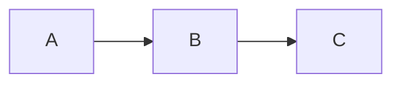

# agentic-module-md-export

Export markdown files to Google Docs and Word documents with Mermaid diagram rendering.

## Features

- Convert markdown to Google Docs (preserving formatting)
- Convert markdown to Word (.docx)
- Automatic Mermaid diagram rendering to PNG
- Upload to Google Drive folder

## Installation

```bash
agentic add github.com/arisegroup/agentic-module-md-export
```

## Setup

### Google OAuth

1. Create OAuth credentials in Google Cloud Console
2. Download `credentials.json` to workspace root
3. Run any command - it will prompt for authorization
4. `token.json` will be created for future use

### Environment Variables

```
GOOGLE_FOLDER_ID=your-google-drive-folder-id
```

## Slash Commands

```
/md-to-gdoc path/to/file.md "Document Title"
/md-to-word path/to/file.md
```

## CLI Usage

```bash
# Export to Google Docs
./run tools/md_to_gdoc.py path/to/file.md --title "My Document"

# Export to Word
./run tools/md_to_docx.py path/to/file.md --output output.docx
```

## Mermaid Support

Both exporters automatically detect and render Mermaid diagrams:

```markdown

```

Diagrams are converted to PNG images and embedded in the output document.
