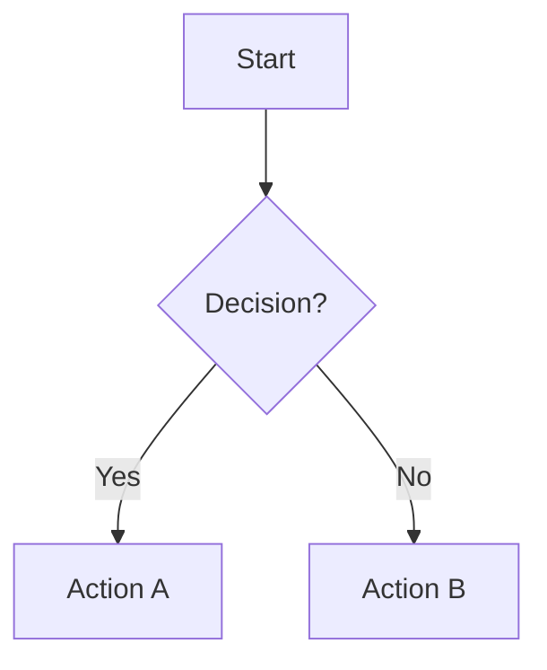

# Markdown to Document Directive

## When to Use

**Trigger phrases:**
- "convert this markdown to a word doc"
- "convert this markdown to a google doc"
- "turn this SOP into a document"
- "create a client-facing document from this markdown"
- "export markdown to docx"

Use this directive when:
- Converting SOPs or documentation from Markdown to client-facing documents
- Creating polished documents with embedded diagrams
- Batch converting a directory of Markdown files

## Which Format to Use

| Use Case | Format | Why |
|----------|--------|-----|
| SOPs with Mermaid diagrams | **Word (.docx)** | Diagrams render as embedded images |
| Quick sharing, collaboration | Google Docs | Instant cloud access, comments |
| Formal client deliverables | **Word (.docx)** | Better formatting control, professional look |
| Internal team docs | Either | Depends on team preference |

**Default recommendation:** Use Word (`.docx`) for client-facing SOPs with diagrams.

## Goal

Convert Markdown files to professionally formatted documents with proper styling, embedded diagrams, and preserved visual structure.

## Inputs

- **Path** (required): File path or directory path containing Markdown files
- **Folder ID** (optional): Target Google Drive folder ID for output
- **Options**:
  - `--dry-run`: Preview without creating documents
  - `--no-folders`: Don't create folder structure, output flat

## Process

1. **Parse Markdown**: Extract structure (headings, lists, tables, code blocks, etc.)
2. **Create Folder Structure**: Mirror local directory structure in Google Drive
3. **Build Document**: Create Google Doc with native formatting
4. **Handle Duplicates**: Add revision suffix if document name exists
5. **Return Results**: Output document URL(s)

## Outputs

- Google Doc URL(s) for created documents
- JSON output to stdout for programmatic use:
  ```json
  {"doc_id": "...", "url": "https://docs.google.com/...", "title": "..."}
  ```

## Edge Cases

- **Large tables**: Tables with many columns may need width adjustments
- **Complex ASCII art**: Preserved as monospace; very wide diagrams may wrap
- **Missing credentials**: Clear error with setup instructions
- **Duplicate names**: Appends `_r2`, `_r3`, etc. to document title
- **Empty files**: Skipped with warning
- **Non-markdown files**: Ignored in directory mode

## Element Conversion Reference

| Markdown | Google Docs |
|----------|-------------|
| `# Heading` | Heading 1 style |
| `## Heading` | Heading 2 style |
| `### Heading` | Heading 3 style |
| `#### Heading` | Heading 4 style |
| `- item` | Bullet list |
| `1. item` | Numbered list |
| `\|table\|` | Native table |
| `` `code` `` | Monospace inline |
| ` ```code``` ` | Monospace block with background |
| `> quote` | Indented, italic |
| `**bold**` | Bold text |
| `*italic*` | Italic text |
| `---` | Horizontal separator |
| `- [ ]` | Checkbox character |

---

## Implementation: Python

**Script:** `tools/md_to_gdoc.py`

**Usage:**

```bash
# Single file
./run tools/md_to_gdoc.py path/to/file.md

# Directory (recursive)
./run tools/md_to_gdoc.py path/to/directory/

# With target folder
./run tools/md_to_gdoc.py path/to/file.md --folder-id 1ABC123xyz

# Preview without creating
./run tools/md_to_gdoc.py path/to/file.md --dry-run

# Flat output (no folder structure)
./run tools/md_to_gdoc.py path/to/directory/ --no-folders
```

**Dependencies:**
- `mistune>=3.0.0` (Markdown parsing)
- `google-api-python-client` (Google APIs)
- `google-auth-oauthlib` (OAuth authentication)

**Authentication:**
- Uses existing `credentials.json` and `token.json` in project root
- Same OAuth flow as other Google scripts (Sheets, Slides, Docs)
- Scopes: `documents`, `drive.file`

**Python-specific notes:**
- JSON output to stdout, progress messages to stderr
- Returns non-zero exit code on failure
- Supports piping: `./run tools/md_to_gdoc.py file.md | jq .url`

---

## Common Workflows

### Convert a single SOP
```bash
./run tools/md_to_gdoc.py plotter-mechanix/sops/new/communication-protocol-v1.md
```

### Batch convert all SOPs in a directory
```bash
./run tools/md_to_gdoc.py plotter-mechanix/sops/new/
```

### Convert to a specific Drive folder
```bash
./run tools/md_to_gdoc.py plotter-mechanix/sops/ --folder-id 1ABC123xyz
```

---

## Conversion Notes

### ASCII Art Handling

The script distinguishes between two types of ASCII art in code blocks:

**Templates** (box characters only: `┌┐└┘│═─`):
- Converted to bullet lists for better readability
- Box borders stripped, content formatted as markdown
- Checkmarks `✓` become `✅` emoji

**Flowcharts** (contain `▼▲→←` arrows or `/  \` branching):
- Preserved as code blocks (gray background)
- Visual structure maintained for diagrams

### Page Breaks

- `---` horizontal rules encourage natural page breaks
- Script auto-inserts `---` before `## ` headings that don't have one
- Prevents headers from appearing orphaned at the bottom of pages

### Google Docs Quirks

| Issue | Solution |
|-------|----------|
| Consecutive plain text lines merge into single paragraph | All template content gets bullet prefix (`- `) |
| Checkmarks `✓✔☑☒` render inconsistently | Converted to `✅` emoji |
| Empty checkbox `☐` hard to see | Converted to `⬜` emoji |
| Sections split awkwardly across pages | Auto-insert `---` before `## ` headings |

---

## Primary: Word Document Output (Recommended)

Use the DOCX converter for client-facing documents, especially those with Mermaid diagrams:

**Script:** `tools/md_to_docx.py`

**Usage:**

```bash
# Single file (outputs .docx in same directory)
./run tools/md_to_docx.py path/to/file.md

# Custom output path
./run tools/md_to_docx.py path/to/file.md --output custom-name.docx

# Directory (recursive)
./run tools/md_to_docx.py path/to/directory/

# Preview without creating
./run tools/md_to_docx.py path/to/file.md --dry-run
```

**Features:**

| Feature | Support |
|---------|---------|
| Mermaid diagrams | Rendered as embedded PNG images |
| Callout boxes | Dotted borders with background shading |
| Tables | Native with header styling |
| Formatting | Full control via python-docx |

### Mermaid Diagram Support

Mermaid code blocks are automatically rendered to PNG and embedded in the Word document:

````markdown

````

**Requirements:** Install mermaid-cli for diagram rendering:
```bash
npm install -g @mermaid-js/mermaid-cli
```

**How it works:**
1. Script detects ```` ```mermaid ```` code blocks
2. Renders each diagram to PNG via `mmdc` (mermaid-cli)
3. Caches rendered diagrams in `.tmp/mermaid/` (hash-based)
4. Embeds PNG in Word document, centered at 6" width

**Fallback:** If mermaid-cli is not installed, diagrams appear as code blocks with a note.

### Word vs Google Docs Comparison

| Feature | Word (md_to_docx) | Google Docs (md_to_gdoc) |
|---------|-------------------|--------------------------|
| Mermaid diagrams | Embedded images | Not supported |
| Formatting control | Full | Limited (API constraints) |
| Callout boxes | Dotted borders, backgrounds | Not supported |
| Flowcharts | Rendered or monospace | Preserved as text |
| Tables | Native + header styling | Native |
| Sharing | Upload or email | Instant cloud access |

**Recommended workflow for client SOPs:**
1. Write SOP in Markdown with Mermaid diagrams
2. Run `./run tools/md_to_docx.py path/to/sop.md`
3. Review in Word/Pages if needed
4. Deliver to client or upload to Google Drive

---

## Related Directives

- `writing_sops.md` - Guidelines for creating SOPs (content rules, Mermaid syntax)
- `audio_to_sop.md` - Extract SOPs from audio recordings

---

## SOP Pipeline

This directive is the final step in the SOP creation workflow:

```
┌─────────────────┐     ┌──────────────────┐     ┌───────────────────┐
│  audio_to_sop   │ ──► │   writing_sops   │ ──► │ markdown_to_gdoc  │
│  (create SOP)   │     │  (format rules)  │     │ (export to Word)  │
└─────────────────┘     └──────────────────┘     └───────────────────┘
        │                        │                        │
   Input: Audio            Reference: How          Output: .docx
   Output: .md             SOPs should look        with diagrams
```

**Typical flow:**
1. Record expert explaining a procedure
2. Use `audio_to_sop` to transcribe and extract SOP
3. Follow `writing_sops` format guidelines (add Mermaid diagrams)
4. Use `md_to_docx.py` to create client-facing Word document
