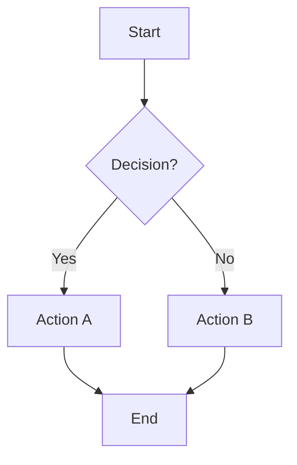
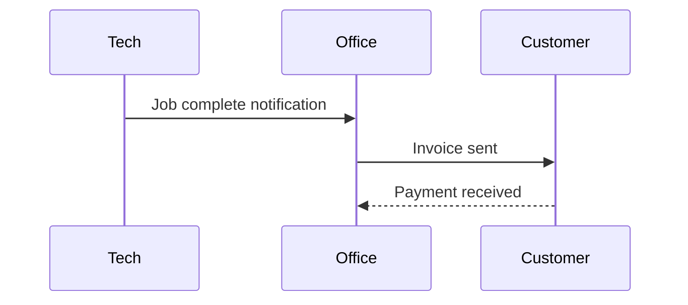
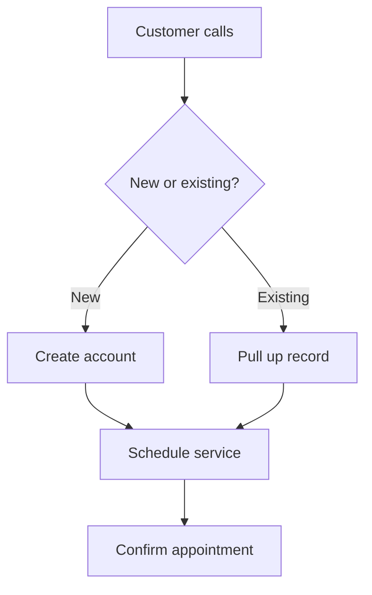

# Writing SOPs Directive

## When to Use

**Trigger phrases:**
- "create an SOP for..."
- "write a standard operating procedure"
- "document this process"
- "turn this into an SOP"

Use this directive when creating or editing Standard Operating Procedures for any client.

---

## Content Guidelines

### What to Include

- **Purpose statement**: Why this SOP exists, what problem it solves
- **Scope**: Who this applies to, when it applies
- **Systems required**: Tools/software needed
- **Step-by-step procedures**: Clear, actionable instructions
- **Decision flowcharts**: For branching logic ("if X, then Y")
- **Examples**: Completed templates, sample scenarios
- **Common questions / edge cases**: Anticipate confusion

### What NOT to Include

- **Pricing**: Tool costs change frequently and clutter operational docs. Keep pricing in separate tool evaluation docs or proposals.
- **Implementation details**: SOPs describe *what* to do, not technical *how*. Implementation details go in directives or scripts.
- **Credentials or API keys**: Never include sensitive data in SOPs.
- **Version-specific UI instructions**: Avoid "click the blue button in the top-right" which breaks when UIs change.

---

## Formatting Conventions

### Document Structure

```markdown
# SOP: [Title]

**Document ID:** [PREFIX]-[CATEGORY]-[NUMBER]
**Version:** X.X
**Effective Date:** [Month Year]
**Process Owner:** [Name (Role)]
**Last Updated:** [Date]

---

## Purpose
[Why this SOP exists]

---

## Scope
[Who/when this applies]

---

## Procedure
[Step-by-step instructions]

---

## Related SOPs
[Links to related documents]
```

### Diagrams with Mermaid

Use Mermaid for all diagrams and flowcharts. Mermaid diagrams are rendered as images when converting to Word documents.

**Basic flowchart:**


**Sequence diagram** (for communication flows):


**Decision flowchart** (for branching procedures):


**Mermaid syntax reference:**
- `graph TD` = top-down flowchart, `graph LR` = left-right
- `A[Text]` = rectangle, `A{Text}` = diamond (decision), `A([Text])` = rounded
- `-->` = arrow, `-->|label|` = labeled arrow
- `-->>` = dashed arrow (for async/optional)

**Requirements:** When converting to Word, `mermaid-cli` must be installed:
```bash
npm install -g @mermaid-js/mermaid-cli
```

### Keeping Diagram Sources Editable

For client-facing Word documents, diagrams are rendered as images. To preserve editable sources, add an **Appendix: Diagram Sources** section at the end of your SOP:

```markdown
---

## Appendix: Diagram Sources

> **Note:** This section contains editable source code for diagrams above.
> Copy to [Mermaid Live Editor](https://mermaid.live) to modify.

### [Diagram Name]
```text
graph TD
    A[Start] --> B[End]
```
```

**How it works:**
- The appendix section is **automatically excluded** from Word output
- The Markdown file retains all diagram sources for future editing
- Copy any diagram to [Mermaid Live Editor](https://mermaid.live) to modify
- Update both the inline `mermaid` block and the appendix `text` block

**Naming convention:** Use `## Appendix: Diagram Sources` (case-insensitive) as the heading.

### Callout Boxes (ASCII)

For quick reference cards and rule boxes, use ASCII box characters. These are converted to styled callout boxes in Word:

```
┌─────────────────────────────────────┐
│  QUICK REFERENCE CARD               │
├─────────────────────────────────────┤
│  ✓ First rule                       │
│  ✓ Second rule                      │
│  ✓ Third rule                       │
└─────────────────────────────────────┘
```

### Checkmarks

- Use `- [ ]` for unchecked items
- Use `- [x]` for checked items
- Avoid raw Unicode checkmarks (`✓✔☐`) as they render inconsistently across platforms

### Section Breaks

- Use `---` horizontal rules to separate major sections
- Helps with page breaks when converting to Google Docs
- Place before each `## ` heading

### Tables

Use markdown tables for structured information:

```markdown
| Column 1 | Column 2 |
|----------|----------|
| Data     | Data     |
```

---

## Naming Conventions

### Document IDs

Format: `[CLIENT]-[CATEGORY]-[NUMBER]`

Categories:
- `FS` - Field Service
- `OA` - Office/Admin
- `CS` - Customer Service
- `CP` - Communication Protocol
- `INV` - Inventory

Example: `PM-FS-005` (Plotter Mechanix, Field Service, document 5)

### File Names

Format: `[descriptive-slug]-v[version].md`

Examples:
- `end-of-job-handoff-v1.md`
- `communication-protocol-v1.md`
- `new-lead-intake-v2.md`

---

## Quality Checklist

Before finalizing an SOP:

- [ ] Purpose is clear and specific
- [ ] Steps are actionable and testable
- [ ] No pricing or cost information included
- [ ] No credentials or sensitive data
- [ ] Flowcharts for any branching decisions
- [ ] Examples provided for templates
- [ ] Related SOPs linked
- [ ] Document ID assigned
- [ ] Version number set

---

## Related Directives

- `markdown_to_gdoc.md` - Converting SOPs to Word/Google Docs (with Mermaid diagram rendering)
- `audio_to_sop.md` - Extracting SOPs from interview audio

---

## SOP Pipeline

These three directives form a complete SOP workflow:

```
┌─────────────────┐     ┌──────────────────┐     ┌───────────────────┐
│  audio_to_sop   │ ──► │   writing_sops   │ ──► │  markdown_to_gdoc │
│  (create SOP)   │     │  (format rules)  │     │ (export to Word)  │
└─────────────────┘     └──────────────────┘     └───────────────────┘
        │                        │                        │
   Input: Audio            Reference: How          Output: .docx
   Output: .md             SOPs should look        with diagrams
```
