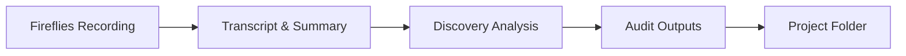

# Discovery Process SOP

## Purpose
Standardized process for conducting client discovery calls and producing comprehensive audit documentation for AI automation opportunities.

## Process Overview



## Inputs

### Required Inputs
1. **Fireflies Recording Output**
   - Summary with key points
   - Action items list
   - Full transcript
   - Participant details

2. **Company Context**
   - Industry and business model
   - Team size and structure
   - Revenue range
   - Current pain points

## Process Steps

### Step 1: Initial Setup & Folder Creation (15 min)
1. Create new project folder: `/active-projects/[client-name]/`
2. Set up standard folder structure:
   ```bash
   mkdir -p active-projects/[client-name]/{audit,discovery,planning/{roadmap,proposals},meetings,docs,status,delivery}
   ```
3. Create discovery meeting folder:
   ```bash
   mkdir -p active-projects/[client-name]/meetings/[YYYY-MM-DD]-discovery
   ```
4. Save Fireflies outputs:
   - `meetings/[date]-discovery/meeting-summary.md` - Key points and action items
   - `meetings/[date]-discovery/full-transcript.md` - Complete transcript
   - `discovery/discovery-summary.md` - Processed analysis

### Step 2: Business Functions Mapping (45 min)
1. Use `agents/business-functions-mapping-agent.md`
2. Extract 10 core business functions
3. Identify ownership and gaps
4. Assess risk levels
5. Output structured JSON

### Step 3: Process Mapping (30 min)
1. Map current workflows
2. Identify bottlenecks
3. Calculate time/cost waste
4. Document in `process-map.md`

### Step 4: Opportunity Analysis (45 min)
1. Create opportunity matrix
2. Categorize by impact/effort
3. Prioritize quick wins vs strategic initiatives
4. Estimate ROI for each opportunity
5. Document in `opportunity-matrix.md`

### Step 5: Discovery Documentation (30 min)
1. Create discovery summary
2. Document unknowns and questions
3. Identify technical requirements
4. List next action items

### Step 6: Audit Package Assembly (15 min)
1. Generate `audit.json` with structured data
2. Create README for audit folder
3. Verify all documents complete
4. Prepare for client review

## Outputs

### Standard Audit Folder Structure
```
[client-name]/
├── audit/
│   ├── README.md               # Audit overview
│   ├── audit.json              # Structured data
│   ├── process-map.md          # Current workflows
│   ├── opportunity-matrix.md   # Prioritized opportunities
│   └── transcripts/            # Meeting recordings
├── discovery/
│   ├── README.md               # Discovery overview
│   ├── discovery-summary.md    # Processed analysis
│   ├── discovery-unknowns.md   # Questions to resolve
│   └── discovery-findings.md   # Comprehensive findings
├── planning/
│   ├── roadmap/               # Implementation plan
│   └── proposals/             # Pricing and proposals
├── meetings/
│   └── [YYYY-MM-DD]-discovery/
│       ├── meeting-summary.md  # Fireflies summary & action items
│       ├── full-transcript.md  # Complete meeting transcript
│       └── README.md          # Meeting overview
├── docs/
│   ├── README.md              # Project documentation
│   └── PROJECT-OVERVIEW.md    # Complete project details
├── status/
│   └── README.md              # Current project status
└── delivery/                  # Implementation materials
```

### Key Deliverables

#### 1. Process Map
- Current state workflows
- Time/cost analysis
- Bottleneck identification
- Efficiency metrics

#### 2. Opportunity Matrix
- Quick wins (high impact, low effort)
- Strategic initiatives (high impact, medium effort)
- Transformations (high impact, high effort)
- ROI calculations for each

#### 3. Audit JSON
```json
{
  "business_overview": {},
  "functions": [...],
  "overload_and_gaps": {},
  "recommendations": {}
}
```

#### 4. Discovery Summary
- Business context
- Key pain points
- Proposed solutions
- Implementation roadmap
- Investment requirements

## Quality Standards

### Completeness Checklist
- [ ] All 10 business functions mapped
- [ ] Risk levels assigned to each function
- [ ] 5+ opportunities identified
- [ ] **Opportunities described qualitatively** (NOT with fabricated ROI numbers)
- [ ] Process map shows clear bottlenecks
- [ ] Discovery unknowns documented
- [ ] Next actions defined

### Accuracy Requirements
- Hours/week estimates **ONLY if explicitly stated by client** (otherwise mark UNKNOWN)
- Cost calculations **ONLY with client-provided data** (otherwise mark UNKNOWN)
- **NO fabricated ROI projections** - describe opportunity qualitatively instead
- Technical feasibility confirmed
- Timeline realistic

### Documentation Standards
- Clear, concise language
- Specific, actionable recommendations
- Visual diagrams where helpful
- Proper markdown formatting
- Version control maintained

---

## ⚠️ CRITICAL: Data Integrity Rules (Anti-Hallucination)

**All discovery and audit outputs MUST be grounded in facts from the source material (transcript, meeting notes, client statements).**

### ABSOLUTE RULES - NEVER VIOLATE:

1. **NEVER fabricate numbers:**
   - No made-up dollar amounts ($X/week losses, $Y ROI)
   - No invented time estimates (X hours/week)
   - No fabricated percentages (X% improvement)
   - No guessed counts (X leads, Y customers)

2. **NEVER extrapolate metrics:**
   - "Client is busy" ≠ "70+ hours/week"
   - "Losing opportunities" ≠ "$5,500/week in lost revenue"
   - "Manual process" ≠ "30 minutes per task"

3. **When data is missing:**
   - Use `null` or `"UNKNOWN - needs follow-up"` in JSON
   - Add to `discovery-unknowns.md` for follow-up
   - State: "Client did not provide [X] - TBD"
   - **NEVER invent placeholder values**

### Acceptable vs. Unacceptable Examples:

| Acceptable ✅ | Unacceptable ❌ |
|--------------|-----------------|
| "David mentioned follow-ups are based on memory" | "30-40% of opportunities lost" |
| "No CRM system causing missed opportunities" | "$5,500/week in lost revenue" |
| "estimated_hours_per_week": null | "estimated_hours_per_week": 40 |
| "Client needs better follow-up process" | "Could recover 20-30 lost leads/month ($10K+ revenue)" |
| "Timeline: MVP in 1-3 weeks (per client)" | "ROI: 50x return on investment" |

### Source Attribution:
Every specific claim should be traceable to the transcript:
- ✅ "David said 'I don't have a good process other than David remembering'" (line 148)
- ❌ "37.5 hours/week wasted on manual processes" (no source)

### Quality Gate:
Before finalizing ANY output, ask:
> "Can I point to the exact quote in the transcript where the client said this number?"

If NO → Remove the number or mark as UNKNOWN

## Tools & Resources

### Agents
- `agents/business-functions-mapping-agent.md` - Core discovery agent
- Additional specialized agents as needed

### Templates
- `templates/process-map-template.md`
- `templates/opportunity-matrix-template.md`
- `templates/discovery-summary-template.md`

### Examples
- `examples/plotter-mechanix-audit/` - Complete audit example
- `examples/david-equipment-share/` - CRM project example

## Time Requirements

### Standard Discovery Processing
- **Total Time:** 3-4 hours
- Initial Processing: 30 min
- Business Mapping: 45 min
- Process Analysis: 30 min
- Opportunity Matrix: 45 min
- Documentation: 30 min
- Review & Assembly: 15 min

### Expedited Processing
- **Total Time:** 90 minutes
- Focus on top 3 pain points
- High-level opportunity mapping
- Essential documentation only

## Success Metrics

### Quality Indicators
- Client validates 90%+ of findings
- Clear path to ROI identified
- Actionable next steps defined
- Technical feasibility confirmed

### Business Impact
- 10+ hours/week savings identified
- 3x+ ROI on proposed investment
- Quick wins achievable in 30 days
- Strategic value clear

## Common Patterns

### Typical Pain Points
1. Owner as bottleneck
2. Manual data entry
3. Disconnected systems
4. No process documentation
5. Inefficient communication

### Standard Solutions
1. Workflow automation
2. System integration
3. AI assistants
4. Process standardization
5. Dashboard creation

## Next Steps After Discovery

1. **Immediate (24 hours)**
   - Send discovery summary to client
   - Schedule follow-up meeting
   - Begin technical scoping

2. **Week 1**
   - Develop detailed proposal
   - Create implementation roadmap
   - Define success metrics

3. **Ongoing**
   - Regular check-ins
   - Iterative refinement
   - Continuous discovery

---

*Last Updated: December 12, 2024*
*Version: 1.0*
*Status: Active SOP*