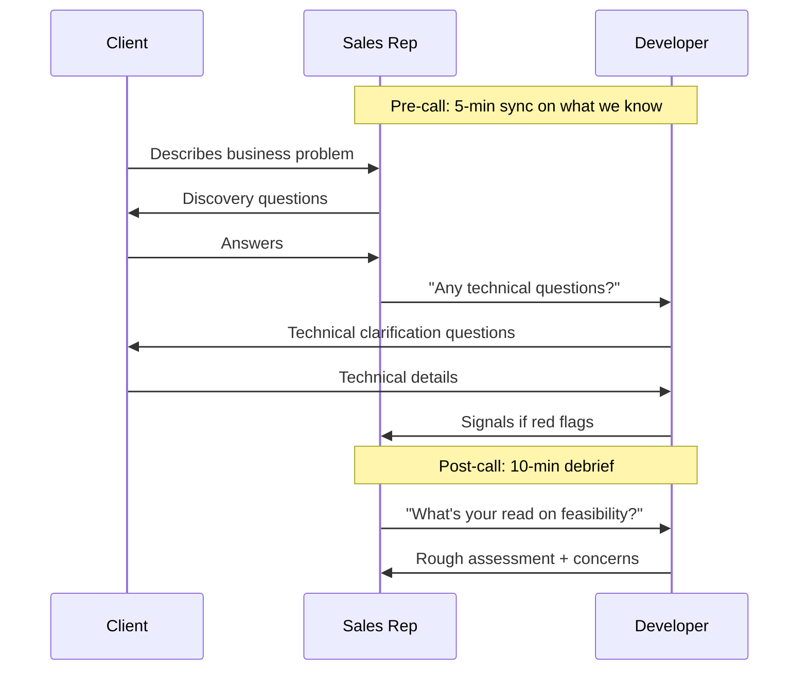
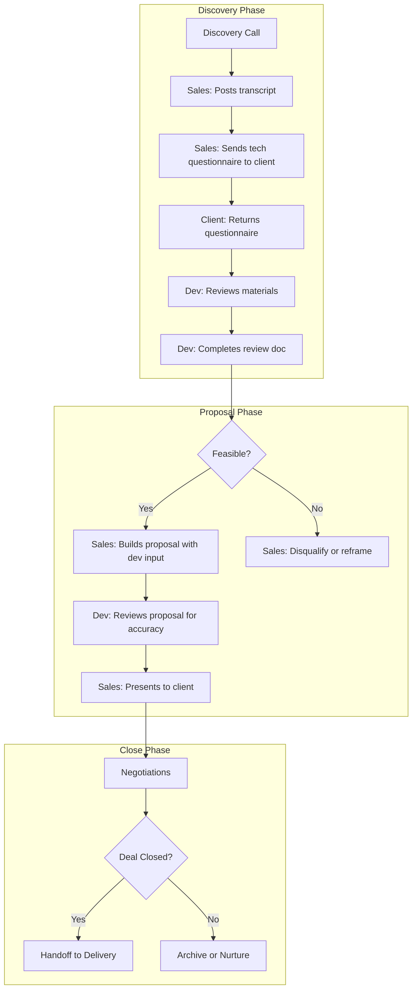

# SOP: Sales-Developer Collaboration

**Document ID:** ARISE-SD-001
**Version:** 1.0
**Effective Date:** February 2026
**Process Owner:** Trent (Coordinator)
**Last Updated:** 2026-02-14

---

## Purpose

Define how sales and development teams collaborate throughout the sales process. This SOP establishes the joint discovery call process and the bidirectional information flow between sales and developers to reduce back-and-forth and catch technical requirements early.

---

## Key Principle

```
┌─────────────────────────────────────────────────────────┐
│                                                         │
│     EVERYONE HELPS.  ONE PERSON OWNS.                   │
│                                                         │
│     Matthew = Sales Support + Delivery                  │
│                                                         │
└─────────────────────────────────────────────────────────┘
```

Everyone on the team joins client calls to help close deals. Matthew provides technical scoping and estimates during sales, PLUS handles delivery after close.

---

## Scope

**Applies to:** All team members (Chris, Mekaiel, Trent, Matthew)

**Reality:** Everyone participates in sales. Roles are flexible, ownership is clear.

---

## Joint Client Calls

### Why Everyone Joins?

| Problem (Before) | Solution (Now) |
|------------------|----------------|
| Sales promises features devs can't build | Matthew catches issues in real-time |
| Multiple follow-up calls to clarify tech | Technical questions answered immediately |
| Proposals lack accurate effort estimates | Matthew hears requirements firsthand |
| Handoffs lose context | Everyone has context from the call |
| Decisions stall waiting for info | All perspectives available immediately |

### Call Staffing: All Hands on Deck

**Current reality:** Everyone joins client calls to help close deals. Specific roles depend on the call type:

| Call Type | Owner (Leads the Call) | Also Joins | Purpose |
|-----------|------------------------|------------|---------|
| Discovery call | Mekaiel | Chris, Trent, Matthew | Qualify, scope, build relationship |
| Follow-up call | Mekaiel or Trent | Matthew | Clarify tech, answer questions |
| Proposal presentation | Trent | Matthew | Present solution, discuss feasibility |
| Closing call | Trent | Matthew (standby) | Negotiate, close |
| Kickoff meeting | Trent + Matthew | — | Transfer to delivery |

**Note:** Not everyone MUST attend every call, but everyone CAN. The owner leads; others support.

### Matthew's Role on Sales Calls

Matthew wears two hats: **Sales Support** during the sales process, **Delivery Lead** after close.

**During Sales Calls — DO:**
- Listen for technical requirements, integrations, existing systems
- Ask clarifying technical questions
- Flag feasibility concerns in real-time
- Take notes on technical details
- Provide rough complexity/hours assessment after the call
- Support the sales team's positioning

**During Sales Calls — DON'T:**
- Commit to timelines or pricing (that's Trent's call)
- Promise specific features
- Get into deep technical weeds that lose the client
- Contradict the sales lead (discuss offline if there's disagreement)

### Call Flow



---

## Proposal Creation Workflow

After discovery is complete, Mekaiel and Matthew work in parallel to create the proposal package.

### Ownership Table

| Deliverable | Owner | Collaborates With |
|-------------|-------|-------------------|
| Presentation | Mekaiel | — |
| Proposal | Mekaiel | Matthew (criteria) |
| SOW | Mekaiel | Matthew (criteria) |
| Criteria (acceptance/work) | Matthew | Mekaiel |
| Technical scope review | Trent + Matthew | — |
| Client presentation | Mekaiel + Trent (joint) | — |
| Negotiation & close | Mekaiel + Trent (joint) | — |

### Key Definitions

- **Presentation** = Full transformation vision, broken into milestones
- **Proposal** = Current phase/milestone scope only
- **SOW** = Contract for current phase
- **Criteria** = Acceptance criteria + work criteria for deliverables

### Workflow

```
Discovery Complete (Mekaiel)
         ↓
┌────────────────────────────────────────────┐
│  PARALLEL WORK                             │
│                                            │
│  Mekaiel:                 Matthew:         │
│  - Draft presentation     - Create criteria│
│  - Draft proposal         - Define scope   │
│  - Draft SOW                               │
└────────────────────────────────────────────┘
         ↓
Mekaiel + Matthew collaborate on scope/criteria
         ↓
Trent + Matthew review technical criteria & scope
         ↓
Finalize proposal package
         ↓
Mekaiel + Trent present to client (joint)
         ↓
Mekaiel + Trent negotiate & close (joint)
```

**Note:** Trent is looped in at the scope review stage, not at handoff 2.

---

## Information Flow: Developers ← Sales

### What Developers Need FROM Sales

| Item | Description | When Needed | Format |
|------|-------------|-------------|--------|
| Discovery transcript/summary | Notes from discovery call | Within 24h of call | Notion record |
| Milestone presentation | Maps first engagement → transformation | Before proposal sent | Slides or doc |
| Proposal + SOW | Contract for current phase | After close (before kickoff) | PDF |
| Tech questionnaire response | Client's apps, integrations, tech stack | Post-discovery follow-up | Completed questionnaire |
| Client contacts | Who to work with during delivery | At kickoff | Contact list |
| Success criteria | How client measures success | Before proposal | Notes |

### Post-Discovery Tech Questionnaire

Send this to the client after discovery call to gather technical details:

---

**TEMPLATE: Post-Discovery Tech Questionnaire**

> Hi [Client Name],
>
> Thanks for the great discovery conversation! To help us prepare an accurate proposal, please answer a few technical questions:
>
> **Current Systems**
> 1. What software/tools do you currently use for [relevant function]?
> 2. Do you have an existing CRM? If so, which one?
> 3. What's your current tech stack? (e.g., website platform, databases, cloud services)
>
> **Integrations**
> 4. What systems would need to connect to the AI solution?
> 5. Do you have APIs available for these systems? (Or do you know if they support integrations?)
>
> **Data**
> 6. What data would feed into the AI solution?
> 7. Where is this data currently stored?
> 8. Roughly how much data are we talking about? (e.g., 1000 records, 1M records)
>
> **Technical Resources**
> 9. Do you have internal IT/dev resources, or would we handle everything?
> 10. Any security or compliance requirements we should know about? (e.g., HIPAA, SOC2)
>
> **Preferences**
> 11. Do you have preferences for specific tools or platforms?
> 12. Any technologies you want to avoid?
>
> Feel free to answer what you can—we can discuss the rest on our next call.
>
> Thanks!
> [Your Name]

---

## Information Flow: Sales ← Developers

### What Sales Needs FROM Developers

| Item | Description | When Needed | Format |
|------|-------------|-------------|--------|
| Hours estimate | Rough effort in hours/days | Before quoting | Written estimate |
| Feasibility check | Can we build this? Blockers? | Before quoting | Yes/No + notes |
| Tech stack recommendation | Tools/platforms we'd use | Before proposal | Written recommendation |
| Risk assessment | What could go wrong or delay | Before proposal | Risk list |
| Complexity rating | Simple / Medium / Complex | After discovery | Verbal or written |
| Acceptance criteria | How we'll know deliverables are complete | During proposal creation | Criteria document |
| Work criteria | Detailed criteria for each deliverable | During proposal creation | Criteria document |
| Scope collaboration | Joint session to align scope with criteria | Before proposal finalized | Meeting + notes |

### Developer Review Document

After reviewing discovery materials, developer completes this:

---

**TEMPLATE: Developer Review Document**

**Project:** [Client Name] - [Brief Description]
**Reviewed by:** [Developer Name]
**Date:** [Date]

---

**1. Feasibility Assessment**

| Question | Answer |
|----------|--------|
| Can we build this? | Yes / Yes with caveats / No |
| Confidence level | High / Medium / Low |
| Major blockers | [List or "None"] |

**2. Technical Approach**

| Aspect | Recommendation |
|--------|----------------|
| Primary platform/tool | [e.g., "n8n for automation, OpenAI for LLM"] |
| Integrations needed | [List integrations] |
| Data storage | [e.g., "Supabase", "Client's existing DB"] |
| Hosting | [e.g., "Our infrastructure", "Client's cloud"] |

**3. Effort Estimate**

| Phase | Hours (Range) | Notes |
|-------|---------------|-------|
| Discovery/Planning | [X-Y hrs] | |
| Development | [X-Y hrs] | |
| Testing | [X-Y hrs] | |
| Deployment | [X-Y hrs] | |
| **Total** | **[X-Y hrs]** | |

**4. Risk Assessment**

| Risk | Likelihood | Impact | Mitigation |
|------|------------|--------|------------|
| [Risk 1] | Low/Med/High | Low/Med/High | [How to mitigate] |
| [Risk 2] | Low/Med/High | Low/Med/High | [How to mitigate] |

**5. Questions for Client**

- [Question 1]
- [Question 2]

**6. Red Flags**

- [ ] None identified
- [ ] See notes: [Notes]

**7. Recommendation**

- [ ] Proceed with proposal
- [ ] Proceed with caveats: [Caveats]
- [ ] Do not proceed: [Reason]

---

## Collaboration Workflow



---

## Timing Expectations

| Activity | SLA | Owner |
|----------|-----|-------|
| Post discovery transcript | Within 24 hours | Sales (Mekaiel) |
| Send tech questionnaire | Within 24 hours | Sales (Mekaiel) |
| Complete dev review | Within 48 hours of receiving materials | Developer |
| Provide hours estimate | Within 48 hours | Developer |
| Review proposal draft | Within 24 hours | Developer |

---

## Communication Channels

| Topic | Channel |
|-------|---------|
| Request dev review | Slack #dev-sales (tag developer) |
| Share discovery materials | Notion + Slack link |
| Developer questions about lead | Slack thread on handoff message |
| Urgent feasibility question | Slack DM to developer |
| Post-call debrief | Zoom/Huddle immediately after call |

---

## Escalation

If sales-dev collaboration is blocked:

1. Post in Slack with clear blocker description
2. Tag Trent and Matthew
3. Discuss in daily standup if not resolved
4. Trent and Matthew resolve resource/priority conflicts

---

## Related SOPs

- [SOP-ARISE-SL-001: Sales Lifecycle Overview](./SOP-ARISE-SL-001-sales-lifecycle.md)
- [SOP-ARISE-HO-001: Handoff Procedures](./SOP-ARISE-HO-001-handoff-procedures.md)

---

## Appendix: Diagram Sources

> **Note:** This section contains editable source code for diagrams above.
> Copy to [Mermaid Live Editor](https://mermaid.live) to modify.

### Call Flow

```text
sequenceDiagram
    participant C as Client
    participant S as Sales Rep
    participant D as Developer

    Note over S,D: Pre-call: 5-min sync on what we know

    C->>S: Describes business problem
    S->>C: Discovery questions
    C->>S: Answers
    S->>D: "Any technical questions?"
    D->>C: Technical clarification questions
    C->>D: Technical details
    D->>S: Signals if red flags

    Note over S,D: Post-call: 10-min debrief

    S->>D: "What's your read on feasibility?"
    D->>S: Rough assessment + concerns
```

### Collaboration Workflow

```text
graph TD
    subgraph DISCOVERY[" Discovery Phase "]
        A[Discovery Call] --> B[Sales: Posts transcript]
        B --> C[Sales: Sends tech questionnaire to client]
        C --> D[Client: Returns questionnaire]
        D --> E[Dev: Reviews materials]
        E --> F[Dev: Completes review doc]
    end

    subgraph PROPOSAL[" Proposal Phase "]
        F --> G{Feasible?}
        G -->|Yes| H[Sales: Builds proposal with dev input]
        G -->|No| I[Sales: Disqualify or reframe]
        H --> J[Dev: Reviews proposal for accuracy]
        J --> K[Sales: Presents to client]
    end

    subgraph CLOSE[" Close Phase "]
        K --> L[Negotiations]
        L --> M{Deal Closed?}
        M -->|Yes| N[Handoff to Delivery]
        M -->|No| O[Archive or Nurture]
    end
```
