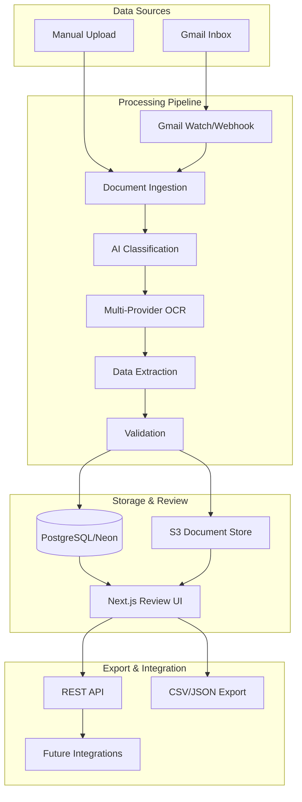
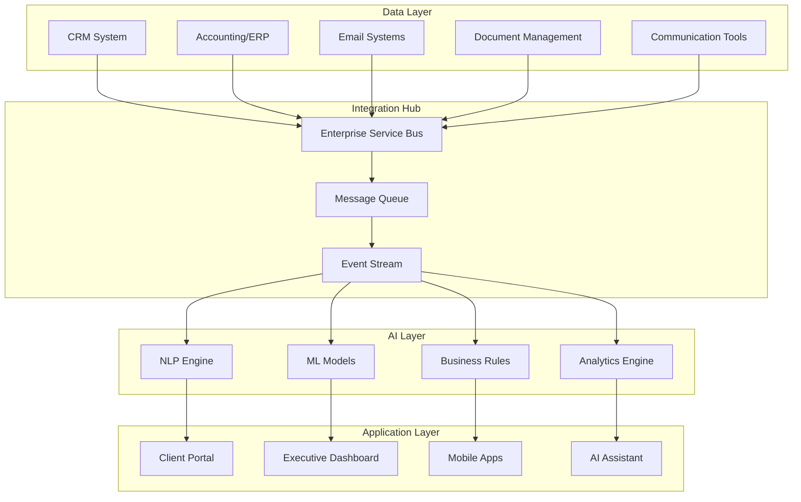

# Ascension Capital - Technical Architecture

## Phase 1: Invoice & Receipt Automation (POC - Complete)

### System Overview



### Codebase Location
**Repository:** `~/workspace/langChainProjects/dataInputPipeline/`
**Branch:** main
**Status:** Production-ready, awaiting deployment

### Technology Stack

#### Backend Architecture
- **Runtime:** Python 3.11
- **Framework:** FastAPI
- **Workflow:** LangGraph/LangChain
- **AI/ML:** OpenAI GPT-4
- **OCR:** Multi-provider strategy
  - Google Vision API (primary)
  - AWS Textract (fallback)
  - Tesseract (local fallback)

#### Frontend Architecture
- **Framework:** Next.js 14
- **Language:** TypeScript
- **Styling:** Tailwind CSS
- **State:** React Context
- **Components:** Shadcn/ui

#### Database & Storage
- **Database:** PostgreSQL 15 (Neon serverless)
- **Document Storage:** AWS S3
- **Caching:** Redis (optional)

#### Infrastructure
- **Containerization:** Docker
- **Orchestration:** Docker Compose
- **Deployment:** AWS Lambda (serverless)
- **Monitoring:** LangSmith
- **Logging:** CloudWatch

### API Endpoints

```yaml
Authentication:
  POST /api/auth/login
  POST /api/auth/refresh
  POST /api/auth/logout

Documents:
  GET    /api/documents           # List all documents
  GET    /api/documents/{id}      # Get document details
  POST   /api/documents/upload    # Manual upload
  PUT    /api/documents/{id}      # Update extracted data
  DELETE /api/documents/{id}      # Delete document

Processing:
  POST   /api/process/batch       # Batch process documents
  GET    /api/process/status/{id} # Check processing status
  POST   /api/process/reprocess   # Reprocess document

Export:
  GET    /api/export/csv          # Export as CSV
  GET    /api/export/json         # Export as JSON
  POST   /api/export/quickbooks   # QuickBooks format

Webhooks:
  POST   /api/webhooks/gmail      # Gmail push notifications
  POST   /api/webhooks/test       # Test webhook endpoint
```

### Database Schema

```sql
-- Main documents table
CREATE TABLE documents (
    id UUID PRIMARY KEY DEFAULT uuid_generate_v4(),
    type VARCHAR(50) NOT NULL, -- 'invoice' or 'receipt'
    status VARCHAR(50) DEFAULT 'pending',
    source VARCHAR(100), -- 'gmail', 'manual', etc.

    -- Extracted fields
    vendor_name VARCHAR(255),
    invoice_number VARCHAR(100),
    invoice_date DATE,
    due_date DATE,
    total_amount DECIMAL(10,2),
    tax_amount DECIMAL(10,2),
    currency VARCHAR(3) DEFAULT 'USD',

    -- Metadata
    confidence_score DECIMAL(3,2),
    ocr_provider VARCHAR(50),
    processing_time_ms INTEGER,

    -- Storage
    original_file_url TEXT,
    processed_data JSONB,

    -- Timestamps
    created_at TIMESTAMP DEFAULT NOW(),
    updated_at TIMESTAMP DEFAULT NOW(),
    processed_at TIMESTAMP
);

-- Line items table
CREATE TABLE line_items (
    id UUID PRIMARY KEY DEFAULT uuid_generate_v4(),
    document_id UUID REFERENCES documents(id) ON DELETE CASCADE,
    description TEXT,
    quantity DECIMAL(10,2),
    unit_price DECIMAL(10,2),
    total DECIMAL(10,2),
    created_at TIMESTAMP DEFAULT NOW()
);

-- Audit log
CREATE TABLE audit_log (
    id UUID PRIMARY KEY DEFAULT uuid_generate_v4(),
    document_id UUID REFERENCES documents(id),
    action VARCHAR(50),
    user_id VARCHAR(255),
    changes JSONB,
    created_at TIMESTAMP DEFAULT NOW()
);
```

### Security Measures

1. **Authentication**
   - OAuth2 for Gmail access
   - JWT tokens for API access
   - Role-based permissions

2. **Data Protection**
   - Encryption at rest (S3, Database)
   - HTTPS everywhere
   - Sensitive data masking in logs

3. **Rate Limiting**
   - API rate limits per user
   - Gmail API quota management
   - Batch processing for efficiency

### Performance Metrics

- **Processing Speed:** < 30 seconds per document
- **Classification Accuracy:** 99%
- **Data Extraction Accuracy:** 95%
- **System Uptime:** 99.9% target
- **Concurrent Processing:** 10 documents
- **Daily Capacity:** 1000+ documents

### Deployment Guide

```bash
# Development
cd ~/workspace/langChainProjects/dataInputPipeline
docker-compose up

# Production (AWS Lambda)
./scripts/deploy.sh production

# Environment Variables Required
OPENAI_API_KEY=sk-...
GOOGLE_VISION_API_KEY=...
AWS_ACCESS_KEY_ID=...
AWS_SECRET_ACCESS_KEY=...
DATABASE_URL=postgresql://...
GMAIL_CLIENT_ID=...
GMAIL_CLIENT_SECRET=...
```

---

## Phase 2: Full Company Architecture (Planned)

### Expanded System Design



### Proposed Tech Stack Expansion

#### Additional Components
- **iPaaS:** Zapier/Make.com for low-code integrations
- **BI Tool:** Tableau/PowerBI for advanced analytics
- **Workflow Engine:** n8n for complex automations
- **Knowledge Base:** Elasticsearch for document search
- **Real-time:** WebSockets for live updates

#### AI/ML Enhancements
- **LLM:** Claude/GPT-4 for natural language
- **Vision:** Document understanding beyond OCR
- **Predictive:** Time series forecasting
- **Classification:** Multi-label categorization
- **NER:** Entity extraction from unstructured data

### Integration Architecture

```yaml
Tier 1 - Direct API Integrations:
  - Salesforce/HubSpot (CRM)
  - QuickBooks/Xero (Accounting)
  - Gmail/Outlook (Email)
  - Slack/Teams (Communication)

Tier 2 - Webhook-Based:
  - Form submissions
  - Payment notifications
  - Calendar events
  - Support tickets

Tier 3 - Batch Processing:
  - Daily reports
  - Data synchronization
  - Backup operations
  - Analytics aggregation
```

### Scalability Design

1. **Microservices Architecture**
   - Document Processing Service
   - Communication Service
   - Analytics Service
   - Integration Service
   - AI Service

2. **Event-Driven Processing**
   - Kafka/RabbitMQ for message queuing
   - Event sourcing for audit trail
   - CQRS for read/write optimization

3. **Cloud-Native Deployment**
   - Kubernetes orchestration
   - Auto-scaling policies
   - Multi-region deployment
   - CDN for global access

### Data Architecture

```sql
-- Unified data model (simplified)
CREATE SCHEMA unified;

-- Master entity table
CREATE TABLE unified.entities (
    id UUID PRIMARY KEY,
    type VARCHAR(50), -- 'customer', 'vendor', 'employee'
    name VARCHAR(255),
    metadata JSONB,
    created_at TIMESTAMP,
    updated_at TIMESTAMP
);

-- Interactions table
CREATE TABLE unified.interactions (
    id UUID PRIMARY KEY,
    entity_id UUID REFERENCES unified.entities(id),
    type VARCHAR(50), -- 'email', 'call', 'meeting', 'document'
    channel VARCHAR(50),
    content TEXT,
    sentiment DECIMAL(3,2),
    metadata JSONB,
    occurred_at TIMESTAMP
);

-- Transactions table
CREATE TABLE unified.transactions (
    id UUID PRIMARY KEY,
    entity_id UUID REFERENCES unified.entities(id),
    type VARCHAR(50), -- 'invoice', 'payment', 'expense'
    amount DECIMAL(12,2),
    currency VARCHAR(3),
    status VARCHAR(50),
    metadata JSONB,
    transaction_date DATE
);
```

### Monitoring & Observability

```yaml
Metrics:
  - API response times
  - Processing throughput
  - Error rates
  - User activity
  - System resource usage

Logging:
  - Centralized log aggregation (ELK stack)
  - Structured logging (JSON)
  - Log levels (DEBUG, INFO, WARN, ERROR)
  - Audit trail for compliance

Alerting:
  - Processing failures
  - API degradation
  - Security events
  - Business anomalies
  - Capacity warnings

Dashboards:
  - Executive KPIs
  - Operational metrics
  - Technical health
  - User analytics
  - Financial overview
```

### Security Architecture

```yaml
Access Control:
  - SSO integration (SAML/OAuth)
  - Multi-factor authentication
  - Role-based permissions
  - API key management

Data Security:
  - Field-level encryption
  - Data masking/tokenization
  - Secure file storage
  - Backup encryption

Compliance:
  - GDPR compliance
  - SOC 2 readiness
  - Audit logging
  - Data retention policies

Network Security:
  - VPC isolation
  - Private subnets
  - WAF protection
  - DDoS mitigation
```

### Cost Optimization

1. **Serverless First**
   - Lambda for processing
   - Neon for database
   - S3 for storage
   - API Gateway for endpoints

2. **Resource Optimization**
   - Spot instances for batch jobs
   - Reserved capacity for predictable loads
   - Auto-scaling based on demand
   - Cold storage for archives

3. **Monitoring Costs**
   - Cost allocation tags
   - Budget alerts
   - Resource utilization reports
   - Optimization recommendations

---

## Migration Path

### From POC to Production

1. **Week 1-2: Foundation**
   - Production environment setup
   - Security hardening
   - Monitoring implementation
   - Load testing

2. **Week 3-4: Integration**
   - Connect to live Gmail
   - Database migration
   - User training
   - Pilot testing

3. **Week 5-6: Expansion**
   - Additional document types
   - System integrations
   - Workflow automation
   - Performance optimization

### From Phase 1 to Full Platform

1. **Month 1: Core Infrastructure**
   - Microservices setup
   - Event streaming
   - API gateway
   - Service mesh

2. **Month 2-3: Integrations**
   - CRM connection
   - Accounting sync
   - Communication tools
   - Document management

3. **Month 4-6: Intelligence Layer**
   - AI models training
   - Analytics implementation
   - Predictive capabilities
   - Natural language interface

---

## Support & Maintenance

### SLA Targets
- **Uptime:** 99.9% (43 minutes downtime/month)
- **Response Time:** < 2 seconds for 95th percentile
- **Processing Time:** < 30 seconds per document
- **Support Response:** < 4 hours for critical issues

### Maintenance Windows
- **Scheduled:** Sunday 2-6 AM EST
- **Emergency:** As needed with notification
- **Updates:** Monthly feature releases
- **Patches:** Weekly security updates

### Documentation
- API documentation (OpenAPI/Swagger)
- User guides
- Admin documentation
- Developer documentation
- Runbooks for common issues

---

*Last Updated: December 2024*
*Version: 1.0*
*Next Review: After Phase 2 Discovery*