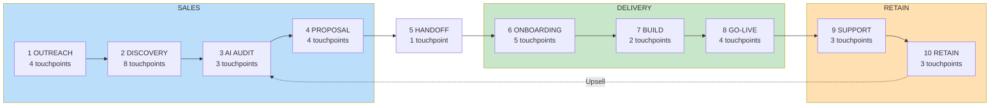
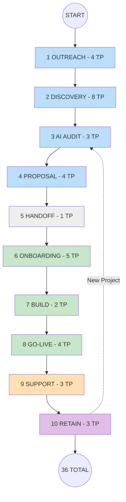

# AriseGroup.ai Customer Journey Map

> Single source of truth for customer experience, touchpoints, and automation opportunities

---

# VISUAL DIAGRAMS FOR MIRO

## INSTRUCTIONS FOR MIRO:
1. In Miro, click the **"+" button** or use "/" shortcut
2. Search for **"Mermaid"** and select it
3. Paste the code below (everything between the ```mermaid tags)
4. Miro will render it as a single connected diagram

## LEGEND:
- **Hexagons** = Customer Touchpoints (automation opportunities)
- **Rectangles** = Internal processes
- **Diamonds** = Decision points

---



```mermaid
flowchart TB
    subgraph SALES["SALES"]
        direction TB

        subgraph S1["1 OUTREACH"]
            S1A[Target ICP]
            S1B[Build List]
            S1C{{Outreach Msg}}
            S1D{{Response}}
            S1E{{Follow-Up 1}}
            S1F{{Follow-Up 2}}
            S1A --> S1B --> S1C --> S1D
            S1C -.-> S1E -.-> S1F
        end

        subgraph S2["2 DISCOVERY"]
            S2A{{Booking Confirm}}
            S2B{{Intake Form}}
            S2C{{Reminder}}
            S2D[Discovery Call]
            S2E{{Post-Call Recap}}
            S2F{{No-Show Follow-Up}}
            S2G{{Audit Offer}}
            S2H{{Audit Follow-Up 1}}
            S2I{{Audit Follow-Up 2}}
            S2A --> S2B --> S2C --> S2D --> S2E --> S2G
            S2D -.-> S2F
            S2G -.-> S2H -.-> S2I
        end

        subgraph S3["3 AI AUDIT"]
            S3A{{Audit Invoice}}
            S3B{{Kickoff Email}}
            S3C[Discovery Sessions]
            S3D[Business Mapping]
            S3E[Opportunity Matrix]
            S3F[PRD + Roadmap]
            S3G{{Deliverables Deck}}
            S3A --> S3B --> S3C --> S3D --> S3E --> S3F --> S3G
        end

        subgraph S4["4 PROPOSAL"]
            S4A{{Proposal Email}}
            S4B[Proposal Call]
            S4C{{Follow-Up 1}}
            S4D{{Follow-Up 2}}
            S4E{{Contract + Invoice}}
            S4F[Deal Closed]
            S4A --> S4B --> S4E --> S4F
            S4B -.-> S4C -.-> S4D
        end

        S1D --> S2A
        S2G --> S3A
        S3G --> S4A
    end

    subgraph HANDOFF["5 HANDOFF"]
        H1[Handoff Packet]
        H2{{Welcome Email}}
    end

    subgraph DELIVERY["DELIVERY"]
        direction TB

        subgraph D1["6 ONBOARDING"]
            D1A{{Welcome Packet}}
            D1B{{Onboarding Form}}
            D1C{{Kickoff Invite}}
            D1D[Kickoff Call]
            D1E{{Kickoff Recap}}
            D1A --> D1B --> D1C --> D1D --> D1E
        end

        subgraph D2["7 BUILD"]
            D2A{{Architecture Review}}
            D2B[Architecture Call]
            D2C[Build Phase]
            D2D{{Weekly Update}}
            D2A --> D2B --> D2C --> D2D
        end

        subgraph D3["8 GO-LIVE"]
            D3A{{UAT Invite}}
            D3B[UAT Testing]
            D3C{{Training Invite}}
            D3D[Training Session]
            D3E{{Go-Live Email}}
            D3F{{Training Recording}}
            D3A --> D3B --> D3C --> D3D --> D3E --> D3F
        end

        D1E --> D2A
        D2D --> D3A
    end

    subgraph SUPPORT["SUPPORT"]
        direction TB

        subgraph P1["9 STABILIZE"]
            P1A{{Check-in 1}}
            P1B{{Check-in 2}}
            P1C{{Check-in 3}}
            P1A --> P1B --> P1C
        end

        subgraph P2["10 RETAIN"]
            P2A{{Monthly Check-in}}
            P2B{{Upsell}}
            P2C{{Referral Request}}
            P2A --> P2B --> P2C
        end

        P1C --> P2A
    end

    S4F --> H1
    H1 --> H2
    H2 --> D1A
    D3F --> P1A
    P2C -.->|New Project| S3A

    style SALES fill:#e3f2fd,stroke:#1976d2,stroke-width:2px
    style HANDOFF fill:#f5f5f5,stroke:#616161,stroke-width:2px
    style DELIVERY fill:#e8f5e9,stroke:#388e3c,stroke-width:2px
    style SUPPORT fill:#fff3e0,stroke:#f57c00,stroke-width:2px
```

### Diagram Key
- **Hexagons {{}}** = Customer Touchpoints (automation opportunities)
- **Rectangles []** = Internal processes
- **Solid arrows** = Main flow
- **Dotted arrows** = Conditional paths

---

## TOUCHPOINT SUMMARY (For Automation)

| # | Stage | Touchpoint | Type | Automate? |
|---|-------|------------|------|-----------|
| 1 | Outreach | Outreach Message | Email/DM | Template |
| 2 | Outreach | Response Email | Email | Template |
| 3 | Outreach | Follow-Up #1 | Email | Auto-send |
| 4 | Outreach | Follow-Up #2 | Email | Auto-send |
| 5 | Discovery | Booking Confirmation | Email | Auto-send |
| 6 | Discovery | Client Intake Form | Form | Auto-send |
| 7 | Discovery | Reminder | Email | Auto-send |
| 8 | Discovery | Post-Call Recap + Audit Offer | Email | Template |
| 9 | Discovery | No-Show Follow-Up | Email | Auto-send |
| 10 | Discovery | Audit Offer Email | Email | Template |
| 11 | Discovery | Audit Follow-Up #1 | Email | Auto-send |
| 12 | Discovery | Audit Follow-Up #2 | Email | Auto-send |
| 13 | Audit (First Sale) | Audit Invoice | Invoice | Auto-generate |
| 14 | Audit (First Sale) | Audit Kickoff Email | Email | Template |
| 15 | Audit (First Sale) | Deliverables Presentation | Email | Template |
| 16 | Implementation Proposal | Proposal Email | Email | Template |
| 17 | Implementation Proposal | Follow-Up #1 | Email | Auto-send |
| 18 | Implementation Proposal | Follow-Up #2 | Email | Auto-send |
| 19 | Implementation Proposal | Contract + Invoice | Doc/Invoice | Auto-generate |
| 20 | Handoff | Welcome Email | Email | Auto-send |
| 21 | Onboarding | Welcome Packet | Email | Auto-send |
| 22 | Onboarding | Onboarding Form | Form | Auto-send |
| 23 | Onboarding | Kickoff Invite | Calendar | Auto-send |
| 24 | Onboarding | Kickoff Recap | Email | Template |
| 25 | Build | Architecture Review | Email | Template |
| 26 | Build | Weekly Update | Email | Template |
| 27 | Go-Live | UAT Invite | Email | Template |
| 28 | Go-Live | Training Invite | Calendar | Auto-send |
| 29 | Go-Live | Go-Live Email | Email | Template |
| 30 | Go-Live | Training Recording | Email | Auto-send |
| 31 | Support | Check-in #1 | Email | Auto-send |
| 32 | Support | Check-in #2 | Email | Auto-send |
| 33 | Support | Check-in #3 | Email | Auto-send |
| 34 | Retain | Monthly Check-in | Email | Auto-send |
| 35 | Retain | Upsell Opportunity | Email | Template |
| 36 | Retain | Referral Request | Email | Auto-send |

---

## ALTERNATIVE: SIMPLER LINEAR VERSION



---

## VERTICAL TIMELINE



TP = Touchpoints

---

# STAGE-BY-STAGE BREAKDOWN

---

## STAGE 1: OUTREACH

**Phase:** Sales | **Touchpoints:** 4

### Internal Process

| Step | Description |
|------|-------------|
| Target ICP | 5-50 employees |
| Build List | 20 prospects/week via LinkedIn + Referrals |

### Touchpoints

| # | Touchpoint | Type | Automation | Template Needed |
|---|------------|------|------------|-----------------|
| 1 | Outreach Message | Email/DM | Template | Personalization framework |
| 2 | Response Email | Email | Template | Response templates by lead type |
| 3 | Follow-Up #1 | Email | Auto-send | Follow-up sequence |
| 4 | Follow-Up #2 | Email | Auto-send | Follow-up sequence |

---

## STAGE 2: DISCOVERY CALL

**Phase:** Sales | **Touchpoints:** 8

### The 5 Questions Framework

| # | Question | Purpose |
|---|----------|---------|
| 1 | What is the biggest problem in your business right now? | Identify pain |
| 2 | How much is this problem costing you per month? | Quantify impact |
| 3 | How long have you had this problem? | Establish urgency |
| 4 | If you do nothing, what does the next 6-12 months look like? | Future pain |
| 5 | If I had a magic wand, what would the perfect solution look like? | Define success |

### Touchpoints

| # | Touchpoint | Type | Automation | Template Needed |
|---|------------|------|------------|-----------------|
| 5 | Booking Confirmation | Email | Auto-send | Calendar integration |
| 6 | Client Intake Form | Form | Auto-send | Form builder |
| 7 | Reminder Email | Email | Auto-send | Reminder template |
| 8 | Post-Call Recap + Audit Offer | Email | Template | Recap structure |
| 9 | No-Show Follow-Up | Email | Auto-send | Reschedule template |
| 10 | Audit Offer Email | Email | Template | Audit offer pitch |
| 11 | Audit Follow-Up #1 | Email | Auto-send | Follow-up sequence |
| 12 | Audit Follow-Up #2 | Email | Auto-send | Follow-up sequence |

---

## STAGE 3: AI AUDIT (First Sale)

**Phase:** Sales | **Touchpoints:** 3

> **This is the entry point to the agency.** The Audit is the first paid engagement after Discovery.

### Audit Deliverables

| Deliverable | Description |
|-------------|-------------|
| Business Mapping | 10 core functions, ownership, gaps, risk levels |
| Opportunity Matrix | Quick Wins vs Strategic vs Transformation, ROI estimates |
| PRD + Roadmap + Money Slide | Implementation plan with investment breakdown |

### Touchpoints

| # | Touchpoint | Type | Automation | Template Needed |
|---|------------|------|------------|-----------------|
| 13 | Audit Invoice | Invoice | Auto-generate | Invoice template |
| 14 | Audit Kickoff Email | Email | Template | Kickoff scheduling |
| 15 | Deliverables Presentation | Email | Template | Presentation deck |

---

## STAGE 4: IMPLEMENTATION PROPOSAL

**Phase:** Sales | **Touchpoints:** 4

> **Based on Audit findings.** This is the proposal for the actual implementation work.

### Objection Handling

| Objection | Response |
|-----------|----------|
| "No budget" | ROI payback period from audit |
| "Need to think" | "What would make it a yes?" |
| "Too expensive" | "You told me it costs $X/month now" |
| "Tried before" | "What went wrong? What would be different?" |

### Touchpoints

| # | Touchpoint | Type | Automation | Template Needed |
|---|------------|------|------------|-----------------|
| 16 | Proposal Email | Email | Template | Proposal template |
| 17 | Follow-Up #1 | Email | Auto-send | Follow-up sequence |
| 18 | Follow-Up #2 | Email | Auto-send | Follow-up sequence |
| 19 | Contract + Invoice | Doc/Invoice | Auto-generate | Contract + invoice |

---

## STAGE 5: HANDOFF

**Phase:** Transition | **Touchpoints:** 1

### Handoff Packet Contents

| Section | Contents |
|---------|----------|
| Client Info | Company details, contacts, stakeholders |
| Pain Points | 3+ documented with impact, root cause, client quotes |
| Tech Stack | CRM, website, email, booking, payments |
| Deliverables | 3-4 automations with priorities and dependencies |
| Timeline | Milestones, investment, payment structure |
| Risks | Technical, client-side, project risks + mitigation |

### Touchpoints

| # | Touchpoint | Type | Automation | Template Needed |
|---|------------|------|------------|-----------------|
| 20 | Welcome Email | Email | Auto-send | Welcome template |

---

## STAGE 6: ONBOARDING

**Phase:** Delivery | **Touchpoints:** 5

### Welcome Packet Contents

- Message from leadership
- What we promise
- What we need from you
- Journey outline
- Communication framework
- Response time expectations

### Touchpoints

| # | Touchpoint | Type | Automation | Template Needed |
|---|------------|------|------------|-----------------|
| 21 | Welcome Packet | Email | Auto-send | Welcome packet |
| 22 | Onboarding Form | Form | Auto-send | Onboarding form |
| 23 | Kickoff Invite | Calendar | Auto-send | Calendar template |
| 24 | Kickoff Recap | Email | Template | Recap template |

---

## STAGE 7: BUILD

**Phase:** Delivery | **Touchpoints:** 2

### Weekly Update Contents

- Status: Green/Yellow/Red
- Current phase + progress %
- Completed this week (3 items)
- Planned next week (3 items)
- Action items for client
- Blockers/risks
- Next milestones

### Touchpoints

| # | Touchpoint | Type | Automation | Template Needed |
|---|------------|------|------------|-----------------|
| 25 | Architecture Review | Email | Template | Review request |
| 26 | Weekly Update | Email | Template | Update template |

---

## STAGE 8: GO-LIVE

**Phase:** Delivery | **Touchpoints:** 4

### Touchpoints

| # | Touchpoint | Type | Automation | Template Needed |
|---|------------|------|------------|-----------------|
| 27 | UAT Invite | Email | Template | UAT instructions |
| 28 | Training Invite | Calendar | Auto-send | Calendar template |
| 29 | Go-Live Email | Email | Template | Go-live announcement |
| 30 | Training Recording | Email | Auto-send | Recording delivery |

---

## STAGE 9: STABILIZE

**Phase:** Support | **Touchpoints:** 3

### Touchpoints

| # | Touchpoint | Type | Automation | Template Needed |
|---|------------|------|------------|-----------------|
| 31 | Check-in #1 | Email | Auto-send | Check-in template |
| 32 | Check-in #2 | Email | Auto-send | Check-in template |
| 33 | Check-in #3 | Email | Auto-send | Review template |

---

## STAGE 10: RETAIN

**Phase:** Retention | **Touchpoints:** 3

### Touchpoints

| # | Touchpoint | Type | Automation | Template Needed |
|---|------------|------|------------|-----------------|
| 34 | Monthly Check-in | Email | Auto-send | Check-in template |
| 35 | Upsell Opportunity | Email | Template | Upsell pitch |
| 36 | Referral Request | Email | Auto-send | Referral request |

---

# AUTOMATION SUMMARY

### Automation Breakdown

| Type | Count | % |
|------|-------|---|
| Auto-send (fully automated) | 22 | 61% |
| Template (human sends) | 11 | 31% |
| Auto-generate (docs/invoices) | 3 | 8% |
| **Total** | **36** | 100% |

### By Stage

| Stage | Touchpoints | Auto-send | Template | Auto-generate |
|-------|-------------|-----------|----------|---------------|
| 1. Outreach | 4 | 2 | 2 | 0 |
| 2. Discovery | 8 | 5 | 3 | 0 |
| 3. Audit | 3 | 0 | 2 | 1 |
| 4. Implementation | 4 | 2 | 1 | 1 |
| 5. Handoff | 1 | 1 | 0 | 0 |
| 6. Onboarding | 5 | 3 | 1 | 0 |
| 7. Build | 2 | 0 | 2 | 0 |
| 8. Go-Live | 4 | 2 | 2 | 0 |
| 9. Support | 3 | 3 | 0 | 0 |
| 10. Retain | 3 | 2 | 1 | 0 |

---

# TEMPLATES NEEDED

### Email Templates (14)

1. Outreach Message (personalization framework)
2. Response Email (by lead type)
3. Follow-Up Sequence (Outreach)
4. Post-Call Recap
5. Audit Offer Email
6. Follow-Up Sequence (Audit Offer)
7. Audit Kickoff Email
8. Deliverables Presentation
9. Proposal Email
10. Follow-Up Sequence (Proposal)
11. Welcome Email (Handoff)
12. Kickoff Recap
13. Architecture Review Request
14. Weekly Update

### Forms (2)

1. Client Intake Form (pre-discovery)
2. Onboarding Form (access + contacts)

### Documents (2)

1. Contract Template
2. Invoice Template

### Calendar Templates (3)

1. Discovery Call Booking
2. Kickoff Call Invite
3. Training Session Invite
