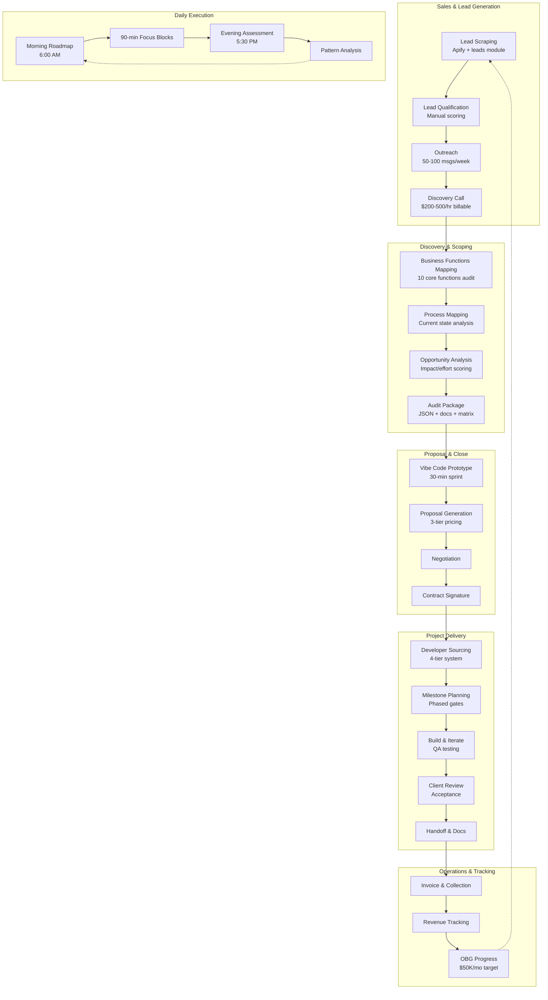
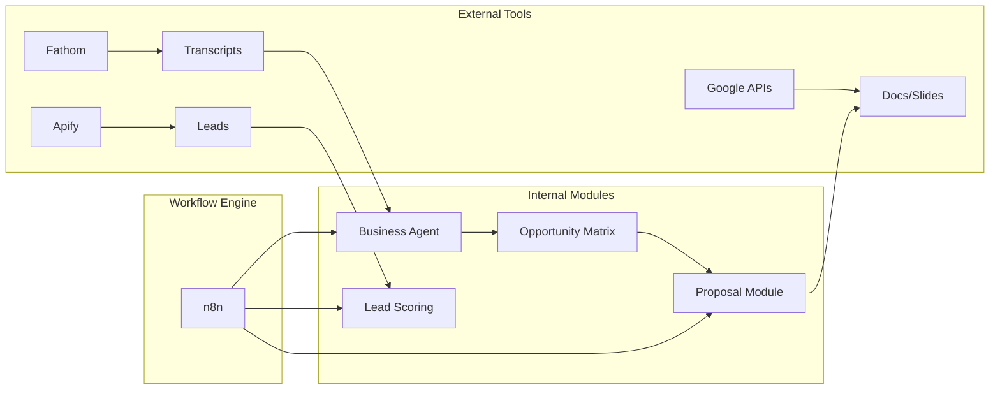

# Agency Business Process Map

*Generated: 2025-12-30*
*Source: Self-Discovery Agent Audit*
*Files Analyzed: 203 (development-os) + 76 (sales-os) = 279 total*

---

## Overview Diagram

---

## Process Details

### 1. Lead Generation (Sales)

**Owner:** Chris Andrade
**Tools:** Audio recording devices, Fireflies (transcription), networking events, referrals
**Current State:** Relationship-driven, manual

| Step | Description | Automated? | Time |
|------|-------------|------------|------|
| 1 | Define ICP criteria | Manual | 30 min |
| 2 | Run Apify scraper (25-lead test) | Automated | 5 min |
| 3 | Verify leads | Manual | 15 min |
| 4 | Full scrape if valid | Automated | 10 min |
| 5 | Upload to Google Sheets | Automated | 2 min |
| 6 | Score & prioritize | Manual | 20 min |

**Automation Opportunity:** Lead scoring can be AI-automated based on industry, size, pain point indicators.

---

### 2. Outreach (Sales)

**Owner:** Chris Andrade
**Tools:** Audio recording, Fireflies, in-person networking, warm referrals
**Current State:** Manual, relationship-focused

| Step | Description | Automated? | Time/Week |
|------|-------------|------------|-----------|
| 1 | Personalize messages | Manual | 3-5 hrs |
| 2 | Send 50-100 messages | Manual | 2-3 hrs |
| 3 | Track responses | Manual | 1 hr |
| 4 | Schedule calls | Manual | 30 min |

**Automation Opportunity:** Email sequencing via Instantly AI, AI-personalized first lines.

---

### 3. Discovery Call (Sales/Technical)

**Owner:** Trent Christopher (Technical Lead)
**Support:** Mekaiel Abdullahi (Requirements)
**Tools:** Google Meet, Fathom/Fireflies, discovery-call-methodology
**Current State:** Structured but manual processing

| Step | Description | Automated? | Time |
|------|-------------|------------|------|
| 1 | Pre-call research | Manual | 15 min |
| 2 | Discovery call (billable) | Manual | 30-60 min |
| 3 | Transcript extraction | Automated (Fathom) | 5 min |
| 4 | Action items extraction | Manual | 15 min |
| 5 | Thank-you + next steps | Manual | 10 min |

**Automation Opportunity:** AI-extracted action items, auto-generated thank-you email with key points.

---

### 4. Business Functions Mapping (Discovery)

**Owner:** Mekaiel Abdullahi (Product Manager)
**Tools:** business-functions-mapping-agent, BMAD agents
**Current State:** Agent-assisted

| Step | Description | Automated? | Time |
|------|-------------|------------|------|
| 1 | Load transcript | Manual | 2 min |
| 2 | Run mapping agent | Automated | 10 min |
| 3 | Review & validate | Manual | 20 min |
| 4 | Generate audit JSON | Automated | 5 min |

**Automation Opportunity:** Direct Fathom → Agent pipeline.

---

### 5. Opportunity Analysis (Discovery)

**Owner:** Mekaiel Abdullahi (PRD creation)
**Review:** Matthew Kerns (Technical feasibility)
**Tools:** Discovery process templates, BMAD PM/Analyst agents
**Current State:** Agent-assisted

| Step | Description | Automated? | Time |
|------|-------------|------------|------|
| 1 | Identify pain points | Agent-assisted | 15 min |
| 2 | Score impact/effort | Manual framework | 20 min |
| 3 | Generate opportunity matrix | Template-based | 15 min |
| 4 | Identify unknowns | Manual review | 10 min |

**Automation Opportunity:** Scoring can be formulaic based on keywords/patterns.

---

### 6. Vibe Coding (Prototype)

**Owner:** Trent Christopher / Matthew Kerns (shared)
**Tools:** Claude Code, AI coding agents, quick prototyping
**Current State:** Manual but fast

| Step | Description | Automated? | Time |
|------|-------------|------------|------|
| 1 | Setup (5 min) | Manual | 5 min |
| 2 | Core build (20 min) | Manual | 20 min |
| 3 | Demo & iterate (5 min) | Manual | 5 min |

**Note:** Intentionally manual - validates feasibility before commitment.

---

### 7. Proposal Generation (Close)

**Owner:** Mekaiel Abdullahi (PRD) / Trent Christopher (Technical Design)
**Review:** Matthew Kerns
**Tools:** proposal module, Google Slides, BMAD agents
**Current State:** Template-driven but manual

| Step | Description | Automated? | Time |
|------|-------------|------------|------|
| 1 | Structure proposal JSON | Manual | 30 min |
| 2 | Validate structure | Automated | 2 min |
| 3 | Generate slides | Automated | 5 min |
| 4 | Review & customize | Manual | 20 min |
| 5 | Deliver to client | Manual | 10 min |

**Automation Opportunity:** Auto-generate proposal JSON from discovery call transcript.

---

### 8. Developer Sourcing (Delivery)

**Owner:** Matthew Kerns / Trent Christopher
**Note:** Currently team is Matthew + Trent for production development
**Tools:** Developer sourcing framework (for future scaling)
**Current State:** In-house team, manual for external sourcing

| Tier | Source | Effort |
|------|--------|--------|
| 1 | Internal system library | Low |
| 2 | Previous developers | Low |
| 3 | Network posting | Medium |
| 4 | Targeted recruiting | High |

**Automation Opportunity:** Developer database with scoring, auto-matching to project needs.

---

### 9. Build & Iterate (Delivery)

**Owner:** Matthew Kerns + Trent Christopher (tag-team)
**Tools:** Claude Code, AutoClaude, AI coding agents, n8n
**Current State:** Milestone-gated, PRD-driven

| Step | Description | Automated? |
|------|-------------|------------|
| 1 | Milestone 1 build | Manual |
| 2 | QA testing | Semi-automated |
| 3 | Client review | Manual |
| 4 | Iterate based on feedback | Manual |
| 5 | Next milestone | Repeat |

---

### 10. Daily Execution (Operations)

**Owner:** Matthew Kerns (Claude Code OS)
**Tools:** Workflow system, slash commands, Claude Code
**Current State:** Designed but command-triggered

| Time | Activity | Automated? |
|------|----------|------------|
| 6:00 AM | Generate daily roadmap | Command-triggered |
| 6:05 AM | Load context | Manual |
| 8:00-5:00 | 90-min focus blocks | Manual execution |
| 5:30 PM | Productivity assessment | Command-triggered |
| 5:40 PM | Tomorrow prep | Manual |

**Automation Opportunity:** Auto-generate roadmap at 6 AM, real-time tracking, auto-assessment.

---

### 11. Revenue Tracking (Operations)

**Owner:** Matthew Kerns
**Tools:** Manual invoicing
**Current State:** Fully manual

| Step | Description | Automated? | Frequency |
|------|-------------|------------|-----------|
| 1 | Create invoice | Manual | Per milestone |
| 2 | Send to client | Manual | Per milestone |
| 3 | Track payment | Manual | Weekly check |
| 4 | Update revenue log | Manual | Weekly |
| 5 | OBG progress check | Manual | Weekly |

**Automation Opportunity:** Invoice generation, payment tracking, auto-OBG dashboard.

---

## Process Maturity Assessment

| Process | Documentation | Automation | Optimization |
|---------|---------------|------------|--------------|
| Lead Generation | ✅ Complete | 🟡 Partial | 🔴 Manual scoring |
| Outreach | ✅ Complete | 🔴 Manual | 🔴 No sequences |
| Discovery Call | ✅ Complete | 🟡 Transcription only | 🟡 Agent-assisted |
| Business Mapping | ✅ Complete | ✅ Agent-driven | ✅ Good |
| Opportunity Analysis | ✅ Complete | 🟡 Template-based | 🟡 Could be formulaic |
| Vibe Coding | ✅ Complete | 🔴 Intentionally manual | ✅ Appropriate |
| Proposal Generation | ✅ Complete | 🟡 Slides automated | 🔴 JSON manual |
| Developer Sourcing | ✅ Complete | 🔴 Manual | 🔴 No database |
| Build & Iterate | ✅ Complete | 🟡 Milestone-gated | ✅ Good |
| Daily Execution | ✅ Complete | 🟡 Command-triggered | 🔴 Should be automatic |
| Revenue Tracking | 🟡 Partial | 🔴 Manual | 🔴 No dashboard |

---

## Integration Points

---

## Key Handoffs

| From | To | Trigger | Current State |
|------|-----|---------|---------------|
| Chris (Lead Gen) | Trent (Discovery) | Qualified lead | Slack + intro |
| Trent (Discovery) | Mekaiel (PRD) | Discovery complete | Meeting recording + notes |
| Mekaiel (PRD) | Matthew + Trent (Build) | PRD signed off | PRD document in Notion |
| Matthew + Trent (Build) | Mekaiel (Client) | Milestone complete | Code + demo ready |
| Mekaiel (Client) | Matthew (Invoice) | Client approval | Sign-off confirmation |

---

## Bottleneck Analysis

### Current Bottlenecks

1. **PRD Creation Speed** - Mekaiel needs to get PRD to dev team quickly for sign-off
2. **Fireflies/Fathom Integration** - Meeting transcripts not auto-flowing to PRD process
3. **No Integrated CRM** - Lead tracking across systems
4. **Payment Tracking** - No automated collection/reminder system
5. **Daily Planning** - Command-triggered vs auto-generated

### Resolution Recommendations

| Bottleneck | Solution | Priority |
|------------|----------|----------|
| PRD Creation Speed | BMAD agents + Fireflies integration | P1 |
| Fireflies/Fathom Integration | Auto-extract to PRD template | P1 |
| No CRM | Implement lead pipeline in Notion/Sheets | P1 |
| Payment Tracking | Invoice automation + reminders | P2 |
| Daily Planning | Auto-generate at 6 AM | P1 |

---

*Next Update: Weekly audit*
