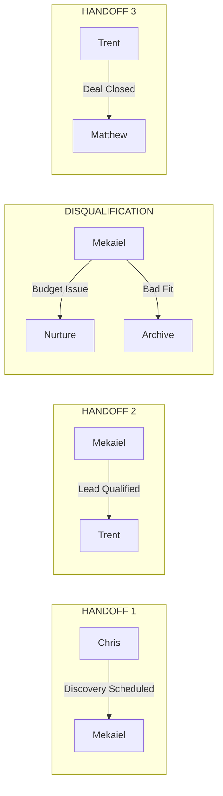
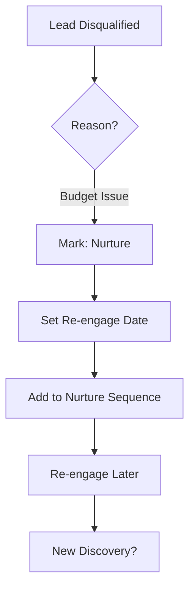
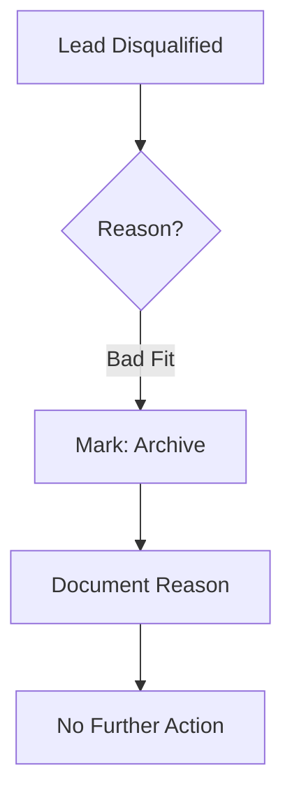

# SOP: Handoff Procedures

**Document ID:** ARISE-HO-001
**Version:** 1.0
**Effective Date:** February 2026
**Process Owner:** Trent (Coordinator)
**Last Updated:** 2026-02-14

---

## Purpose

Define the three critical handoff points in the Arise AI Group sales process. Clear handoffs prevent leads from falling through the cracks and ensure each team member has the information they need to succeed.

---

## Scope

**Applies to:** All team members involved in sales handoffs

| Handoff | From | To | Trigger |
|---------|------|-----|---------|
| Handoff 1 | Chris | Mekaiel | Discovery call scheduled |
| Handoff 2 | Mekaiel | Trent | Lead qualified, opportunity matrix complete |
| Handoff 3 | Trent | Matthew | Deal closed, contract signed |

---

## Handoff Overview



---

## Handoff 1: Chris → Mekaiel

### Trigger

Discovery call scheduled with prospect.

### Actions

| Step | Owner | Action | Channel |
|------|-------|--------|---------|
| 1 | Chris | Post handoff notification | Slack #sales |
| 2 | Mekaiel | Confirm receipt | Slack reply |
| 3 | Chris | Ensure Notion record is complete | Notion |

### Required Information

Chris must provide the following before handoff:

| Item | Description | Required |
|------|-------------|----------|
| Contact logged in Notion | Full contact record with name, email, phone, company | Yes |
| Company context | What the company does, size, industry | Yes |
| Initial interest | What problem they're trying to solve, why they're interested | Yes |
| Discovery call details | Date, time, calendar invite link | Yes |
| Source | How the lead was generated (referral, outbound, inbound) | Yes |
| Notes | Any relevant conversation history or context | No |

### Handoff Message Template

```
**HANDOFF 1: New Discovery Scheduled**

**Company:** [Company Name]
**Contact:** [Name] - [Title]
**Discovery Date:** [Date/Time]

**Context:**
- Company does: [Brief description]
- Initial interest: [What they're looking for]
- Source: [How we found them]

**Notion Link:** [Link to lead record]

@Mekaiel please confirm receipt
```

### Confirmation Required

Mekaiel must reply with confirmation within 4 business hours. If no confirmation, Chris follows up via DM.

---

## Handoff 2: Mekaiel → Trent

### Trigger

Lead qualified AND opportunity matrix complete.

### Actions

| Step | Owner | Action | Channel |
|------|-------|--------|---------|
| 1 | Mekaiel | Complete opportunity matrix | Notion |
| 2 | Mekaiel | Post handoff notification with discovery package | Slack #sales |
| 3 | Trent | Confirm receipt and review | Slack reply |
| 4 | Mekaiel | Update lead status in Notion | Notion |

### Required Information (Discovery Package)

Mekaiel must provide the following before handoff:

| Item | Description | Required |
|------|-------------|----------|
| Discovery transcript/notes | Summary of discovery call conversation | Yes |
| Opportunity matrix | Completed opportunity assessment | Yes |
| Qualification status | Explicit "Qualified" or "Disqualified" with reasoning | Yes |
| Budget indication | What budget range they indicated (if any) | Yes |
| Timeline | When they want to start, urgency level | Yes |
| Decision maker | Who makes the buying decision | Yes |
| Pain points | Specific problems they need solved | Yes |
| Success criteria | How they'll measure success | No |
| Competition | Other solutions they're considering | No |

### Handoff Message Template

```
**HANDOFF 2: Lead Qualified for Proposal**

**Company:** [Company Name]
**Contact:** [Name] - [Title]
**Qualification:** QUALIFIED

**Discovery Summary:**
- Pain points: [Key problems]
- Budget: [Range or indication]
- Timeline: [When they want to start]
- Decision maker: [Who signs]

**Opportunity Matrix:** [Link]
**Discovery Notes:** [Link]
**Notion Record:** [Link]

@Trent please confirm receipt
```

### Confirmation Required

Trent must reply with confirmation within 4 business hours. If no confirmation, Mekaiel follows up via DM.

---

## Disqualification Paths

When Mekaiel determines a lead is not qualified, one of two paths applies:

### Path A: Budget Issue → Nurture

**Criteria:** Lead has genuine need and fit, but budget/timing doesn't work now.

| Step | Action | Owner |
|------|--------|-------|
| 1 | Mark as "Disqualified - Nurture" in Notion | Mekaiel |
| 2 | Set re-engagement date (30/60/90 days) | Mekaiel |
| 3 | Add to nurture sequence | Chris |
| 4 | Re-engage when date triggers | Chris |



### Path B: Bad Fit → Archive

**Criteria:** Lead is not a good fit for our services (wrong industry, wrong size, misaligned expectations).

| Step | Action | Owner |
|------|--------|-------|
| 1 | Mark as "Disqualified - Archive" in Notion | Mekaiel |
| 2 | Document reason for archive | Mekaiel |
| 3 | No further action | — |



### Disqualification Notification

Even disqualified leads need a handoff notification so the team stays informed:

```
**DISQUALIFICATION NOTICE**

**Company:** [Company Name]
**Status:** DISQUALIFIED - [Nurture/Archive]

**Reason:** [Brief explanation]
**Action:** [Nurture: Re-engage on X date / Archive: No action]

**Notion Record:** [Link]
```

---

## Handoff 3: Trent → Matthew

### Trigger

Deal closed AND contract signed.

### Actions

| Step | Owner | Action | Channel |
|------|-------|--------|---------|
| 1 | Trent | Confirm contract signed | Notion |
| 2 | Trent | Schedule kickoff meeting with client + Matthew | Calendar |
| 3 | Trent | Post handoff notification with project package | Slack #delivery |
| 4 | Matthew | Confirm receipt | Slack reply |
| 5 | Matthew | Review materials before kickoff | — |

### Required Information (Project Package)

Trent must provide the following before handoff:

| Item | Description | Required |
|------|-------------|----------|
| Signed SOW | Executed Statement of Work / contract | Yes |
| Milestone presentation | Maps first engagement to transformation | Yes |
| Client contacts | Primary contact + stakeholders with roles | Yes |
| Kickoff meeting | Scheduled date/time with calendar invite | Yes |
| Budget | Contract value and payment terms | Yes |
| Timeline | Project duration and key dates | Yes |
| Scope summary | What we're delivering | Yes |
| Discovery notes | Original discovery call notes for context | No |
| Proposal | Final proposal that was accepted | No |

### Handoff Message Template

```
**HANDOFF 3: Deal Closed - Ready for Delivery**

**Company:** [Company Name]
**Contract Value:** $[Amount]
**Timeline:** [Start Date] - [End Date]

**Primary Contact:** [Name] - [Title] - [Email]

**Scope:**
- [Deliverable 1]
- [Deliverable 2]
- [Deliverable 3]

**Kickoff Meeting:** [Date/Time]

**Attachments:**
- Signed SOW: [Link]
- Milestone Presentation: [Link]
- Client Contacts: [Link]

@Matthew please confirm receipt
```

### Confirmation Required

Matthew must reply with confirmation within 4 business hours. If no confirmation, Trent follows up via DM.

---

## Handoff Checklist

Use this checklist to verify handoffs are complete:

### Handoff 1 (Chris → Mekaiel)
- [ ] Contact logged in Notion with all required fields
- [ ] Company context documented
- [ ] Initial interest captured
- [ ] Discovery call scheduled and on calendar
- [ ] Handoff message posted in Slack
- [ ] Confirmation received from Mekaiel

### Handoff 2 (Mekaiel → Trent)
- [ ] Discovery call completed
- [ ] Discovery notes/transcript documented
- [ ] Opportunity matrix complete
- [ ] Qualification decision made and documented
- [ ] Handoff message posted in Slack
- [ ] Confirmation received from Trent

### Handoff 3 (Trent → Matthew)
- [ ] Contract signed
- [ ] Milestone presentation created
- [ ] Client contacts documented
- [ ] Kickoff meeting scheduled
- [ ] Handoff message posted in Slack
- [ ] Confirmation received from Matthew

---

## Escalation

If a handoff is stuck (no confirmation after follow-up DM):

1. Escalate to Trent (or to the other coordinator if Trent is the blocker)
2. Discuss in next daily standup
3. Trent resolves the blocker

---

## Related SOPs

- [SOP-ARISE-SL-001: Sales Lifecycle Overview](./SOP-ARISE-SL-001-sales-lifecycle.md)
- [SOP-ARISE-SD-001: Sales-Developer Collaboration](./SOP-ARISE-SD-001-sales-dev-collaboration.md)

---

## Appendix: Diagram Sources

> **Note:** This section contains editable source code for diagrams above.
> Copy to [Mermaid Live Editor](https://mermaid.live) to modify.

### Handoff Overview

```text
graph LR
    subgraph H1[" HANDOFF 1 "]
        A[Chris] -->|Discovery Scheduled| B[Mekaiel]
    end

    subgraph H2[" HANDOFF 2 "]
        C[Mekaiel] -->|Lead Qualified| D[Trent]
    end

    subgraph DQ[" DISQUALIFICATION "]
        E[Mekaiel] -->|Budget Issue| F[Nurture]
        E -->|Bad Fit| G[Archive]
    end

    subgraph H3[" HANDOFF 3 "]
        H[Trent] -->|Deal Closed| I[Matthew]
    end
```

### Nurture Path

```text
graph TD
    A[Lead Disqualified] --> B{Reason?}
    B -->|Budget Issue| C[Mark: Nurture]
    C --> D[Set Re-engage Date]
    D --> E[Add to Nurture Sequence]
    E --> F[Re-engage Later]
    F --> G[New Discovery?]
```

### Archive Path

```text
graph TD
    A[Lead Disqualified] --> B{Reason?}
    B -->|Bad Fit| C[Mark: Archive]
    C --> D[Document Reason]
    D --> E[No Further Action]
```
