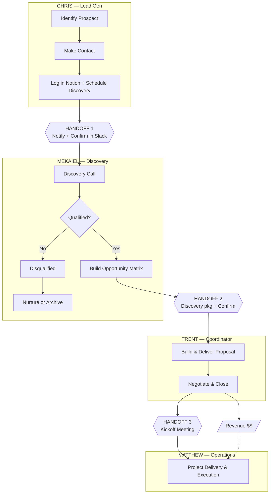
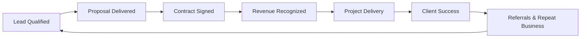

# SOP: Sales Lifecycle Overview

**Document ID:** ARISE-SL-001
**Version:** 1.0
**Effective Date:** February 2026
**Process Owner:** Trent (Coordinator)
**Last Updated:** 2026-02-14

---

## Purpose

Define the complete sales lifecycle for Arise AI Group, from initial lead identification through project delivery. This SOP ensures every team member understands their role, handoff points, and communication expectations.

---

## Scope

**Applies to:** All Arise AI Group team members involved in sales and delivery

| Role | Person | Primary Responsibility |
|------|--------|------------------------|
| Lead Gen | Chris | Identify prospects, make contact, log in Notion, schedule discovery |
| Discovery | Mekaiel | Conduct discovery calls, qualify leads, build opportunity matrix |
| Coordinator | Trent | Build proposals, negotiate, close deals, monitor all stages |
| Operations | Matthew | Project delivery and execution |

---

## Sales Lifecycle Flow



**Note:** Trent monitors all stages via daily 10-minute Notion review.

---

## Stage-by-Stage Responsibilities

### Stage 1: Lead Generation (Chris)

| Step | Action | Output |
|------|--------|--------|
| 1.1 | Identify prospect | Target company identified |
| 1.2 | Make contact | Initial conversation/rapport built |
| 1.3 | Log in Notion | Lead record created with company context |
| 1.4 | Schedule discovery | Calendar invite sent to prospect + Mekaiel |

**Exit criteria:** Discovery call scheduled, lead logged in Notion

---

### Stage 2: Discovery (Mekaiel)

| Step | Action | Output |
|------|--------|--------|
| 2.1 | Conduct discovery call | Call transcript/notes |
| 2.2 | Qualify the lead | Qualification decision (Yes/No) |
| 2.3 | Build opportunity matrix | Opportunity matrix document |

**Exit criteria (qualified):** Opportunity matrix complete, discovery package ready for Trent

**Disqualification paths:**
- **Budget issue:** Move to nurture sequence (re-engage later)
- **Bad fit:** Archive (no further action)

---

### Stage 3: Proposal & Close (Trent)

| Step | Action | Output |
|------|--------|--------|
| 3.1 | Build proposal | Proposal document |
| 3.2 | Deliver proposal | Proposal presented to client |
| 3.3 | Negotiate terms | Agreed terms |
| 3.4 | Close deal | Signed contract/SOW |

**Exit criteria:** Contract signed, kickoff meeting scheduled

---

### Stage 4: Delivery (Matthew)

| Step | Action | Output |
|------|--------|--------|
| 4.1 | Kickoff meeting | Project kickoff complete |
| 4.2 | Execute project | Deliverables completed |
| 4.3 | Deliver milestones | Client milestones met |

**Exit criteria:** Project delivered, client satisfied

---

## Communication Protocol

### Async (Default)

Use asynchronous communication as the default. Meetings are the exception.

| Communication Type | Channel |
|--------------------|---------|
| Status updates | Slack channel |
| Questions | Slack DM |
| Progress reports | Notion |
| Ideas & feedback | Slack thread |
| Lead updates | Notion record |
| FYI / link sharing | Slack |

---

### Meetings (Exception Only)

Only schedule meetings for:

| Scenario | Why Meeting Required |
|----------|---------------------|
| Team decision with disagreement | Need real-time discussion to resolve |
| Client-facing call prep | Alignment before external communication |
| Deal strategy (close stage) | Complex negotiation planning |
| Unresolvable conflict | Mediation required |
| New client kickoff | Formal project start |
| Standing meetings | Pre-scheduled recurring meetings |

**Rule:** All non-standing meetings must have an agenda, time limit, and expected output.

---

### Standing Meetings

| Meeting | Frequency | Duration | Purpose |
|---------|-----------|----------|---------|
| Daily Standup | Daily | 15 min | Quick sync on blockers and priorities |
| Weekly Pipeline Review | Friday | 30 min | Review pipeline status, forecast |
| 1-on-1s with Trent | Weekly | 30 min | Individual check-ins and coaching |

**No-call day:** Preserved (check team calendar for designated day)

---

### Routing Rules

| Topic | Route To | Notes |
|-------|----------|-------|
| Task-specific work | Direct to owner | Go direct, don't loop everyone |
| Pipeline / clients | Loop Trent | Trent needs visibility on all deals |
| Priority changes | Trent first | Get alignment before shifting focus |
| Conflict | Trent mediates | Escalate unresolved disagreements |

**Principle:** Visibility, not approval. Keep Trent informed but don't wait for permission on routine tasks.

---

## Revenue Flow



Revenue is recognized upon contract signing (CLOSED WON). Project delivery follows revenue recognition.

---

## Related SOPs

- [SOP-ARISE-HO-001: Handoff Procedures](./SOP-ARISE-HO-001-handoff-procedures.md)
- [SOP-ARISE-SD-001: Sales-Developer Collaboration](./SOP-ARISE-SD-001-sales-dev-collaboration.md)

---

## Appendix: Diagram Sources

> **Note:** This section contains editable source code for diagrams above.
> Copy to [Mermaid Live Editor](https://mermaid.live) to modify.

### Sales Lifecycle Flow

```text
graph TD
    subgraph CHRIS[" CHRIS — Lead Gen "]
        A[Identify Prospect] --> B[Make Contact]
        B --> C[Log in Notion + Schedule Discovery]
    end

    C --> H1{{"HANDOFF 1<br/>Notify + Confirm in Slack"}}

    subgraph MEKAIEL[" MEKAIEL — Discovery "]
        D[Discovery Call] --> E{Qualified?}
        E -->|Yes| F[Build Opportunity Matrix]
        E -->|No| DQ[Disqualified]
        DQ --> DQ1[Nurture or Archive]
    end

    H1 --> D
    F --> H2{{"HANDOFF 2<br/>Discovery pkg + Confirm"}}

    subgraph TRENT[" TRENT — Coordinator "]
        G[Build & Deliver Proposal] --> H[Negotiate & Close]
    end

    H2 --> G
    H --> H3{{"HANDOFF 3<br/>Kickoff Meeting"}}
    H --> REV[/"Revenue $$"/]

    subgraph MATTHEW[" MATTHEW — Operations "]
        I[Project Delivery & Execution]
    end

    H3 --> I
    REV -.-> I
```

### Revenue Flow

```text
graph LR
    A[Lead Qualified] --> B[Proposal Delivered]
    B --> C[Contract Signed]
    C --> D[Revenue Recognized]
    D --> E[Project Delivery]
    E --> F[Client Success]
    F --> G[Referrals & Repeat Business]
    G --> A
```
