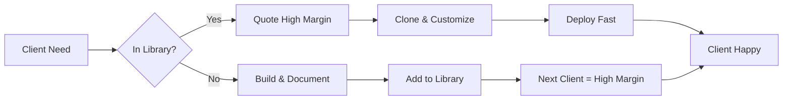

# AI Agency Reusable Components Library

> **Purpose:** Maximize profitability by never building the same thing twice
> **Impact:** Turn 30% margins into 70%+ margins
> **Strategy:** Every project adds to this library

## Quick Margin Calculator

```
First Implementation: $5,000 revenue - $3,000 dev cost = 40% margin
Second Implementation: $5,000 revenue - $500 customization = 90% margin
Third Implementation: $5,000 revenue - $200 config only = 96% margin
```

## Component Catalog

### 🔐 Authentication Systems

| Component | Setup Time | Client Value | Your Cost | Margin | Ready? |
|-----------|------------|-------------|-----------|--------|--------|
| [Clerk Auth](./authentication/clerk-auth/) | 2 hours | $1,000-2,000 | $100 | 90-95% | ✅ |
| Supabase Auth | 3 hours | $1,500-2,500 | $150 | 90-94% | 🚧 |
| Auth0 Enterprise | 1 day | $3,000-5,000 | $500 | 83-90% | 📝 |
| Custom JWT | 2 days | $2,000-3,000 | $1,000 | 50-67% | 📝 |

### 💾 Database Solutions

| Component | Setup Time | Client Value | Your Cost | Margin | Ready? |
|-----------|------------|-------------|-----------|--------|--------|
| [Convex Real-time](./database/convex-integration/) | 4 hours | $2,000-4,000 | $200 | 90-95% | ✅ |
| Supabase + PostgREST | 6 hours | $2,500-4,500 | $300 | 88-93% | 🚧 |
| MongoDB + Prisma | 1 day | $3,000-5,000 | $500 | 83-90% | 📝 |
| Vector DB (Pinecone) | 4 hours | $2,000-3,000 | $200 | 90-93% | 📝 |

### 📄 Document Processing

| Component | Setup Time | Client Value | Your Cost | Margin | Ready? |
|-----------|------------|-------------|-----------|--------|--------|
| [Invoice Automation](./document-processing/invoice-automation/) | 2-3 days | $5,000-15,000 | $500-1,500 | 70-97% | ✅ |
| Receipt Processing | 2 days | $4,000-10,000 | $500-1,000 | 75-95% | 🚧 |
| Contract Analysis | 3 days | $8,000-20,000 | $1,000-2,000 | 75-95% | 📝 |
| Resume Parsing | 1 day | $3,000-8,000 | $300-800 | 73-96% | 📝 |

### 🤖 AI Integrations

| Component | Setup Time | Client Value | Your Cost | Margin | Ready? |
|-----------|------------|-------------|-----------|--------|--------|
| ChatGPT Chatbot | 1 day | $3,000-8,000 | $300-800 | 73-96% | 🚧 |
| Claude Assistant | 1 day | $3,000-10,000 | $300-1,000 | 70-97% | 🚧 |
| Voice AI (ElevenLabs) | 2 days | $5,000-12,000 | $500-1,500 | 75-96% | 📝 |
| Image Generation | 4 hours | $2,000-5,000 | $200-500 | 75-96% | 📝 |

### 📊 Analytics & Reporting

| Component | Setup Time | Client Value | Your Cost | Margin | Ready? |
|-----------|------------|-------------|-----------|--------|--------|
| Real-time Dashboard | 2 days | $4,000-10,000 | $500-1,000 | 75-95% | 📝 |
| PDF Report Generator | 1 day | $2,000-5,000 | $300-500 | 75-95% | 📝 |
| Data Export System | 4 hours | $1,500-3,000 | $150-300 | 80-95% | 📝 |
| Analytics Pipeline | 3 days | $6,000-15,000 | $1,000-2,000 | 75-92% | 📝 |

### 🔄 Workflow Automation

| Component | Setup Time | Client Value | Your Cost | Margin | Ready? |
|-----------|------------|-------------|-----------|--------|--------|
| Email Automation | 1 day | $2,000-5,000 | $300-500 | 75-94% | 📝 |
| Approval Workflows | 2 days | $4,000-8,000 | $500-1,000 | 75-94% | 📝 |
| Notification System | 1 day | $2,000-4,000 | $200-400 | 80-95% | 📝 |
| Task Scheduling | 1 day | $2,500-5,000 | $300-500 | 80-94% | 📝 |

## Status Legend
- ✅ **Ready** - Fully documented, tested, ready to deploy
- 🚧 **In Progress** - Being documented from existing projects
- 📝 **Planned** - Identified, not yet documented

## How to Use This Library

### 1. During Discovery Call ($500)
```
Client: "We need invoice processing automation"
You: Check library → Invoice Automation ✅ Ready
     → Quote: $8,000 (knowing your cost is $1,000)
     → Margin: 87.5%
```

### 2. During Vibe Coding
```
1. Pull component template
2. Customize for client's specific needs
3. Show working prototype in 2-4 hours
4. Client sees immediate value → easier close
```

### 3. During Development
```
1. Clone the component
2. Update branding/config
3. Add client-specific features (10-20% of work)
4. Deploy in 1/3 the time
```

## Pricing Strategy

### Package Tiers

| Tier | When to Use | Markup | Example |
|------|------------|--------|---------|
| **Quick Win** | Component is 90% ready | 5-10x cost | $500 cost → $5,000 price |
| **Standard** | Component needs customization | 3-5x cost | $1,500 cost → $6,000 price |
| **Complex** | Multiple components + custom | 2-3x cost | $5,000 cost → $12,000 price |
| **Enterprise** | Full system integration | 2x cost + monthly | $10,000 cost → $20,000 + $2,000/mo |

### Value-Based Pricing Formula

```
Base Component Cost: $X
+ Customization Time: $Y
+ Integration Complexity: $Z
= Your Internal Cost

Client Value Created: $VALUE
Your Price: 20-30% of $VALUE
(Never less than 3x your cost)
```

## Implementation Workflow



## ROI Tracking

### Per Component Metrics
Track for each component:
- Times reused
- Total revenue generated
- Average margin
- Time saved per implementation
- Client satisfaction score

### Example: Invoice Automation
```
Built: October 2024
Original Cost: $3,000
Times Reused: 4

Revenue Generated:
- Client 1: $8,000 (original)
- Client 2: $6,000 (customized)
- Client 3: $5,000 (standard)
- Client 4: $7,500 (with integrations)

Total Revenue: $26,500
Total Cost: $3,000 + $800 + $500 + $1,000 = $5,300
ROI: 400% | Average Margin: 80%
```

## Contributing New Components

### When You Build Something New

1. **Document Immediately**
   - Architecture diagram
   - Setup instructions
   - Common customizations
   - Pricing suggestions

2. **Create Template**
   - Remove client-specific code
   - Add configuration variables
   - Include example data

3. **Add to Library**
   - Update this README
   - Create component guide
   - Add to pricing matrix

4. **Track Performance**
   - Implementation time
   - Client feedback
   - Reuse potential

## Quick Reference Commands

```bash
# Clone any component
git clone templates/[component-name]

# Quick setup
npm run setup:component [component-name]

# Deploy template
npm run deploy:template [component-name]

# Generate quote
npm run quote:generate [component-name] [customization-level]
```

## Next Components to Document

Priority based on market demand:

1. **Zapier Alternative** - $10k-30k value
2. **Customer Portal** - $5k-15k value
3. **Analytics Dashboard** - $5k-12k value
4. **PDF Generation** - $3k-8k value
5. **Webhook System** - $3k-7k value

## The Golden Rules

1. **Never build from scratch if it's in here**
2. **Every project adds at least one component**
3. **Price based on value, not time**
4. **Second implementation should be 80% faster**
5. **Third implementation should be configuration only**

## Resources

- [Component Templates](./templates/)
- [Pricing Calculator](./tools/pricing-calculator.md)
- [Implementation Checklist](./tools/implementation-checklist.md)
- [Client Presentation Deck](./tools/sales-deck-template.md)

---

*Remember: Every component you document today is margin you protect tomorrow.*