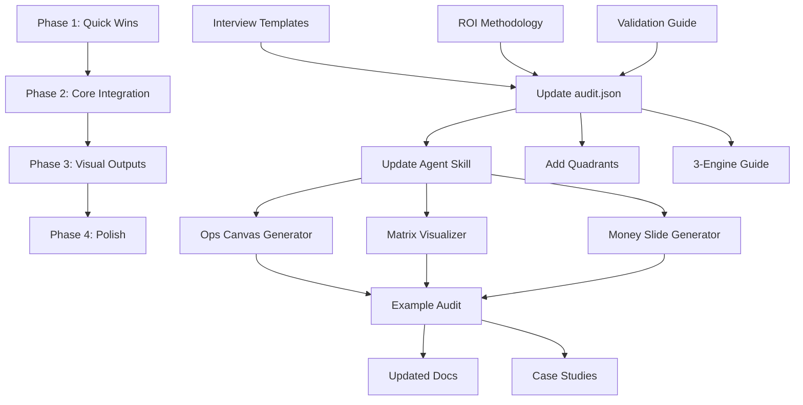

# Liam Ottley Framework Integration - Implementation Plan

**Status**: 📋 Planning
**Start Date**: 2025-12-09
**Target Completion**: 4 weeks
**Owner**: AriseGroup.ai Team

---

## Overview

This plan integrates Liam Ottley's $10K AI Audit framework into our existing comprehensive-ai-audit system, using the **Hybrid Approach** to maintain our data-first advantages while adding missing tactical components.

**Reference**: See `liam-ottley-framework-comparison.md` for full gap analysis

---

## Integration Strategy

### What We're Adding
1. ✅ Detailed interview templates (stakeholder + end-user)
2. ✅ Validation workshop process
3. ✅ Revenue uplift ROI calculation methodology
4. ✅ Visual output generators (Ops Canvas, Opportunity Matrix, Money Slide)
5. ✅ 3-engine categorization framework
6. ✅ Opportunity quadrant classification

### What We're Keeping
1. ✅ audit.json as source of truth
2. ✅ Claude Code skill automation
3. ✅ 7-phase workflow structure
4. ✅ Implementation-ready outputs
5. ✅ Business functions mapping integration

---

## Phase 1: Quick Wins (Week 1)

**Goal**: Add critical missing interview and ROI components
**Timeline**: 3-5 days
**Priority**: 🔴 HIGH

### Task 1.1: Create Interview Question Templates

**Files to Create**:
- `templates/stakeholder-interview-questions.md`
- `templates/end-user-interview-questions.md`
- `documentation/interview-best-practices.md`

**Content**:

#### stakeholder-interview-questions.md
```markdown
# Stakeholder Interview Questions (30,000-Foot View)

Duration: 30-45 minutes
Interviewee: C-level, VP, Director, Manager
Purpose: Understand high-level business goals, team structures, challenges, and strategic vision

## 1. Role & Team Overview
- Can you describe your role and your team's primary responsibilities?
- What are the main goals or KPIs your team is responsible for this quarter/year?
- Could you walk me through your team's structure? Who reports to whom?
- How many people are on your team? What are their primary roles?

## 2. Core Processes & Workflow
- From a high level, what are the most critical processes your team manages?
- Where do you see the biggest bottlenecks or delays in your team's workflow?
- Which tasks seem to consume the most man-hours or resources?
- What processes keep you up at night?

## 3. Tools & Technology
- What are the main software systems or tools your team relies on?
- What are your biggest frustrations with your current technology stack?
- Are there important processes that happen outside of your main software (e.g., in spreadsheets, email, manual documents)?
- What tools did you try that didn't work out? Why?

## 4. Pain Points & Strategic Challenges
- What are the biggest challenges your team is facing right now?
- If you had a magic wand, what is the one problem you would solve for your team overnight?
- What do you feel is preventing your team from being more efficient or effective?
- Where do you lose the most time? The most money? The most opportunities?

## 5. Future Vision
- Where do you see the biggest opportunities for improvement in your department?
- What would success look like 6 months from now? 1 year from now?
- How does your team generally respond to new technology? What would make a new tool successful versus likely to be resisted?
- If this initiative works perfectly, what changes?

## 6. Context & Constraints
- What budget constraints should we be aware of?
- What timeline are you working with?
- Are there any political or organizational dynamics we should understand?
- Who else should we talk to? Who needs to be involved in decisions?

## Interview Best Practices
- Listen 80%, talk 20%
- Ask "Why?" repeatedly to get to root causes
- Record the call (with permission) - use Fireflies.ai or similar
- Take note of exact quotes - these are gold for presentations
- Focus on problems, not solutions (solutions come later)
- Pay attention to emotion - where do they get frustrated, excited?
```

#### end-user-interview-questions.md
```markdown
# End-User Interview Questions (On-the-Ground Reality)

Duration: 30-45 minutes
Interviewee: Individual contributors, specialists, frontline staff
Purpose: Understand day-to-day workflows, manual processes, pain points, and frustrations

## 1. Daily Role & Responsibilities
- Can you walk me through a typical day or week in your role?
- What are the 1-3 most common tasks you perform every day?
- How much of your day is spent on your core responsibilities versus administrative or repetitive tasks?
- What does a "good day" look like? What makes a day frustrating?

## 2. Step-by-Step Process Deep Dive
Pick 1-2 critical processes and go DEEP:

**Process: [e.g., "Onboard a new client"]**
- Could you walk me through the exact steps you take to complete this task?
- What happens first? Then what? Then what? (Keep asking)
- Which part of that process is the most manual or takes the most time?
- What information do you need to find or reference to complete this task, and where do you get it from?
- Where do things typically go wrong or get delayed?

**Key Questions**:
- How long does this typically take?
- How many times per day/week do you do this?
- What happens if you make a mistake? How do you catch it?
- Are there variations in how this gets done? Why?

## 3. Tools & Frustrations
- What software do you spend most of your day working in?
- What do you find most frustrating about the tools you have to use?
- Is there any double-entry of data or copying-and-pasting you have to do between different systems?
- What workarounds have you created to get your job done?
- What would you change about your tools if you could?

## 4. Pain Points & Wishlist
- What is the most boring or repetitive part of your job?
- If you had an assistant, what tasks would you give them immediately?
- How do you currently track your work or report on your progress?
- What keeps you from getting your work done faster or better?
- What questions do you get asked repeatedly? What do you have to explain over and over?

## 5. Data & Information Flow
- Where does the data you work with come from?
- Where does it go when you're done with it?
- What information is hard to find or access?
- Do you ever feel like you're entering the same information multiple times?

## 6. Error Handling & Edge Cases
- What errors or exceptions do you deal with regularly?
- How much time do you spend fixing problems versus doing the work?
- What happens when [system/process] breaks?
- What's your backup plan?

## Interview Best Practices
- Listen 80%, talk 20%
- Ask for SPECIFIC examples ("Tell me about the last time you did this")
- Ask to see their screen/tools while they walk through processes
- Pay attention to tone - where do they sigh, laugh, roll eyes?
- Get exact numbers: "How long?" "How many?" "How often?"
- Record the call (with permission)
- Ask "Why is it done that way?" to uncover assumptions
```

#### interview-best-practices.md
```markdown
# AI Audit Interview Best Practices

## Pre-Interview Preparation

### 1. Review Available Materials
- [ ] Sales handoff packet
- [ ] Discovery call notes
- [ ] Intake form responses
- [ ] Company website and LinkedIn
- [ ] Any previous communications

### 2. Set Up Recording
- [ ] Get explicit permission to record
- [ ] Test recording tool (Fireflies.ai, Zoom, etc.)
- [ ] Backup: Take written notes anyway

### 3. Prepare Questions
- [ ] Customize question template for this specific role
- [ ] Research industry-specific terminology
- [ ] Prepare follow-up questions based on what you already know

### 4. Schedule Strategically
- [ ] 30-45 minutes per interview (not longer - focus degrades)
- [ ] Leave 15 minutes between interviews for notes
- [ ] Aim for 3-5 interviews for small businesses (10-50 employees)
- [ ] Aim for 10-15 interviews for larger/complex operations

---

## During the Interview

### The 80/20 Rule
**You should talk 20% of the time, they should talk 80%**

Your 20%:
- Asking questions
- Clarifying what they said
- Minimal acknowledgment ("Got it", "That makes sense")

Their 80%:
- Describing their work
- Explaining processes
- Sharing frustrations
- Telling stories

### The "Why?" Technique
Ask "Why?" 3-5 times to get to root causes:

**Example**:
- **Them**: "We manually enter data from emails into spreadsheets"
- **You**: "Why is it done that way?"
- **Them**: "Because our CRM doesn't integrate with the website form"
- **You**: "Why doesn't it integrate?"
- **Them**: "We use an old CRM that doesn't have an API"
- **You**: "Why haven't you switched?"
- **Them**: "The sales team is comfortable with it and doesn't want to change"
- **You**: "Why is the sales team resistant to change?" ← NOW you've found the real issue

### Focus on Problems, Not Solutions
❌ **Don't**: "Oh, an AI could fix that!"
✅ **Do**: "Tell me more about that. How often does it happen? What's the impact?"

You'll design solutions later. Right now, just understand the pain.

### Get Specific Numbers
Vague answers don't help. Push for specifics:

❌ **Vague**: "It takes a while"
✅ **Specific**: "About 15 minutes per lead, and we get 50-100 leads per week, so that's 12-25 hours per week"

**Key metrics to capture**:
- Time: How long does it take?
- Frequency: How often does it happen?
- Volume: How many per day/week/month?
- Error rate: What percentage have issues?
- Cost: What's the financial impact?

### Capture Exact Quotes
When someone says something particularly powerful, write it down EXACTLY:

> "We're spending 20 hours a week on data entry that adds zero value to our customers"

These quotes are GOLD for presentations. They make the business case for you.

### Watch for Non-Verbal Cues
- **Sighs**: Indicates frustration - dig deeper
- **Long pauses**: They're thinking of the real answer - stay quiet and wait
- **Laughs**: Often covering pain - "It's so ridiculous, but we..."
- **Tone shifts**: Energy drops when discussing boring/painful tasks

### Ask to See Their Screen
"Could you share your screen and show me how you do this?"

Seeing the actual process reveals:
- Hidden steps they forgot to mention
- Workarounds they've created
- Tools they're actually using
- Real complexity vs. described complexity

---

## After the Interview

### 1. Immediate Notes (Do this within 30 minutes)
- [ ] Review recording and add notes
- [ ] Extract key quotes
- [ ] Identify pain points with metrics
- [ ] Note any follow-up questions
- [ ] Rate priority/severity of issues discussed

### 2. Update audit.json
Add to `discovery_interviews` section:
- Interviewee name and role
- Date and duration
- Key findings (bulleted)
- Link to transcript

### 3. Cross-Reference
Look for patterns across interviews:
- Do multiple people mention the same pain point?
- Do stakeholder views match end-user reality?
- Where are the gaps?

---

## Interview Planning Matrix

| Company Size | Recommended Interviews | Mix |
|--------------|----------------------|-----|
| 1-10 employees | 2-3 interviews | 1 stakeholder, 1-2 end-users |
| 10-50 employees | 3-5 interviews | 1-2 stakeholders, 2-3 end-users |
| 50-200 employees | 5-10 interviews | 2-3 stakeholders, 3-7 end-users |
| 200+ employees | 10-15 interviews | 3-5 stakeholders, 7-10 end-users |

**Stakeholder = Manager, Director, VP, C-level**
**End-user = Individual contributor doing the daily work**

---

## Common Interview Mistakes to Avoid

### ❌ Mistake 1: Suggesting Solutions Too Early
**Why it's bad**: Shuts down conversation, makes you miss deeper issues
**Fix**: Stay curious, keep asking about problems

### ❌ Mistake 2: Accepting Vague Answers
**Why it's bad**: Can't build ROI case without numbers
**Fix**: Always ask "About how long?" "How many?" "How often?"

### ❌ Mistake 3: Talking Too Much
**Why it's bad**: You learn nothing when you're talking
**Fix**: Set a timer, aim for 80/20 ratio

### ❌ Mistake 4: Not Recording
**Why it's bad**: You'll miss details, misremember, can't reference later
**Fix**: Always record (with permission), use AI transcription

### ❌ Mistake 5: Interviewing Only Leadership
**Why it's bad**: Leaders often don't know the on-the-ground reality
**Fix**: Always interview end-users who do the daily work

### ❌ Mistake 6: Not Preparing
**Why it's bad**: Wastes their time, makes you look unprofessional
**Fix**: Review all available materials before the call

### ❌ Mistake 7: One-Size-Fits-All Questions
**Why it's bad**: Generic questions get generic answers
**Fix**: Customize questions for each role and company

---

## Interview Success Checklist

Before you conclude the interview phase, verify:

- [ ] Interviewed at least 1 stakeholder (leadership perspective)
- [ ] Interviewed at least 2 end-users (ground-level reality)
- [ ] Have recordings or detailed transcripts
- [ ] Captured specific metrics (time, frequency, cost)
- [ ] Identified 3-5 major pain points with quantified impact
- [ ] Collected powerful quotes for presentation
- [ ] Understand 3-5 critical processes end-to-end
- [ ] Know what tools/systems they use and why
- [ ] Understand team dynamics and change resistance factors
- [ ] Updated audit.json with all interview data

---

**Next Step**: Move to Process Mapping phase with interview insights
```

**Outcome**: Consultants have battle-tested interview frameworks

---

### Task 1.2: Document Revenue Uplift ROI Calculation

**File to Create**: `documentation/roi-calculation-methodology.md`

**Content**: Full step-by-step guide to calculating:
1. Direct cost savings (existing)
2. **Revenue uplift from reallocated time** (new)
3. Combined ROI presentation

**Example**:
```markdown
## Revenue Uplift Calculation

### Step 1: Calculate Time Saved
Hours saved per week × % reallocated to revenue-generating activities = Revenue hours unlocked

Example: 10 hours saved × 50% = 5 hours available for sales

### Step 2: Calculate Revenue Value Per Hour
Average deal value ÷ Hours to close = Value per hour

Example: $5,000 deal ÷ 2 hours = $2,500 per hour

### Step 3: Calculate Annual Revenue Uplift
Revenue hours per week × Value per hour × 52 weeks = Annual revenue potential

Example: 5 hours × $2,500 × 52 = $650,000 annual revenue potential
```

**Outcome**: ROI calculations now include revenue opportunity, not just cost savings

---

### Task 1.3: Add Validation Workshop Process

**File to Create**: `documentation/opportunity-validation-workshop.md`

**Content**:
- When to run validation workshop (after opportunity identification)
- Who to invite (stakeholders who will approve/implement)
- How to facilitate (collaborative, not pitching)
- Validation questions template
- How to document feedback in audit.json

**Outcome**: Formal co-creation step ensures client buy-in before roadmap

---

### Task 1.4: Create "Money Slide" Generator Concept

**File to Create**: `documentation/money-slide-generator.md`

**Content**:
- What the Money Slide is (table format)
- Required data from audit.json
- Template structure
- Example output

**Note**: Phase 3 will build the actual generator function

**Outcome**: Documentation for most compelling presentation slide

---

## Phase 2: Core Integration (Week 2)

**Goal**: Update audit.json structure and workflow
**Timeline**: 5-7 days
**Priority**: 🔴 HIGH

### Task 2.1: Enhance audit-template.json

**File to Update**: `templates/audit-template.json`

**Changes to Add**:

```json
{
  "discovery_interviews": {
    "stakeholder_interviews": [
      {
        "interviewee_name": "",
        "role": "",
        "date": "",
        "duration_minutes": 0,
        "interview_type": "stakeholder",
        "key_findings": [],
        "pain_points_mentioned": [],
        "transcript_link": "",
        "recording_link": "",
        "notes": ""
      }
    ],
    "end_user_interviews": [
      {
        "interviewee_name": "",
        "role": "",
        "date": "",
        "duration_minutes": 0,
        "interview_type": "end_user",
        "processes_described": [],
        "key_findings": [],
        "pain_points_mentioned": [],
        "transcript_link": "",
        "recording_link": "",
        "notes": ""
      }
    ],
    "interview_summary": {
      "total_interviews": 0,
      "stakeholder_count": 0,
      "end_user_count": 0,
      "key_themes": [],
      "top_pain_points": []
    }
  },

  "ops_canvas": {
    "acquisition_engine": {
      "description": "How the business finds and signs new customers",
      "processes": [],
      "time_sinks": [],
      "quality_risks": [],
      "systems_involved": []
    },
    "delivery_engine": {
      "description": "How the business delivers its product or service",
      "processes": [],
      "time_sinks": [],
      "quality_risks": [],
      "systems_involved": []
    },
    "support_engine": {
      "description": "How the business handles customer questions and post-sale issues",
      "processes": [],
      "time_sinks": [],
      "quality_risks": [],
      "systems_involved": []
    }
  },

  "ai_opportunity_matrix": [
    {
      // ... existing fields ...
      "quadrant": "quick_win|big_swing|nice_to_have|deprioritize",
      "business_engine": "acquisition|delivery|support",
      "roi_calculation": {
        "direct_cost_savings": {
          "hours_saved_per_week": 0,
          "number_of_employees_affected": 0,
          "avg_hourly_rate": 0,
          "weekly_cost_savings": 0,
          "annual_cost_savings": 0
        },
        "revenue_uplift": {
          "hours_saved_per_week": 0,
          "percent_reallocated_to_revenue": 0,
          "revenue_generating_hours_per_week": 0,
          "value_per_hour": 0,
          "calculation_method": "",
          "weekly_revenue_potential": 0,
          "annual_revenue_potential": 0
        },
        "total_annual_value": 0,
        "implementation_cost": 0,
        "roi_percentage": 0,
        "break_even_months": 0,
        "payback_period": ""
      }
    }
  ],

  "opportunity_validation": {
    "validation_workshop_held": false,
    "workshop_date": "",
    "attendees": [],
    "opportunities_reviewed": [],
    "validated_opportunities": [],
    "deprioritized_opportunities": [],
    "modified_opportunities": [],
    "stakeholder_feedback": [
      {
        "opportunity_id": "",
        "feedback": "",
        "concerns_raised": [],
        "support_level": "high|medium|low"
      }
    ],
    "agreed_upon_priorities": [],
    "next_steps_from_workshop": []
  },

  "money_slide": {
    "slide_title": "Investment & ROI Summary",
    "opportunities": [
      {
        "opportunity_id": "",
        "name": "",
        "implementation_cost": 0,
        "direct_savings_annual": 0,
        "revenue_uplift_annual": 0,
        "total_impact_annual": 0,
        "roi_percentage": 0,
        "payback_months": 0
      }
    ],
    "totals": {
      "total_investment": 0,
      "total_direct_savings": 0,
      "total_revenue_uplift": 0,
      "total_annual_value": 0,
      "blended_roi_percentage": 0,
      "average_payback_months": 0
    }
  }
}
```

**Outcome**: audit.json now captures all Liam framework components

---

### Task 2.2: Update comprehensive-ai-audit-agent.md

**File to Update**: `.claude/skills/comprehensive-ai-audit/SKILL.md`

**Changes**:

Add new phases:
- Phase 1.5: **Discovery Interviews** (between Intake and Current-State Mapping)
- Phase 4.5: **Opportunity Validation Workshop** (between Opportunity Discovery and Architecture)
- Phase 6.5: **Money Slide Generation** (in Roadmap phase)

Update ROI guidance to include revenue uplift calculation

Add ops_canvas (3-engine) categorization

**Outcome**: Skill agent now guides through enhanced workflow

---

### Task 2.3: Add Quadrant Classification Logic

**Files to Update**:
- `documentation/comprehensive-audit-quick-start.md`
- Agent prompts in SKILL.md

**Logic**:
```
Quick Win: impact=high, effort=low|medium
Big Swing: impact=high, effort=high
Nice to Have: impact=low|medium, effort=low
Deprioritize: impact=low, effort=high
```

Auto-assign quadrant based on impact/effort scores

**Outcome**: Opportunities automatically categorized for communication

---

### Task 2.4: Create 3-Engine Categorization Guide

**File to Create**: `documentation/3-engine-framework-guide.md`

**Content**:
- What are the 3 engines (Acquisition, Delivery, Support)
- How to categorize processes
- Examples for common industries
- How this maps to current_state_maps

**Outcome**: Simple framework for client communication

---

### Task 2.5: Document Slack Operational Workflow

**Files to Create**:
- `documentation/slack-operational-workflow.md`
- `templates/slack-sales-handoff-template.md`
- `templates/slack-audit-milestone-updates.md`
- `templates/slack-implementation-handoff-template.md`

**Content for slack-operational-workflow.md**:
- **Channel structure and purpose**
  - Map of current Slack channels: #client-acquisition, #client-new, #client-onboarding, #sales-pipeline, #sales-revenue, #ops-general, #dev-sprint, etc.
  - Purpose and usage guidelines for each channel
  - When to use which channel

- **Sales-to-Audit Handoff Process**
  - What sales posts to #client-new when audit is sold
  - Required information: client name, industry, contact, pain points, budget, timeline, discovery call recording
  - Template format with all required fields
  - cc: and @mentions protocol

- **Audit Milestone Updates**
  - What gets posted to #client-onboarding after each audit phase
  - Interview completion summary template
  - Opportunity validation workshop results template
  - Final presentation delivered template
  - Format and structure for consistency

- **Audit-to-Implementation Handoff**
  - What gets posted to #dev-sprint when audit converts to implementation
  - Link to audit.json, roadmap, technical requirements
  - Implementation team needs and dependencies

- **Client Communication Guidelines**
  - When/if to invite clients into Slack channels
  - Professional communication standards
  - What should vs. shouldn't be shared in client-facing channels

**Update to audit-template.json**:

Add `operational_tracking` section:

```json
{
  "operational_tracking": {
    "slack_integration": {
      "client_channel": "",
      "sales_handoff": {
        "posted": false,
        "channel": "#client-new",
        "posted_by": "",
        "posted_date": "",
        "message_link": ""
      },
      "audit_kickoff": {
        "posted": false,
        "channel": "#client-onboarding",
        "posted_date": ""
      },
      "interviews_complete": {
        "posted": false,
        "summary_posted_to": "#client-onboarding"
      },
      "validation_workshop": {
        "posted": false,
        "summary_posted_to": "#client-onboarding"
      },
      "final_presentation": {
        "posted": false,
        "posted_to": "#client-onboarding",
        "posted_date": ""
      },
      "implementation_handoff": {
        "posted": false,
        "posted_to": "#dev-sprint",
        "posted_date": ""
      }
    },
    "project_status_tracking": {
      "current_phase": "discovery|mapping|opportunities|validation|presentation|complete",
      "phase_start_date": "",
      "expected_completion_date": "",
      "blockers": []
    }
  }
}
```

**Outcome**:
- Clear operational workflow for how audits move through Slack channels
- Consistent handoff templates between sales, audit, and implementation teams
- Tracking of Slack notifications in audit.json
- Better team coordination and client communication

---

## Phase 3: Visual Outputs (Weeks 3-4)

**Goal**: Generate visual diagrams from audit.json data
**Timeline**: 7-10 days
**Priority**: 🟡 MEDIUM

### Task 3.1: Build Ops Canvas Diagram Generator

**File to Create**: `templates/ops-canvas-generator.md` (or .py if scripted)

**Approach**:
- Read `current_state_maps` and `ops_canvas` from audit.json
- Generate Mermaid diagram or SVG
- Color-code time sinks (yellow) and quality risks (red)

**Output**: Visual flowchart showing 3 engines with tagged bottlenecks

**Outcome**: Client-ready process visualization

---

### Task 3.2: Build Opportunity Matrix Visualizer

**File to Create**: `templates/opportunity-matrix-generator.md`

**Approach**:
- Read `ai_opportunity_matrix` from audit.json
- Plot opportunities on 2x2 grid (Impact x Effort)
- Color-code by quadrant
- Generate as Mermaid quadrant chart or image

**Output**: Visual 2x2 matrix with all opportunities positioned

**Outcome**: Single-view prioritization for presentations

---

### Task 3.3: Build Current vs Future State Diagram Generator

**File to Create**: `templates/current-vs-future-generator.md`

**Approach**:
- Read `current_state_maps` and `target_state_designs`
- Generate side-by-side "before/after" diagrams
- Show time savings and improvements

**Output**: Before/After comparison diagrams for top opportunities

**Outcome**: Visually compelling transformation story

---

### Task 3.4: Build Money Slide Table Generator

**File to Create**: `templates/money-slide-generator.md` (enhance from 1.4)

**Approach**:
- Read `money_slide` object from audit.json
- Generate markdown table or HTML table
- Format currency and percentages
- Calculate totals row

**Output**:
| Solution | Investment | Direct Savings | Revenue Uplift | Total Value | ROI % |
|----------|-----------|----------------|----------------|-------------|-------|
| Opp 1    | $10K      | $24K           | $75K           | $99K        | 990%  |
| **Total**| **$40K**  | **$80K**       | **$200K**      | **$280K**   | **700%** |

**Outcome**: The most powerful slide in the presentation

---

## Phase 4: Polish & Documentation (Ongoing)

**Goal**: Refine based on real-world usage
**Timeline**: Ongoing
**Priority**: 🟢 LOW

### Task 4.1: Create Example Audit

**File to Create**: `audits/example-saas-company/audit.json`

Complete example audit for a fictional SaaS company showing:
- All interview data populated
- 3-engine categorization
- Validated opportunities with quadrants
- Full ROI calculations (cost + revenue)
- Money slide data
- Complete presentation outline

**Outcome**: Reference example for consultants

---

### Task 4.2: Update Quick Start Guide

**File to Update**: `documentation/comprehensive-audit-quick-start.md`

Add sections for:
- When to use stakeholder vs end-user interview templates
- How to run validation workshop
- How to calculate revenue uplift ROI
- How to generate visual outputs

**Outcome**: Up-to-date onboarding for new consultants

---

### Task 4.3: Build Case Study Template

**File to Create**: `templates/audit-case-study-template.md`

Extract from completed audits:
- Client industry and challenge
- Opportunities identified
- ROI delivered
- Implementation outcomes
- Client testimonial

**Integration**: Feed into content-strategy skill for LinkedIn posts

**Outcome**: Sales and marketing collateral from audits

---

### Task 4.4: Add Pricing Strategy Documentation

**File to Create**: `documentation/audit-pricing-strategy.md`

Document:
- Base pricing: $10K for 2 weeks (Liam's model)
- Pricing tiers by company size
- Value-based pricing calculator
- When to discount/upsell
- How to position audit cost vs. implementation value

**Outcome**: Consistent pricing across sales team

---

### Task 4.5: Create Integration Tests

**File to Create**: `documentation/audit-quality-checklist.md`

Before delivering any audit, verify:
- [ ] 3+ interviews conducted (mix of stakeholder + end-user)
- [ ] All processes categorized into 3 engines
- [ ] 5+ opportunities identified and validated
- [ ] Each opportunity has quadrant classification
- [ ] ROI includes BOTH cost savings AND revenue uplift
- [ ] Money Slide generated and compelling
- [ ] Visual outputs created (Ops Canvas, Matrix)
- [ ] Presentation ready for client
- [ ] audit.json complete and validated

**Outcome**: Quality assurance for every audit

---

## Implementation Dependencies



---

## Success Metrics

### Process Metrics
- [ ] All 4 phases completed
- [ ] All files created/updated as specified
- [ ] Example audit created and validated
- [ ] Documentation updated

### Quality Metrics
- [ ] Audit time reduced by 20% (automation improvements)
- [ ] Client presentation satisfaction increased
- [ ] Close rate on audit-to-implementation improved
- [ ] Revenue uplift ROI resonates with clients

### Business Metrics
- [ ] Audit pricing maintained at $10K
- [ ] Time to deliver audit: 8-12 hours (target maintained)
- [ ] Implementation deal size increased (better business cases)

---

## Risk Management

### Risk 1: Scope Creep
**Mitigation**: Stick to 4 phases as defined, no additions without approval

### Risk 2: Backward Compatibility
**Mitigation**: New fields are additive to audit.json, old audits still work

### Risk 3: Visual Generator Complexity
**Mitigation**: Start with simple Mermaid diagrams, upgrade to fancy graphics later

### Risk 4: Adoption by Team
**Mitigation**: Create example audit and training session for consultants

---

## File Change Summary

### New Files (19)
```
templates/
├── stakeholder-interview-questions.md ✅ DONE (Phase 1)
├── end-user-interview-questions.md ✅ DONE (Phase 1)
├── slack-sales-handoff-template.md (Phase 2)
├── slack-audit-milestone-updates.md (Phase 2)
├── slack-implementation-handoff-template.md (Phase 2)
├── ops-canvas-generator.md (Phase 3)
├── opportunity-matrix-generator.md (Phase 3)
├── current-vs-future-generator.md (Phase 3)
└── audit-case-study-template.md (Phase 4)

documentation/
├── interview-best-practices.md ✅ DONE (Phase 1)
├── roi-calculation-methodology.md ✅ DONE (Phase 1)
├── opportunity-validation-workshop.md ✅ DONE (Phase 1)
├── money-slide-generator.md ✅ DONE (Phase 1)
├── slack-operational-workflow.md (Phase 2)
├── 3-engine-framework-guide.md (Phase 2)
├── audit-pricing-strategy.md (Phase 4)
└── audit-quality-checklist.md (Phase 4)

audits/
└── example-saas-company/
    └── audit.json (Phase 4)
```

### Updated Files (4)
```
templates/
└── audit-template.json (enhanced with new sections)

.claude/skills/comprehensive-ai-audit/
└── SKILL.md (new phases added)

documentation/
└── comprehensive-audit-quick-start.md (new sections)

(liam-ottley-framework-comparison.md - reference only)
```

---

## Next Steps

1. **Review this plan** - Does this integration strategy make sense?
2. **Approve to proceed** - Green light to start Phase 1?
3. **Set timeline** - Confirm 4-week timeline or adjust
4. **Assign ownership** - Who owns each phase?
5. **Kickoff** - Start with Phase 1, Task 1.1

---

## Questions for Review

1. Is the Hybrid Approach the right strategy?
2. Should we build visual generators in Phase 3 or defer?
3. Do we need approval gates between phases?
4. Should we pilot with one real audit before rolling out fully?
5. Any additional integration points we're missing?

---

**Status**: ✅ Ready for Review and Approval
**Next Action**: Get stakeholder sign-off to begin Phase 1
