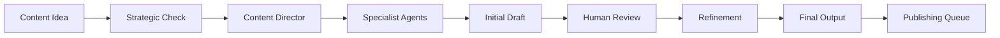

# Content Team (Magnetic Content OS) Implementation Plan

## Department Mission
Create high-quality, strategically-aligned content across all channels using a team of 14+ specialized AI agents, maintaining brand voice while maximizing production efficiency.

## Core Functions

### 1. Content Creation System
- **Multi-Channel Content** (YouTube, Blog, Social, Email)
- **Script & Copy Generation** (long-form and short-form)
- **Content Ideation** (topic research and trending analysis)
- **Brand Voice Consistency** (style and tone maintenance)

### 2. Agent Specialization
- **Head of Content**: Orchestrates and delegates work
- **YouTube Specialist**: Long-form video scripts
- **Short Content Creator**: TikTok/Reels/Shorts
- **Blog Writer**: SEO-optimized articles
- **Email Copywriter**: Newsletters and campaigns
- **Social Media Manager**: Platform-specific content
- **Hook Specialist**: Attention-grabbing openings
- **SEO Optimizer**: Keyword and search optimization
- **Content Researcher**: Topic and trend analysis
- **Editor**: Quality control and refinement
- **Thumbnail Designer**: Visual content ideation
- **Title Optimizer**: Headline and title creation
- **Content Strategist**: Calendar and planning
- **Analytics Reviewer**: Performance analysis

### 3. Workflow Management
- **Content Pipeline**: Ideation → Creation → Review → Publishing
- **Collaboration System**: Human-AI iterative refinement
- **Output Management**: Organized storage and versioning
- **Performance Tracking**: Content metrics and optimization

## Implementation Steps

### Phase 1: Content Infrastructure (Week 1)

1. **Define Content Pillars**
   ```yaml
   Content Strategy:
     Pillars:
       - Educational: Teaching core concepts
       - Inspirational: Success stories and vision
       - Practical: How-to and tutorials
       - Thought Leadership: Industry insights

     Channels:
       - YouTube: 2x weekly long-form
       - Blog: 1x weekly article
       - Email: Weekly newsletter
       - Social: Daily posts

     Voice Guidelines:
       - Tone: Expert yet accessible
       - Style: Direct and actionable
       - Values: Authentic and helpful
   ```

2. **Create Content Templates**
   - YouTube script structure
   - Blog post framework
   - Email templates
   - Social media formats

3. **Set Up Output System**
   - Folder organization by channel
   - Version control system
   - Review/approval workflow
   - Publishing calendar

### Phase 2: Agent Development (Week 2-3)

1. **Head of Content Creation Agent**
   ```yaml
   Name: Content Creation Director
   Purpose: Orchestrate content production across all agents
   Capabilities:
     - Delegate tasks to specialist agents
     - Coordinate multi-agent workflows
     - Ensure brand consistency
     - Manage content calendar
   Workflow:
     1. Receive content request
     2. Analyze requirements
     3. Delegate to appropriate agents
     4. Coordinate collaboration
     5. Compile final output
   ```

2. **YouTube Script Writer Agent**
   ```yaml
   Name: YouTube Script Specialist
   Purpose: Create engaging long-form video scripts
   Structure:
     - Hook: First 15 seconds
     - Preview: What they'll learn
     - Content: Main teaching points
     - Examples: Real-world applications
     - CTA: Clear next steps
   Framework:
     - Narrative arc
     - Educational value
     - Entertainment factor
     - Retention optimization
   ```

3. **SEO Content Optimizer Agent**
   ```yaml
   Name: SEO Optimization Specialist
   Purpose: Maximize content discoverability
   Functions:
     - Keyword research
     - Title optimization
     - Meta descriptions
     - Content structure
     - Internal linking
   Process:
     - Analyze topic potential
     - Research keywords
     - Optimize content
     - Create metadata
     - Suggest improvements
   ```

### Phase 3: Workflow Automation (Week 4)

1. **Content Pipeline Automation**
   - Idea capture system
   - Assignment routing
   - Review triggers
   - Publishing queue

2. **Quality Control System**
   - Brand voice checker
   - Fact verification
   - Plagiarism check
   - Performance prediction

## File Structure

```
04-content-team/
├── agents/
│   ├── prompts/
│   │   ├── content-director.md
│   │   ├── youtube-specialist.md
│   │   ├── blog-writer.md
│   │   ├── email-copywriter.md
│   │   ├── social-media.md
│   │   ├── hook-specialist.md
│   │   ├── seo-optimizer.md
│   │   ├── content-researcher.md
│   │   └── editor.md
│   └── configs/
│       └── agent-settings.yaml
├── content-templates/
│   ├── youtube/
│   │   ├── script-structure.md
│   │   ├── hook-formulas.md
│   │   └── cta-templates.md
│   ├── blog/
│   │   ├── article-framework.md
│   │   ├── seo-checklist.md
│   │   └── headline-formulas.md
│   ├── email/
│   │   ├── newsletter-template.md
│   │   ├── campaign-structure.md
│   │   └── subject-lines.md
│   └── social/
│       ├── post-templates.md
│       ├── platform-specs.md
│       └── hashtag-strategy.md
├── workflows/
│   ├── content-pipeline.md
│   ├── review-process.md
│   ├── publishing-checklist.md
│   └── collaboration-guide.md
└── output-management/
    ├── drafts/
    ├── review/
    ├── approved/
    └── published/
```

## Key Agent Prompts

### Content Director Prompt
```
You are the Head of Content Creation for Claude Code OS.

Your role is to orchestrate content production across a team of specialized agents, ensuring quality, consistency, and strategic alignment.

Team Management:
1. ANALYZE content request
2. IDENTIFY required specialists
3. DELEGATE tasks appropriately
4. COORDINATE collaboration
5. COMPILE final output

Specialist Agents Available:
- YouTube Script Writer
- Blog Content Creator
- Email Copywriter
- Social Media Manager
- Hook Specialist
- SEO Optimizer
- Content Researcher
- Editor

Workflow Process:
1. Understand content goal
2. Check strategic alignment
3. Assign to specialists
4. Monitor progress
5. Quality control
6. Final compilation

Output Standards:
- Brand voice consistency
- Strategic message alignment
- Educational value
- Engagement optimization
- SEO best practices

Always ensure:
- Clear value proposition
- Actionable insights
- Authentic voice
- Professional quality
```

### YouTube Script Specialist Prompt
```
You are a YouTube Script Specialist for Claude Code OS.

Create engaging, educational video scripts that maintain viewer retention while delivering massive value.

Script Structure:
1. HOOK (0-15 seconds)
   - Pattern interrupt
   - Big promise
   - Create curiosity

2. PREVIEW (15-30 seconds)
   - What they'll learn
   - Why it matters
   - Credibility marker

3. CONTENT (Main body)
   - Clear teaching points
   - Stories and examples
   - Visual cues
   - Engagement loops

4. CTA (Final 30 seconds)
   - Clear next step
   - Value reminder
   - Engagement prompt

Writing Principles:
- Conversational tone
- Short sentences
- Active voice
- Specific examples
- Emotional connection

Retention Tactics:
- Open loops
- Pattern interrupts
- Value bombs
- Visual changes
- Energy shifts

Video Types:
- Educational tutorials
- Thought leadership
- Case studies
- Framework explanations
- Success stories
```

### Hook Specialist Prompt
```
You are the Hook Specialist for Claude Code OS.

Your mission: Create irresistible openings that stop the scroll and compel consumption.

Hook Formulas:
1. CURIOSITY GAP
   "Most people think X, but actually Y..."

2. BIG PROMISE
   "In the next 8 minutes, you'll learn..."

3. PATTERN INTERRUPT
   "Stop what you're doing. This changes everything..."

4. AUTHORITY STATEMENT
   "After 10 years of X, I discovered..."

5. PROBLEM AGITATION
   "You're losing $X every day because..."

6. CONTRARIAN VIEW
   "Everyone's wrong about X. Here's why..."

7. TRANSFORMATION STORY
   "6 months ago I was... Now I..."

Platform Adaptations:
- YouTube: 15-second hook
- TikTok: 3-second hook
- Blog: Headline + first paragraph
- Email: Subject + preview

Testing Framework:
- Multiple variations
- A/B test options
- Performance metrics
- Iteration suggestions
```

## Content Production Workflow

### Ideation → Creation Process


### Daily Content Operations
1. **Morning**: Review content calendar
2. **AM Block**: Create priority content
3. **Midday**: Review and refine drafts
4. **PM Block**: Schedule and publish
5. **Evening**: Performance review

### Weekly Content Planning
- Monday: Week's content strategy
- Tuesday-Thursday: Production sprints
- Friday: Review and optimization
- Weekend: Scheduling and planning

## Quality Control Framework

### Content Standards Checklist
- [ ] Strategic alignment with OBG
- [ ] Brand voice consistency
- [ ] Educational value provided
- [ ] SEO optimization applied
- [ ] Engagement elements included
- [ ] CTA clearly defined
- [ ] Visuals/examples relevant
- [ ] Length appropriate for platform
- [ ] Grammar and spelling checked
- [ ] Fact verification completed

### Performance Metrics

1. **Creation Metrics**
   - Content pieces per week
   - Time to production
   - Revision cycles needed
   - Agent utilization rate

2. **Quality Metrics**
   - Brand consistency score
   - Educational value rating
   - Engagement predictions
   - SEO optimization level

3. **Performance Metrics**
   - View/read rates
   - Engagement rates
   - Conversion rates
   - Share/save rates

## Integration Points

### Inputs From
- **AI Growth Engine**: Strategic messaging and positioning
- **Executive Office**: Content priorities and deadlines
- **Operations**: Performance data and insights
- **Market Research**: Trending topics and opportunities

### Outputs To
- **Publishing Platforms**: Final content for distribution
- **Operations**: Content performance metrics
- **Archive**: Content library and versions
- **Analytics**: Performance tracking data

## Continuous Improvement

### Daily Optimization
- Review content performance
- Refine agent prompts
- Update templates
- Capture learnings

### Weekly Enhancement
- Analyze content metrics
- A/B test results review
- Agent performance tuning
- Workflow optimization

### Monthly Evolution
- Content strategy revision
- New agent development
- Template updates
- Process automation

## Quick Start Guide

1. **Day 1**: Set up content folders and templates
2. **Day 2**: Create Content Director agent
3. **Day 3**: Develop 3 specialist agents
4. **Day 4**: Run first content creation
5. **Day 5**: Refine based on output
6. **Week 2**: Add remaining agents
7. **Week 3**: Full system operational

---

*"AI-powered content creation requires your touch, your thinking. It's always a collaboration between you, the expert with vision, and your team of AI agents."*