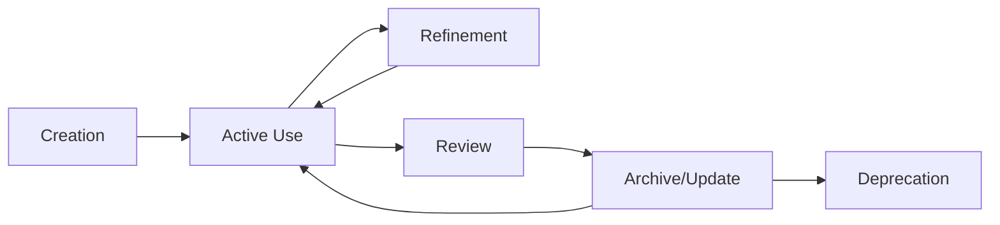

# Knowledge Base Architecture

## Overview
The Knowledge Base serves as the persistent memory and strategic foundation for Claude Code OS, ensuring all departments operate with consistent information and aligned objectives.

## Architecture Layers

### Layer 1: Core Principles
Foundational beliefs and methodologies that govern all system operations.

```
core-principles/
├── 13-principles.md           # The foundational 13 principles
├── entropy-principle.md       # Accepting imperfection
├── zero-friction.md          # Removing barriers
├── spartan-rule.md          # Lean operations
├── breaking-constraints.md  # Bottleneck focus
├── input-over-output.md     # Controllable metrics
└── strategic-alignment.md   # OBG focus
```

### Layer 2: Strategic Framework
Business-critical information that guides decision-making.

```
frameworks/
├── business-model/
│   ├── lean-gpt-model.md
│   ├── value-creation.md
│   └── scaling-strategy.md
├── positioning/
│   ├── unique-differentiation.md
│   ├── target-market.md
│   └── competitive-advantage.md
└── methodologies/
    ├── 4l-framework.md
    ├── freedom-framework.md
    └── decision-matrix.md
```

### Layer 3: Business Context
Specific business information and operational details.

```
business-context/
├── about/
│   ├── company-story.md
│   ├── vision-mission.md
│   └── core-values.md
├── market/
│   ├── customer-profiles.md
│   ├── competitor-analysis.md
│   └── market-position.md
└── products/
    ├── offerings.md
    ├── pricing-strategy.md
    └── value-propositions.md
```

### Layer 4: Operational Knowledge
Practical information for daily operations.

```
operational/
├── workflows/
│   ├── daily-routines.md
│   ├── weekly-processes.md
│   └── monthly-reviews.md
├── templates/
│   ├── report-formats.md
│   ├── assessment-criteria.md
│   └── planning-structures.md
└── metrics/
    ├── kpi-definitions.md
    ├── success-metrics.md
    └── tracking-methods.md
```

## Data Structure Standards

### File Naming Convention
```
[category]-[topic]-[version].md
Examples:
- strategy-obg-v1.md
- process-daily-planning-v2.md
- framework-4l-v1.md
```

### Document Structure Template
```markdown
# Document Title

## Metadata
- Version: 1.0
- Last Updated: YYYY-MM-DD
- Category: [Strategic/Operational/Framework]
- Access Level: [All/Restricted]

## Purpose
[Why this document exists]

## Core Content
[Main information]

## Connections
- Related Documents: [Links]
- Dependent Systems: [List]
- Update Triggers: [Conditions]

## Usage Guidelines
[How to apply this knowledge]

## Version History
- v1.0: Initial creation
- v1.1: [Updates]
```

## Knowledge Integration Matrix

### Cross-Department Knowledge Flow

| Knowledge Type | Executive | Operations | AI Growth | Content | HR |
|---------------|-----------|------------|-----------|---------|-----|
| Strategic Framework | Read/Write | Read | Write | Read | Read |
| Business Context | Read | Read | Write | Read | Read |
| Operational Procedures | Read | Write | Read | Read | Read |
| Performance Metrics | Read | Write | Read | Read | Read |
| Agent Templates | Read | Read | Read | Read | Write |

### Access Patterns

```yaml
Read Access:
  - All departments can read all knowledge
  - Ensures consistent understanding
  - Enables informed decision-making

Write Access:
  - Department-specific ownership
  - Maintains data integrity
  - Clear update responsibilities

Update Triggers:
  - Strategic shifts
  - Performance insights
  - Market changes
  - Process improvements
```

## Knowledge Maintenance Protocol

### Daily Maintenance
1. **Activity Logging**
   - Capture new learnings
   - Document decisions
   - Record outcomes

2. **Quick Updates**
   - Fix errors immediately
   - Add clarifications
   - Update metrics

### Weekly Review
1. **Knowledge Audit**
   - Check for outdated information
   - Identify gaps
   - Consolidate duplicates

2. **Cross-Reference Check**
   - Verify internal links
   - Update dependencies
   - Align related documents

### Monthly Refresh
1. **Strategic Review**
   - Reassess frameworks
   - Update positioning
   - Refine methodologies

2. **Performance Integration**
   - Incorporate learnings
   - Update best practices
   - Archive obsolete knowledge

## Knowledge Query System

### Query Categories
1. **Strategic Queries**
   - "What is our OBG?"
   - "How does this align with strategy?"
   - "What's our positioning?"

2. **Operational Queries**
   - "What's the daily planning process?"
   - "How do we assess productivity?"
   - "What are the success metrics?"

3. **Historical Queries**
   - "What worked last month?"
   - "What patterns have we seen?"
   - "How has performance trended?"

### Query Processing
```python
def process_knowledge_query(query):
    # 1. Classify query type
    query_type = classify_query(query)

    # 2. Identify relevant knowledge domains
    domains = map_to_domains(query_type)

    # 3. Retrieve information
    knowledge = retrieve_from_domains(domains)

    # 4. Synthesize response
    response = synthesize_answer(knowledge, query)

    # 5. Verify alignment
    aligned_response = check_strategic_alignment(response)

    return aligned_response
```

## Knowledge Evolution Framework

### Version Control System
```yaml
Version Numbering:
  Major: Fundamental changes (1.0 -> 2.0)
  Minor: Significant updates (1.0 -> 1.1)
  Patch: Small corrections (1.0.0 -> 1.0.1)

Change Documentation:
  - Change summary
  - Reason for change
  - Impact assessment
  - Rollback plan
```

### Knowledge Lifecycle


## Integration with Departments

### Executive Office Integration
- Accesses strategic frameworks for planning
- Uses business context for alignment
- References operational procedures
- Updates based on strategic shifts

### Operations Integration
- Uses metrics definitions
- Updates performance data
- References process documentation
- Maintains operational knowledge

### AI Growth Engine Integration
- Owns strategic framework
- Maintains business context
- Defines positioning elements
- Ensures alignment checking

### Content Team Integration
- References brand voice
- Uses positioning for messaging
- Accesses product information
- Maintains content guidelines

### HR Department Integration
- Uses framework templates
- References best practices
- Maintains agent knowledge
- Updates creation methodologies

## Knowledge Base Metrics

### Usage Metrics
- Query frequency by domain
- Most accessed documents
- Update frequency
- Cross-reference patterns

### Quality Metrics
- Information accuracy
- Document completeness
- Update timeliness
- Alignment consistency

### Impact Metrics
- Decision quality improvement
- Time saved in planning
- Error reduction
- Alignment improvement

## Security & Backup

### Backup Strategy
```yaml
Frequency:
  - Real-time: Critical strategic docs
  - Daily: Operational knowledge
  - Weekly: Full knowledge base

Storage:
  - Primary: Active system
  - Secondary: Cloud backup
  - Archive: Historical versions

Recovery:
  - RPO: 24 hours
  - RTO: 1 hour
  - Testing: Monthly
```

### Access Control
```yaml
Levels:
  Public: General principles
  Internal: All departments
  Restricted: Strategic only
  Confidential: Leadership only

Audit:
  - Access logs
  - Change tracking
  - Review cycles
```

## Quick Start Implementation

### Week 1: Foundation
1. Create folder structure
2. Document core principles
3. Define strategic framework
4. Set up version control

### Week 2: Population
1. Import existing knowledge
2. Create initial documents
3. Establish connections
4. Test query system

### Week 3: Integration
1. Connect departments
2. Implement workflows
3. Train query processing
4. Begin maintenance cycle

---

*"Persistent memory with no lost context or forgotten projects - this is the foundation of consistent, strategic execution."*