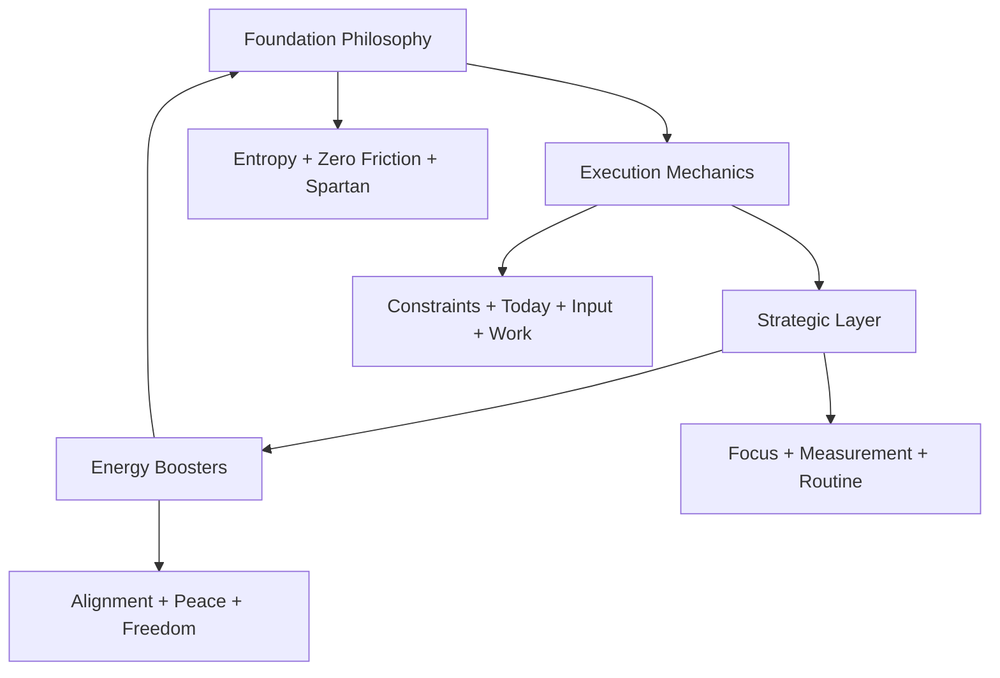

# The 13 Foundational Productivity Principles

## Overview
These principles, refined over 20 years, form the philosophical and practical foundation of Claude Code OS. They work together as an integrated system to maximize productivity while maintaining sustainable performance.

---

## Category 1: Foundation Philosophy
*Core beliefs that make everything else work*

### 1. The Entropy Principle 🌀
**"Forget perfect. It will necessarily be messy."**

- **Core Truth**: Disorder is the natural state - fighting it wastes energy
- **Application**: Accept that 99% can be imperfect as long as you nail the 1% that matters
- **Implementation in Claude Code OS**:
  - Daily plans are "good enough" not perfect
  - Focus on completion over perfection
  - Automated systems handle the mess
- **Key Insight**: Time spent perfecting is time stolen from executing

### 2. Zero Friction Discipline 🚀
**"The easier it is to do the right thing, the more likely you will do it consistently."**

- **Core Truth**: Friction kills discipline regardless of motivation
- **Application**: Remove every barrier between intention and action
- **Implementation in Claude Code OS**:
  - 1-minute morning planning
  - Automated report generation
  - Single-command workflows
- **Key Insight**: Discipline = Motivation / Friction

### 3. The Spartan Rule ⚔️
**"Lean operations through one obsession and brutal elimination."**

- **Core Truth**: Complexity is the enemy of execution
- **Application**: Focus on one thing, eliminate everything else
- **Implementation in Claude Code OS**:
  - One Big Obsessional Goal (OBG)
  - Brutal prioritization framework
  - Kill lists (what NOT to do)
- **Key Insight**: Addition by subtraction - less is exponentially more

---

## Category 2: Execution Mechanics
*Tactical rules that turn principles into results*

### 4. Breaking Constraints 🔨
**"Find the main bottleneck and break it."**

- **Core Truth**: Systems are only as strong as their weakest link
- **Application**: Identify constraint → Break it → Find next constraint
- **Implementation in Claude Code OS**:
  - Daily constraint identification
  - Focused problem-solving
  - Iterative optimization
- **Key Insight**: One broken constraint unlocks massive flow

### 5. Today Over Tomorrow 📅
**"Tomorrow's problems can wait if today's aren't solved."**

- **Core Truth**: Anticipated problems often never materialize
- **Application**: Solve present reality before future possibilities
- **Implementation in Claude Code OS**:
  - Tier 1 tasks (today) always first
  - Future planning only after current execution
  - No premature optimization
- **Key Insight**: Mental energy spent on tomorrow is stolen from today

### 6. Input Over Output 🎯
**"Control the inputs, trust the outputs."**

- **Core Truth**: You control actions, not outcomes
- **Application**: Measure and optimize what you can control
- **Implementation in Claude Code OS**:
  - Track daily actions taken
  - Measure input volume/quality
  - Trust causality to deliver results
- **Key Insight**: Right inputs × Consistency = Inevitable outputs

### 7. Do The Work 💪
**"Execute regardless of friction, motivation, or mood."**

- **Core Truth**: Professionals work, amateurs wait for inspiration
- **Application**: Show up and deliver the required inputs daily
- **Implementation in Claude Code OS**:
  - Non-negotiable daily routines
  - Automated accountability
  - Progress over perfection
- **Key Insight**: Consistency beats intensity every time

---

## Category 3: Strategic Layer
*Ensures you're working on the right things*

### 8. Tactical vs Strategic Focus 🎖️
**"Strategic focus is mandatory, tactical parallelism is acceptable."**

- **Core Truth**: Strategy requires singular focus, tactics can multitask
- **Application**: One strategic goal, multiple tactical executions
- **Implementation in Claude Code OS**:
  - Single OBG alignment
  - Multiple agent workflows
  - Fire-and-forget delegation
- **Key Insight**: Strategic wandering kills progress, tactical variety accelerates it

### 9. The Third Eye Principle 👁️
**"What gets measured gets managed and improved."**

- **Core Truth**: Objective measurement reveals truth
- **Application**: Track everything that matters numerically
- **Implementation in Claude Code OS**:
  - Daily productivity scores (1-10)
  - Weekly trend analysis
  - Monthly pattern recognition
- **Key Insight**: Feelings lie, numbers don't

### 10. Power of Routine ⏰
**"Fast planning under time constraints is mandatory."**

- **Core Truth**: Routine creates compound efficiency
- **Application**: Daily/weekly/monthly planning rituals
- **Implementation in Claude Code OS**:
  - Morning: 1-minute planning
  - Evening: Productivity assessment
  - Weekly: Strategic review
- **Key Insight**: Routine is freedom in disguise

---

## Category 4: Energy Boosters
*What keeps you sane and sustainable*

### 11. Strategic Alignment = No Waste 🎪
**"When everything serves your main goal, there's no internal conflict."**

- **Core Truth**: Misalignment creates friction and waste
- **Application**: Every action must serve the OBG
- **Implementation in Claude Code OS**:
  - Automatic alignment checking
  - Strategic drift alerts
  - Continuous realignment
- **Key Insight**: Perfect alignment feels effortless

### 12. Mind Peace Through Systems 🧘
**"Continuity, traceability, and no lost work create peace."**

- **Core Truth**: Uncertainty creates anxiety
- **Application**: Systems that remember everything
- **Implementation in Claude Code OS**:
  - Persistent memory
  - Complete project tracking
  - No forgotten work
- **Key Insight**: Trust in systems liberates mental energy

### 13. Discipline Equals Freedom 🗽
**"Systems reduce friction, making discipline easier and freedom real."**

- **Core Truth**: Constraints paradoxically create freedom
- **Application**: Rigid systems enable flexible outcomes
- **Implementation in Claude Code OS**:
  - Automated disciplines
  - Systematic execution
  - Freedom from decision fatigue
- **Key Insight**: The disciplined are the only truly free

---

## Principle Integration Map

### How Principles Work Together

### Daily Application Flow

1. **Morning** (Principles 2, 10)
   - Zero friction planning
   - Routine execution

2. **Execution** (Principles 4, 5, 6, 7)
   - Break constraints
   - Focus on today
   - Control inputs
   - Do the work

3. **Alignment** (Principles 3, 8, 11)
   - Spartan focus
   - Strategic alignment
   - OBG service

4. **Assessment** (Principles 9, 12)
   - Measure performance
   - Maintain peace through tracking

5. **Freedom** (Principles 1, 13)
   - Accept imperfection
   - Enjoy earned freedom

## Implementation Checklist

### Week 1: Foundation
- [ ] Understand all 13 principles
- [ ] Identify personal constraints
- [ ] Define your OBG
- [ ] Remove 3 friction points

### Week 2: Execution
- [ ] Implement morning routine
- [ ] Start measuring inputs
- [ ] Apply constraint breaking
- [ ] Track daily productivity

### Week 3: Optimization
- [ ] Refine based on metrics
- [ ] Eliminate non-essentials
- [ ] Strengthen routines
- [ ] Achieve first freedom milestone

## Principle Violations to Avoid

### Common Mistakes
1. **Perfection Paralysis** (Violates #1)
   - Spending 2 hours on perfect planning
   - Endless refinement without shipping

2. **Friction Accumulation** (Violates #2)
   - Complex multi-step processes
   - Manual work that could be automated

3. **Focus Dilution** (Violates #3)
   - Working on 10 projects simultaneously
   - Not saying no to opportunities

4. **Future Obsession** (Violates #5)
   - Planning for problems that don't exist
   - Optimizing for scale before product

5. **Output Fixation** (Violates #6)
   - Obsessing over results you can't control
   - Ignoring input metrics

## Success Indicators

### You're Following the Principles When:
- Planning takes <2 minutes
- Daily productivity score >7
- Zero forgotten projects
- Consistent daily execution
- Declining stress levels
- Increasing free time
- Clear mental space
- Measurable progress on OBG

### Red Flags:
- Planning takes >30 minutes
- Productivity score <5
- Constant context switching
- Forgotten commitments
- Rising anxiety
- No free time
- Mental overwhelm
- OBG stagnation

---

## The Meta-Principle

**"The system serves you, not the reverse."**

These principles create a framework for freedom, not a prison of productivity. Apply them to gain control, then use that control to live the life you want.

---

*"20 years condensed into 13 principles. Apply them and transform your productivity permanently."*