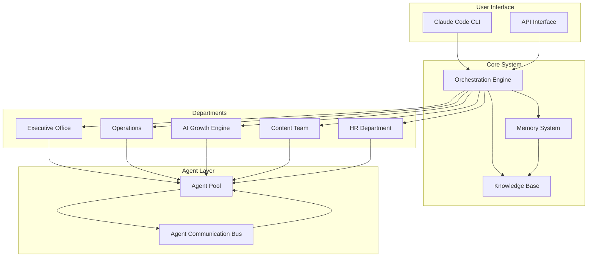
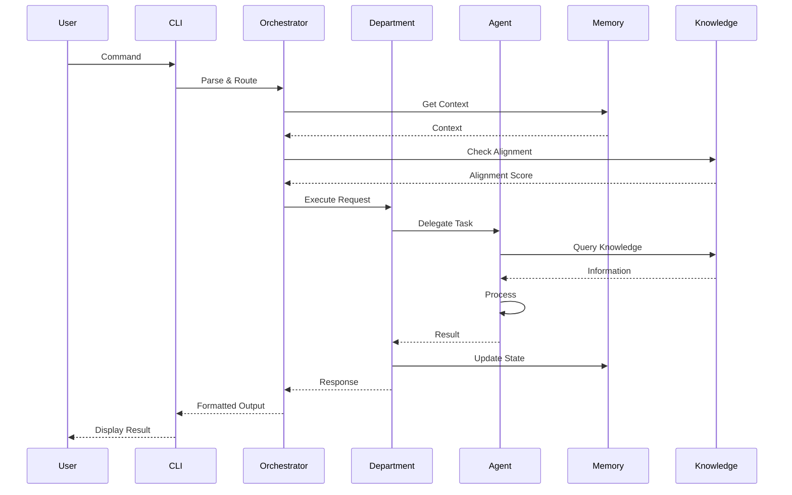

# Claude Code OS Technical Architecture

## System Architecture Overview

Claude Code OS is designed as a distributed AI agent system with persistent memory, inter-agent communication, and automated workflow orchestration.



---

## Core Components

### 1. Orchestration Engine

**Purpose:** Central coordination and request routing

**Technical Implementation:**
```python
class OrchestrationEngine:
    def __init__(self):
        self.departments = {
            'executive': ExecutiveOffice(),
            'operations': OperationsDept(),
            'growth': AIGrowthEngine(),
            'content': ContentTeam(),
            'hr': HRDepartment()
        }
        self.memory = MemorySystem()
        self.knowledge = KnowledgeBase()

    async def process_request(self, request):
        # 1. Classify request type
        request_type = self.classify_request(request)

        # 2. Check strategic alignment
        alignment = await self.growth.check_alignment(request)

        # 3. Route to appropriate department
        department = self.route_to_department(request_type)

        # 4. Execute with memory context
        context = await self.memory.get_context(request)
        response = await department.execute(request, context)

        # 5. Update memory
        await self.memory.update(request, response)

        return response
```

**Key Features:**
- Asynchronous request handling
- Strategic alignment checking
- Context-aware routing
- Memory persistence

### 2. Memory System

**Purpose:** Persistent context and historical tracking

**Architecture:**
```yaml
memory_system:
  short_term:
    type: "Redis/In-Memory"
    ttl: "24 hours"
    capacity: "1000 items"

  long_term:
    type: "PostgreSQL/SQLite"
    retention: "Indefinite"
    indexing: "Full-text search"

  working_memory:
    type: "Context Window"
    size: "Current session"

  structure:
    daily_logs:
      - tasks_completed
      - decisions_made
      - patterns_observed
    project_state:
      - active_projects
      - project_history
      - dependencies
    performance_metrics:
      - productivity_scores
      - time_tracking
      - success_rates
```

**Implementation:**
```python
class MemorySystem:
    def __init__(self):
        self.short_term = RedisCache()
        self.long_term = PostgresDB()
        self.working = ContextManager()

    async def store(self, data, memory_type='short'):
        if memory_type == 'short':
            await self.short_term.set(data.key, data.value, ttl=86400)
        elif memory_type == 'long':
            await self.long_term.insert(data)

        # Always update working memory
        self.working.update(data)

    async def recall(self, query):
        # Check working memory first
        if result := self.working.search(query):
            return result

        # Then short-term
        if result := await self.short_term.get(query):
            return result

        # Finally long-term
        return await self.long_term.query(query)

    async def get_context(self, request):
        return {
            'recent_tasks': await self.get_recent_tasks(),
            'project_state': await self.get_project_state(),
            'user_patterns': await self.get_user_patterns(),
            'strategic_context': await self.get_strategic_context()
        }
```

### 3. Knowledge Base System

**Purpose:** Strategic and operational knowledge management

**Structure:**
```python
class KnowledgeBase:
    def __init__(self):
        self.schemas = {
            'principles': PrinciplesSchema(),
            'strategic': StrategicSchema(),
            'operational': OperationalSchema(),
            'templates': TemplatesSchema()
        }
        self.index = SearchIndex()

    async def query(self, question, context=None):
        # 1. Identify relevant domains
        domains = self.classify_query(question)

        # 2. Retrieve relevant knowledge
        knowledge = []
        for domain in domains:
            results = await self.search_domain(domain, question)
            knowledge.extend(results)

        # 3. Rank by relevance
        ranked = self.rank_results(knowledge, question, context)

        # 4. Synthesize response
        return self.synthesize(ranked, question)

    async def update(self, domain, data):
        # Validate against schema
        schema = self.schemas[domain]
        validated = schema.validate(data)

        # Update knowledge
        await self.store(domain, validated)

        # Re-index for search
        await self.index.update(domain, validated)
```

---

## Department Architecture

### Executive Office Technical Stack

```python
class ExecutiveOffice:
    def __init__(self):
        self.agents = {
            'daily_planner': DailyPlannerAgent(),
            'weekly_strategist': WeeklyStrategistAgent(),
            'monthly_reviewer': MonthlyReviewerAgent()
        }
        self.templates = PlanningTemplates()
        self.metrics = MetricsTracker()

    async def generate_daily_plan(self):
        # Gather context
        context = {
            'yesterday': await self.get_yesterday_status(),
            'pending': await self.get_pending_tasks(),
            'strategic': await self.get_strategic_priorities(),
            'energy': await self.predict_energy_levels()
        }

        # Generate plan
        plan = await self.agents['daily_planner'].create_plan(context)

        # Validate alignment
        aligned_plan = await self.validate_alignment(plan)

        # Store plan
        await self.store_plan(aligned_plan)

        return aligned_plan
```

### Agent Communication Protocol

**Message Format:**
```json
{
  "id": "uuid",
  "timestamp": "2024-01-01T09:00:00Z",
  "sender": {
    "department": "executive",
    "agent": "daily_planner"
  },
  "receiver": {
    "department": "operations",
    "agent": "productivity_assessor"
  },
  "message_type": "request|response|broadcast|alert",
  "priority": "high|medium|low",
  "payload": {
    "action": "assess_productivity",
    "data": {},
    "deadline": "2024-01-01T17:00:00Z"
  },
  "requires_response": true,
  "correlation_id": "parent-message-id"
}
```

**Communication Bus:**
```python
class AgentCommunicationBus:
    def __init__(self):
        self.message_queue = AsyncQueue()
        self.subscribers = defaultdict(list)
        self.routing_table = RoutingTable()

    async def publish(self, message):
        # Validate message format
        self.validate_message(message)

        # Add to queue
        await self.message_queue.put(message)

        # Notify subscribers
        await self.notify_subscribers(message)

        # Route to destination
        await self.route_message(message)

    async def subscribe(self, agent, message_types):
        for msg_type in message_types:
            self.subscribers[msg_type].append(agent)

    async def process_messages(self):
        while True:
            message = await self.message_queue.get()
            await self.handle_message(message)
```

---

## Data Flow Architecture

### Request Processing Pipeline



### Data Storage Schema

**Tasks Table:**
```sql
CREATE TABLE tasks (
    id UUID PRIMARY KEY,
    created_at TIMESTAMP,
    updated_at TIMESTAMP,
    date DATE,
    tier INTEGER,
    description TEXT,
    estimated_time INTERVAL,
    actual_time INTERVAL,
    status VARCHAR(20),
    obg_alignment_score FLOAT,
    department VARCHAR(50),
    agent_id VARCHAR(100),
    parent_task_id UUID,
    metadata JSONB
);
```

**Productivity Assessments Table:**
```sql
CREATE TABLE productivity_assessments (
    id UUID PRIMARY KEY,
    date DATE UNIQUE,
    score FLOAT,
    tasks_planned INTEGER,
    tasks_completed INTEGER,
    tier1_completion_rate FLOAT,
    time_estimation_accuracy FLOAT,
    strategic_alignment_score FLOAT,
    patterns JSONB,
    blockers JSONB,
    successes JSONB,
    notes TEXT
);
```

**Agent Interactions Table:**
```sql
CREATE TABLE agent_interactions (
    id UUID PRIMARY KEY,
    timestamp TIMESTAMP,
    request_id UUID,
    sender_agent VARCHAR(100),
    receiver_agent VARCHAR(100),
    message_type VARCHAR(50),
    payload JSONB,
    response JSONB,
    processing_time INTERVAL,
    success BOOLEAN,
    error_message TEXT
);
```

---

## Integration Architecture

### Claude Code CLI Integration

```python
class ClaudeCodeCLI:
    def __init__(self):
        self.os = ClaudeCodeOS()
        self.command_parser = CommandParser()
        self.output_formatter = OutputFormatter()

    async def execute_command(self, command_string):
        # Parse command
        command = self.command_parser.parse(command_string)

        # Execute via OS
        result = await self.os.execute(command)

        # Format output
        formatted = self.output_formatter.format(result)

        return formatted

# Command examples
commands = {
    "daily_plan": "claude-os plan daily",
    "assess": "claude-os assess productivity",
    "weekly": "claude-os plan weekly",
    "create_agent": "claude-os create agent --type specialist",
    "check_alignment": "claude-os check alignment --task 'new feature'"
}
```

### API Integration Layer

```python
from fastapi import FastAPI, HTTPException
from pydantic import BaseModel

app = FastAPI(title="Claude Code OS API")

class PlanRequest(BaseModel):
    type: str  # daily|weekly|monthly
    context: dict = {}

class AssessmentRequest(BaseModel):
    date: str
    completed_tasks: list
    notes: str = ""

@app.post("/plan")
async def generate_plan(request: PlanRequest):
    try:
        plan = await claude_os.generate_plan(
            plan_type=request.type,
            context=request.context
        )
        return {"status": "success", "plan": plan}
    except Exception as e:
        raise HTTPException(status_code=500, detail=str(e))

@app.post("/assess")
async def assess_productivity(request: AssessmentRequest):
    assessment = await claude_os.assess_productivity(
        date=request.date,
        tasks=request.completed_tasks,
        notes=request.notes
    )
    return {"status": "success", "assessment": assessment}

@app.get("/metrics")
async def get_metrics(timeframe: str = "week"):
    metrics = await claude_os.get_metrics(timeframe)
    return {"status": "success", "metrics": metrics}
```

---

## Performance Optimization

### Caching Strategy

```python
class CachingLayer:
    def __init__(self):
        self.cache_ttl = {
            'plans': 3600,  # 1 hour
            'assessments': 86400,  # 24 hours
            'knowledge': 604800,  # 1 week
            'metrics': 300  # 5 minutes
        }

    @cache(ttl=3600)
    async def get_cached_plan(self, date, force_refresh=False):
        if force_refresh:
            self.invalidate(f"plan_{date}")

        return await self.generate_plan(date)

    def invalidate(self, key_pattern):
        # Invalidate matching cache entries
        for key in self.cache.keys(pattern=key_pattern):
            del self.cache[key]
```

### Parallel Processing

```python
async def parallel_department_execution():
    tasks = [
        executive_office.generate_plan(),
        operations.assess_productivity(),
        content_team.generate_content(),
        hr_dept.create_agent()
    ]

    results = await asyncio.gather(*tasks, return_exceptions=True)

    return process_results(results)
```

### Rate Limiting

```python
class RateLimiter:
    def __init__(self):
        self.limits = {
            'plan_generation': (10, 3600),  # 10 per hour
            'agent_creation': (5, 3600),  # 5 per hour
            'assessments': (20, 86400),  # 20 per day
        }

    async def check_limit(self, action, user_id):
        key = f"{action}:{user_id}"
        count = await self.redis.incr(key)

        if count == 1:
            await self.redis.expire(key, self.limits[action][1])

        if count > self.limits[action][0]:
            raise RateLimitExceeded(action)
```

---

## Security Architecture

### Authentication & Authorization

```python
class SecurityLayer:
    def __init__(self):
        self.auth = AuthenticationManager()
        self.authz = AuthorizationManager()
        self.audit = AuditLogger()

    async def authenticate(self, token):
        user = await self.auth.verify_token(token)
        if not user:
            raise AuthenticationError()
        return user

    async def authorize(self, user, resource, action):
        if not await self.authz.check_permission(user, resource, action):
            await self.audit.log_unauthorized_attempt(user, resource, action)
            raise AuthorizationError()

    async def audit_action(self, user, action, data):
        await self.audit.log({
            'user': user.id,
            'action': action,
            'data': data,
            'timestamp': datetime.utcnow()
        })
```

### Data Encryption

```yaml
encryption:
  at_rest:
    algorithm: AES-256
    key_management: AWS KMS / HashiCorp Vault

  in_transit:
    protocol: TLS 1.3
    certificates: Let's Encrypt

  sensitive_fields:
    - api_keys
    - credentials
    - personal_data
```

---

## Deployment Architecture

### Container Strategy

```dockerfile
# Dockerfile
FROM python:3.11-slim

WORKDIR /app

COPY requirements.txt .
RUN pip install -r requirements.txt

COPY . .

CMD ["python", "-m", "claude_code_os"]
```

### Docker Compose

```yaml
version: '3.8'

services:
  orchestrator:
    build: .
    environment:
      - DATABASE_URL=postgresql://postgres:password@db:5432/claude_os
      - REDIS_URL=redis://redis:6379
    depends_on:
      - db
      - redis

  db:
    image: postgres:15
    environment:
      - POSTGRES_PASSWORD=password
      - POSTGRES_DB=claude_os
    volumes:
      - postgres_data:/var/lib/postgresql/data

  redis:
    image: redis:7-alpine
    volumes:
      - redis_data:/data

volumes:
  postgres_data:
  redis_data:
```

### Kubernetes Deployment

```yaml
apiVersion: apps/v1
kind: Deployment
metadata:
  name: claude-code-os
spec:
  replicas: 3
  selector:
    matchLabels:
      app: claude-code-os
  template:
    metadata:
      labels:
        app: claude-code-os
    spec:
      containers:
      - name: orchestrator
        image: claude-code-os:latest
        ports:
        - containerPort: 8000
        env:
        - name: DATABASE_URL
          valueFrom:
            secretKeyRef:
              name: claude-os-secrets
              key: database-url
        resources:
          requests:
            memory: "512Mi"
            cpu: "500m"
          limits:
            memory: "1Gi"
            cpu: "1000m"
```

---

## Monitoring & Observability

### Metrics Collection

```python
from prometheus_client import Counter, Histogram, Gauge

# Define metrics
request_count = Counter('claude_os_requests_total',
                       'Total requests',
                       ['department', 'action'])
request_duration = Histogram('claude_os_request_duration_seconds',
                            'Request duration',
                            ['department', 'action'])
active_agents = Gauge('claude_os_active_agents',
                     'Number of active agents')
productivity_score = Gauge('claude_os_productivity_score',
                          'Current productivity score')

# Usage
@track_metrics
async def handle_request(department, action, request):
    request_count.labels(department=department, action=action).inc()

    with request_duration.labels(department=department, action=action).time():
        result = await process_request(request)

    return result
```

### Logging Strategy

```python
import structlog

logger = structlog.get_logger()

class LoggingMiddleware:
    async def process_request(self, request):
        logger.info("request_received",
                   request_id=request.id,
                   department=request.department,
                   action=request.action)

        try:
            result = await self.execute(request)
            logger.info("request_completed",
                       request_id=request.id,
                       duration=result.duration)
            return result

        except Exception as e:
            logger.error("request_failed",
                        request_id=request.id,
                        error=str(e))
            raise
```

---

## Scaling Strategy

### Horizontal Scaling

```python
class ScalableOrchestrator:
    def __init__(self):
        self.worker_pool = WorkerPool(min_workers=2, max_workers=10)
        self.load_balancer = LoadBalancer()

    async def scale_based_on_load(self):
        current_load = await self.get_system_load()

        if current_load > 0.8:
            await self.worker_pool.scale_up()
        elif current_load < 0.3:
            await self.worker_pool.scale_down()

    async def distribute_work(self, tasks):
        workers = await self.worker_pool.get_available_workers()
        return await self.load_balancer.distribute(tasks, workers)
```

### Performance Benchmarks

```yaml
benchmarks:
  response_times:
    daily_plan_generation: <2s
    productivity_assessment: <1s
    agent_creation: <30s
    knowledge_query: <500ms

  throughput:
    concurrent_users: 100
    requests_per_second: 1000
    agents_active: 50

  resource_usage:
    memory_per_user: 50MB
    cpu_per_request: 100m
    storage_per_user: 100MB
```

---

## Implementation Roadmap

### Phase 1: Core Infrastructure (Weeks 1-2)
- [ ] Set up orchestration engine
- [ ] Implement memory system
- [ ] Create knowledge base structure
- [ ] Basic CLI interface

### Phase 2: Department Integration (Weeks 3-4)
- [ ] Executive Office integration
- [ ] Operations integration
- [ ] Basic agent communication

### Phase 3: Full System (Weeks 5-6)
- [ ] All departments operational
- [ ] Complete agent library
- [ ] API layer
- [ ] Monitoring setup

### Phase 4: Production Ready (Weeks 7-8)
- [ ] Security implementation
- [ ] Performance optimization
- [ ] Deployment automation
- [ ] Documentation complete

---

*"A robust technical architecture ensures Claude Code OS scales with your ambitions while maintaining the simplicity that makes it powerful."*