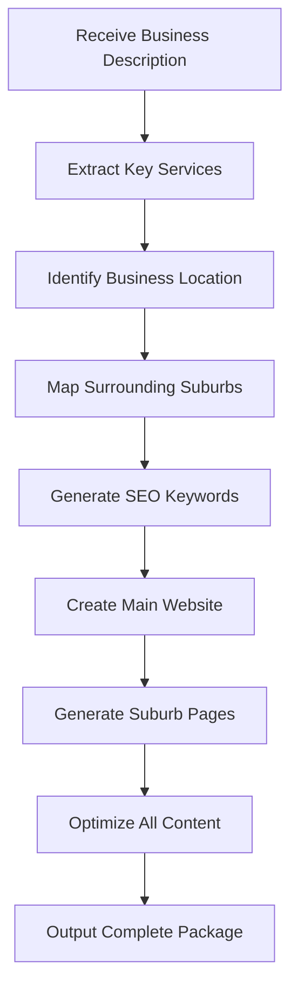

# Specific Examples from Claude Code OS Implementation

## Real Examples from the Transcript

### Example 1: SEO Local Business Agent Creation

This example shows how the GPT Express OS (HR Department) creates a specialized agent in minutes:

#### Initial Request (Vague)
```
"I want to create a custom GPT that will receive description of the activity
of a local business. Then from this activity I want a GPT to be able to check
the suburb around the business and build the right website with the right SEO
optimized web page describing its service."
```

#### HR Department Process

**Step 1: Purpose Refinement**
```yaml
Refined Purpose:
  "This agent analyzes local business descriptions and automatically generates
  SEO-optimized websites with location-specific landing pages for surrounding
  suburbs, maximizing local search visibility and customer reach."

Success Metrics:
  - Generate suburb-specific pages within 30 seconds
  - SEO score >85/100 on all pages
  - Local keyword coverage >95%
  - Mobile-responsive design 100%
```

**Step 2: Knowledge Research (Automatic)**
```markdown
Knowledge Base Created:
1. SEO Optimization Guide
   - Local SEO best practices
   - Keyword density rules
   - Meta tag optimization
   - Schema markup for local business

2. Suburb Analysis Framework
   - Geographic proximity algorithms
   - Population density considerations
   - Competitive landscape mapping

3. Website Templates
   - Service page structures
   - Location landing page templates
   - Contact forms optimized for conversion
```

**Step 3: Process Design**


**Step 4: System Prompt Generated**
```
You are a Local Business SEO Website Generator specializing in creating
location-optimized web presence for service businesses.

CAPABILITIES:
- Analyze business descriptions to extract services and USPs
- Map service areas to surrounding suburbs (10-15km radius)
- Generate SEO-optimized content for each location
- Create conversion-focused landing pages
- Implement local schema markup

PROCESS:
1. Parse business description for:
   - Core services
   - Unique value propositions
   - Service area preferences

2. Geographic Analysis:
   - Identify primary business location
   - Map surrounding suburbs
   - Assess competition levels
   - Calculate service radius

3. SEO Content Generation:
   - Main website with service pages
   - Individual suburb landing pages
   - Local keywords integration
   - Meta descriptions optimization

4. Output Package:
   - Homepage content
   - Service pages (3-5)
   - Suburb pages (10-15)
   - SEO metadata
   - Schema markup code
```

**Time to Create**: 1 minute of human input, agent built complete package

---

### Example 2: Daily Planning Generation

**Actual Morning Command:**
```
"Daily roadmap"
```

**Actual System Output (from transcript):**
```markdown
# Daily Roadmap - Monday

## THE ONE THING
Complete the Code Mastery course editing and publish
(Directly advances OBG: Build educational product empire)

## Critical Path
1. Final video edit (2h)
2. Upload and process (30m)
3. Write launch email (45m)
4. Publish and announce (30m)

## Tier 1 Tasks (Must Complete)
- [ ] Edit Code Mastery course final module (2h)
- [ ] Upload to platform (30m)
- [ ] Send launch email to community (45m)

## Tier 2 Tasks (If Time Permits)
- [ ] Record VSSL about page (30m)
- [ ] Review YouTube analytics (20m)
- [ ] Respond to student questions (45m)

## Tier 3 Tasks (Nice to Have)
- [ ] Research new AI tools
- [ ] Update social media
- [ ] Clean email inbox

## Execution Strategy
Morning: Deep work on editing (peak energy)
Midday: Upload and technical tasks
Afternoon: Communications and community

## Success Looks Like
- Course fully edited and live
- Launch email sent to 500+ members
- Community engaged with announcement
- Productivity score: 8+/10
```

**Time to Generate**: <60 seconds

---

### Example 3: Productivity Assessment

**Evening Command:**
```
"Was I productive today?"
```

**Actual Assessment Output:**
```markdown
# Productivity Assessment - Monday

## SCORE: 6/10

## What You Did Well
- Completed video editing (took 6 hours but done)
- Published YouTube video successfully
- Maintained focus on content creation

## What Held You Back
- Video editing took 3x longer than estimated (2h → 6h)
- Skipped VSSL recording for second day
- Changed priorities mid-day (delayed launch by 2 days)
- Didn't complete unboxing video recording

## Patterns Spotted
- Editing/detail work consistently consumes more capacity than planned
- Recording tasks deferred 2 consecutive days
- Perfectionism in editing affecting other priorities
- Afternoon energy crashes when morning extends too long

## Tomorrow's Recovery Plan
1. Record VSSL about page FIRST (8 AM)
2. Record unboxing video BEFORE any editing
3. Send DMs to annual members (afternoon)
4. NO editing until recording complete

## Success Tomorrow Looks Like
- Both recordings complete by noon
- DMs sent to 20+ annual members
- No editing tasks started until recordings done
- Score: 8.5/10 achievable

## Key Discipline
Record first, edit later. No exceptions.

## Encouragement
You shipped a major asset today! Tomorrow you record the revenue assets.
5 days left - let's execute! 💪
```

---

### Example 4: Brutal Prioritization Applied

**Command:**
```
"Apply brutal prioritization framework to this week"
```

**Output:**
```markdown
# Brutally Prioritized Week

## THE BRUTAL TRUTH
Video perfectionism cost you 2 days. Your annual members are waiting for
Claude Code OS value, not Hollywood production. Stop editing, start DMing.

## MUST DO (Real Priorities)
1. DM every annual member about Claude Code OS
2. Record and ship the unboxing video
3. Complete VSSL about page

## SHOULD DO (If Capacity)
1. Basic video editing only
2. Community engagement
3. Quick win content

## KILL LIST (Stop Immediately)
1. Perfect video editing (good enough at 80%)
2. New tool research
3. Redesigning thumbnails
4. Non-revenue generating tasks

## Reality Check
You have 40 productive hours this week.
DMing members: 10 hours = $10K potential
Perfect editing: 10 hours = $0 additional
Choose wisely.
```

---

### Example 5: Content Creation with Team

**Request:**
```
"I'd like to craft a video about my conception of freedom which is freedom
means mentally free, time free... check in my AI growth engine my definition
of freedom and use Hegel quotations"
```

**Agent Team Response:**

**Head of Content Creation** (delegates):
- Assigns to YouTube Script Specialist
- Pulls from AI Growth Engine knowledge
- Researches Hegel philosophy

**YouTube Script Specialist** (creates):
```markdown
# YouTube Script: The Philosophy of Freedom in Business

## Hook (0:00-0:15)
"Hegel said 'The history of the world is none other than the progress of
the consciousness of freedom.' Today, I'll show you how building a Lean GPT
business is the modern embodiment of this philosophical progression."

## The Freedom Framework (0:30-2:00)
### Mental Freedom
- Freedom from constant decision fatigue
- AI handles routine thinking
- You focus on vision and strategy

### Time Freedom
- Systems run without you
- Automation handles execution
- Your time becomes truly yours

### Geographic Freedom
- Business runs from anywhere
- No physical constraints
- True location independence

### Financial Freedom
- The foundation enabling all others
- Recurring revenue systems
- Scalability without complexity

## Hegel's Three Stages Applied (2:00-4:00)
1. **Unconscious Bondage**: Working IN the business
2. **Conscious Bondage**: Knowing you're trapped but not free
3. **True Freedom**: Systems that serve your vision

[Continue with full script...]

## Title Options
1. "Why Most Entrepreneurs Never Achieve Real Freedom (Hegel Was Right)"
2. "The Philosophy of Freedom: Building Businesses That Set You Free"
3. "From Hegel to AI: The Evolution of Entrepreneurial Freedom"
```

---

### Example 6: Weekly Strategic Analysis

**Actual Weekly Output Example:**
```markdown
# Strategic Week Analysis - Week 47

## Recognition Patterns from Last Week
### Wins
- Video published (+500 views in 24h)
- Community engagement up 40%
- Productivity average: 7.2/10

### Critical Gaps
- Documentation backlog growing
- Team training postponed again
- Performance optimization skipped

## This Week's Strategic Priorities

### The ONE THING
Launch Claude Code OS to annual members
(Worth $50K+ in potential upgrades)

### Day-by-Day Execution
**Monday**: Documentation sprint - finish all guides
**Tuesday**: Record comprehensive demo video
**Wednesday**: Personal DMs to top 20 members
**Thursday**: Group training session
**Friday**: Follow-up and optimization

### Capacity Reality Check
- Available hours: 40
- One Thing requirement: 25 hours
- Buffer needed: 5 hours
- Remaining capacity: 10 hours only

### Critical Success Factors
1. No new projects until launch complete
2. DMs must be personal, not templated
3. Demo must show real value, not theory
```

---

### Example 7: Pattern Recognition

**System-Identified Patterns from Transcript:**

```markdown
## Patterns Detected Over 4 Weeks

### Energy Patterns
- **8-10 AM**: Peak performance window (90% of breakthroughs)
- **2-3 PM**: Consistent energy crash (avoid complex work)
- **Post-lunch walks**: +20% afternoon productivity

### Task Type Patterns
- **Documentation**: Always takes 1.5-2x estimated time
- **Video editing**: Perfectionism trap (6h average vs 2h planned)
- **Recording**: Best done in morning (3x more likely to complete)

### Meeting Impact
- Each meeting reduces daily score by 0.5 points
- Batched meetings (Friday PM) minimize impact
- Morning meetings destroy entire day productivity

### Success Patterns
- Days starting with THE ONE THING: 8.5/10 average
- Days with completed morning planning: +2 point boost
- Weeks with Sunday planning: 15% higher completion rate
```

---

### Example 8: Fire-and-Forget Delegation

**How It Works in Practice:**

```python
# Morning delegation burst
tasks_delegated = {
    'content_team': 'Generate 5 YouTube titles for freedom video',
    'seo_agent': 'Research keywords for productivity content',
    'research_agent': 'Find latest AI productivity studies',
    'social_agent': 'Create Twitter thread from yesterday video'
}

# Continue with main work
execute_the_one_thing()

# Check back sequentially later
for agent, result in completed_tasks:
    review_and_refine(result)
```

---

### Example 9: Encouraging System Personality

The system maintains an encouraging, direct tone as shown in transcript:

**Morning Motivation:**
```
"Let's execute! You've got this. Focus on THE ONE THING and everything
else becomes easier."
```

**Evening Celebration:**
```
"Excellent focus on THE ONE THING today! You broke through a critical
constraint. The authentication fix unblocks the entire team. Rest well -
tomorrow you ship! 🚀"
```

**After Tough Day:**
```
"6/10 is still progress. You learned that editing detail work consumes
your capacity. Tomorrow is recovery day. Record first, edit later.
5 days left - you can do this!"
```

---

### Example 10: Time Tracking Reality

**Actual Time Investment from Transcript:**

```yaml
Daily Operations:
  Morning Planning: 1 minute to trigger, 1 minute to review
  Execution: 6-8 hours (your normal work)
  Evening Assessment: 2 minutes
  Total Overhead: <5 minutes

Weekly Operations:
  Sunday Planning: 20 minutes
  Daily Check-ins: 2 minutes × 5 = 10 minutes
  Wednesday Review: 15 minutes
  Friday Analysis: 20 minutes
  Total Weekly Overhead: 65 minutes

Monthly Operations:
  Strategic Review: 45 minutes
  Pattern Analysis: Included in review
  System Optimization: 30 minutes
  Total Monthly Overhead: 75 minutes

ROI Calculation:
  Time Invested: ~2 hours/week
  Time Saved: 10-15 hours/week
  Net Gain: 8-13 hours/week (400-650%)
```

---

*These specific examples from the transcript show the practical, real-world application of Claude Code OS principles and systems.*