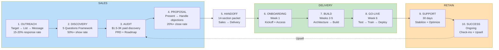
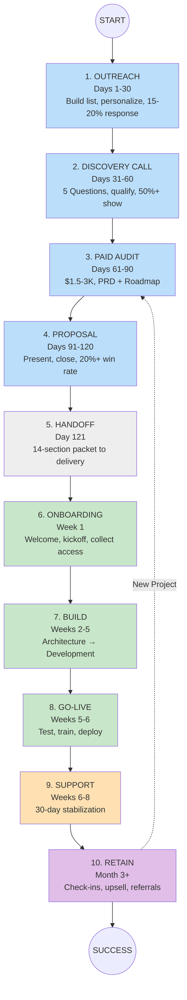

```mermaid
flowchart TB
    subgraph SALES["SALES PHASE (Days 1-120)"]
        direction TB

        subgraph S1["STAGE 1: OUTREACH"]
            S1A[Target ICP<br/>20-100 employees<br/>$5K-20K budget]
            S1B[Build List<br/>30-40 prospects/week<br/>LinkedIn + Referrals]
            S1C[Personalize Message<br/>10-12 min each<br/>Hook → Value → CTA]
            S1D[Manage Responses<br/>Hot: 1hr / Warm: 4hr<br/>Target: 15-20% response]
            S1A --> S1B --> S1C --> S1D
        end

        subgraph S2["STAGE 2: DISCOVERY CALL"]
            S2A[Pre-Call Prep<br/>15-20 min research<br/>Case study ready]
            S2B[5 Questions<br/>1. Biggest problem?<br/>2. Monthly cost?<br/>3. How long?<br/>4. Do nothing = ?<br/>5. Magic wand?]
            S2C[Qualify & Close<br/>Summarize pains<br/>Set next step]
            S2A --> S2B --> S2C
        end

        subgraph S3["STAGE 3: PAID AUDIT"]
            S3A[Discovery Sessions<br/>2-4 hours interviews<br/>$1,500-3,000]
            S3B[Business Mapping<br/>10 core functions<br/>Identify gaps + risks]
            S3C[Opportunity Matrix<br/>Quick Wins vs Strategic<br/>ROI estimates]
            S3D[Deliverables<br/>PRD + Roadmap<br/>Implementation plan]
            S3A --> S3B --> S3C --> S3D
        end

        subgraph S4["STAGE 4: PROPOSAL"]
            S4A[Build Proposal<br/>Within 48 hours<br/>Align to pain points]
            S4B[Present & Handle<br/>Objections<br/>Use discovery data]
            S4C[Close Deal<br/>Contract signed<br/>Payment confirmed]
            S4A --> S4B --> S4C
        end

        S1D --> S2A
        S2C --> S3A
        S3D --> S4A
    end

    subgraph HANDOFF["HANDOFF (Day 121)"]
        H1[Sales → Delivery<br/>Handoff Packet]
        H2[14-Section Document<br/>Client info, Pain points<br/>Tech stack, Timeline<br/>Risks, Expectations]
        H1 --> H2
    end

    subgraph DELIVERY["DELIVERY PHASE (Weeks 1-6)"]
        direction TB

        subgraph D1["STAGE 6: ONBOARDING"]
            D1A[Welcome Client<br/>Within 24 hours<br/>Send welcome packet]
            D1B[Kickoff Call<br/>60 minutes<br/>Map workflows]
            D1C[Collect Access<br/>CRM, Website<br/>Email, APIs]
            D1A --> D1B --> D1C
        end

        subgraph D2["STAGE 7: BUILD"]
            D2A[Week 2: Architecture<br/>Design systems<br/>Client approves]
            D2B[Weeks 3-5: Build<br/>Automations<br/>Integrations<br/>Voice agents]
            D2C[Weekly Updates<br/>Every Friday<br/>Status + Progress]
            D2A --> D2B --> D2C
        end

        subgraph D3["STAGE 8: GO-LIVE"]
            D3A[Testing & UAT<br/>QA + Client testing<br/>Fix issues]
            D3B[Training<br/>2 hours live<br/>Documentation]
            D3C[Deploy<br/>Go-live call<br/>System LIVE]
            D3A --> D3B --> D3C
        end

        D1C --> D2A
        D2C --> D3A
    end

    subgraph SUPPORT["SUPPORT & RETENTION"]
        direction TB

        subgraph P1["STAGE 9: STABILIZE"]
            P1A[30-Day Support<br/>Monitor closely<br/>Bug fixes 24hr]
            P1B[Optimize<br/>Performance tuning<br/>Adjustments]
            P1C[30-Day Check-in<br/>What's working?<br/>Any issues?]
            P1A --> P1B --> P1C
        end

        subgraph P2["STAGE 10: RETAIN"]
            P2A[Monthly Check-ins<br/>Maintain relationship<br/>Track ROI]
            P2B[Upsell<br/>Phase 2 projects<br/>New automations]
            P2C[Success Stories<br/>Document wins<br/>Referrals]
            P2A --> P2B --> P2C
        end

        P1C --> P2A
    end

    S4C --> H1
    H2 --> D1A
    D3C --> P1A
    P2C -.->|New Project| S3A

    style SALES fill:#e3f2fd,stroke:#1976d2,stroke-width:2px
    style HANDOFF fill:#f5f5f5,stroke:#616161,stroke-width:2px
    style DELIVERY fill:#e8f5e9,stroke:#388e3c,stroke-width:2px
    style SUPPORT fill:#fff3e0,stroke:#f57c00,stroke-width:2px
```

# Customer Journey - Mermaid Format for Miro

## INSTRUCTIONS FOR MIRO:
1. In Miro, click the **"+" button** or use "/" shortcut
2. Search for **"Mermaid"** and select it
3. Paste the code below (everything between the ```mermaid tags)
4. Miro will render it as a single connected diagram

---



---

## ALTERNATIVE: SIMPLER LINEAR VERSION

If the above is too complex, use this simplified version:



---

## THIRD OPTION: VERTICAL TIMELINE


