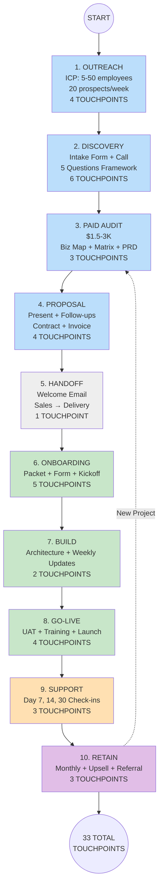

```mermaid
flowchart TB
    subgraph SALES["SALES PHASE"]
        direction TB

        subgraph S1["STAGE 1: OUTREACH"]
            S1A[Target ICP<br/>5-50 employees]
            S1B[Build List<br/>20 prospects/week<br/>LinkedIn + Referrals]
            S1C{{TOUCHPOINT: Outreach Message<br/>Personalized DM/Email<br/>Hook → Value → CTA}}
            S1D{{TOUCHPOINT: Response Email<br/>Hot: 1hr / Warm: 4hr}}
            S1E{{TOUCHPOINT: Follow-Up #1<br/>Day 3 if no response}}
            S1F{{TOUCHPOINT: Follow-Up #2<br/>Day 7 if no response}}
            S1A --> S1B --> S1C --> S1D
            S1C -.-> S1E -.-> S1F
        end

        subgraph S2["STAGE 2: DISCOVERY CALL"]
            S2A{{TOUCHPOINT: Booking Confirmation<br/>Calendar invite + prep info}}
            S2B{{TOUCHPOINT: Client Intake Form<br/>Collect contacts, pain points<br/>Tech stack, goals}}
            S2C{{TOUCHPOINT: Reminder Email<br/>24hr before call}}
            S2D[Discovery Call<br/>5 Questions Framework<br/>30-45 minutes]
            S2E{{TOUCHPOINT: Post-Call Recap<br/>Summary + next steps}}
            S2F{{TOUCHPOINT: No-Show Follow-Up<br/>Reschedule email}}
            S2A --> S2B --> S2C --> S2D --> S2E
            S2D -.-> S2F
        end

        subgraph S3["STAGE 3: PAID AUDIT"]
            S3A{{TOUCHPOINT: Audit Invoice<br/>$1,500-3,000}}
            S3B{{TOUCHPOINT: Audit Kickoff Email<br/>Schedule sessions}}
            S3C[Discovery Sessions<br/>2-4 hours interviews]
            S3D[Business Mapping<br/>10 core functions<br/>Gaps + risks]
            S3E[Opportunity Matrix<br/>Quick Wins vs Strategic<br/>ROI estimates]
            S3F{{TOUCHPOINT: Deliverables Email<br/>PRD + Roadmap<br/>+ Money Slide}}
            S3A --> S3B --> S3C --> S3D --> S3E --> S3F
        end

        subgraph S4["STAGE 4: PROPOSAL"]
            S4A{{TOUCHPOINT: Proposal Email<br/>Within 48 hours}}
            S4B[Proposal Call<br/>Present + Handle objections]
            S4C{{TOUCHPOINT: Follow-Up #1<br/>Day 2 post-proposal}}
            S4D{{TOUCHPOINT: Follow-Up #2<br/>Day 5 post-proposal}}
            S4E{{TOUCHPOINT: Contract + Invoice<br/>Payment link}}
            S4F[Deal Closed<br/>Payment confirmed]
            S4A --> S4B --> S4E --> S4F
            S4B -.-> S4C -.-> S4D
        end

        S1D --> S2A
        S2E --> S3A
        S3F --> S4A
    end

    subgraph HANDOFF["STAGE 5: HANDOFF"]
        H1[Internal: Sales → Delivery<br/>Handoff Packet]
        H2{{TOUCHPOINT: Welcome Email<br/>Intro to delivery team}}
    end

    subgraph DELIVERY["DELIVERY PHASE"]
        direction TB

        subgraph D1["STAGE 6: ONBOARDING"]
            D1A{{TOUCHPOINT: Welcome Packet<br/>Within 24 hours}}
            D1B{{TOUCHPOINT: Onboarding Form<br/>Access credentials<br/>Team contacts}}
            D1C{{TOUCHPOINT: Kickoff Invite<br/>60 min call}}
            D1D[Kickoff Call<br/>Map workflows<br/>Confirm scope]
            D1E{{TOUCHPOINT: Kickoff Recap<br/>Action items + timeline}}
            D1A --> D1B --> D1C --> D1D --> D1E
        end

        subgraph D2["STAGE 7: BUILD"]
            D2A{{TOUCHPOINT: Architecture Review<br/>Design approval request}}
            D2B[Architecture Call<br/>Client approves design]
            D2C[Build Phase<br/>Weeks 3-5<br/>Automations + Integrations]
            D2D{{TOUCHPOINT: Weekly Update<br/>Every Friday<br/>Status + Progress}}
            D2A --> D2B --> D2C --> D2D
        end

        subgraph D3["STAGE 8: GO-LIVE"]
            D3A{{TOUCHPOINT: UAT Invite<br/>Testing instructions}}
            D3B[User Acceptance Testing<br/>Client tests system]
            D3C{{TOUCHPOINT: Training Invite<br/>2 hours scheduled}}
            D3D[Training Session<br/>Live walkthrough]
            D3E{{TOUCHPOINT: Go-Live Email<br/>System is LIVE}}
            D3F{{TOUCHPOINT: Training Recording<br/>+ Documentation}}
            D3A --> D3B --> D3C --> D3D --> D3E --> D3F
        end

        D1E --> D2A
        D2D --> D3A
    end

    subgraph SUPPORT["SUPPORT & RETENTION"]
        direction TB

        subgraph P1["STAGE 9: STABILIZE"]
            P1A{{TOUCHPOINT: Day 7 Check-in<br/>How's it going?}}
            P1B{{TOUCHPOINT: Day 14 Check-in<br/>Any issues?}}
            P1C{{TOUCHPOINT: Day 30 Check-in<br/>Full review + feedback}}
            P1A --> P1B --> P1C
        end

        subgraph P2["STAGE 10: RETAIN"]
            P2A{{TOUCHPOINT: Monthly Check-in<br/>ROI review}}
            P2B{{TOUCHPOINT: Upsell Opportunity<br/>Phase 2 proposal}}
            P2C{{TOUCHPOINT: Referral Request<br/>Case study + testimonial}}
            P2A --> P2B --> P2C
        end

        P1C --> P2A
    end

    S4F --> H1
    H1 --> H2
    H2 --> D1A
    D3F --> P1A
    P2C -.->|New Project| S3A

    style SALES fill:#e3f2fd,stroke:#1976d2,stroke-width:2px
    style HANDOFF fill:#f5f5f5,stroke:#616161,stroke-width:2px
    style DELIVERY fill:#e8f5e9,stroke:#388e3c,stroke-width:2px
    style SUPPORT fill:#fff3e0,stroke:#f57c00,stroke-width:2px
```

# Customer Journey - Mermaid Format for Miro

## INSTRUCTIONS FOR MIRO:
1. In Miro, click the **"+" button** or use "/" shortcut
2. Search for **"Mermaid"** and select it
3. Paste the code below (everything between the ```mermaid tags)
4. Miro will render it as a single connected diagram

## LEGEND:
- **Hexagons** = Customer Touchpoints (automation opportunities)
- **Rectangles** = Internal processes
- **Diamonds** = Decision points

---



---

## TOUCHPOINT SUMMARY (For Automation)

| # | Stage | Touchpoint | Type | Automate? |
|---|-------|------------|------|-----------|
| 1 | Outreach | Outreach Message | Email/DM | Template |
| 2 | Outreach | Response Email | Email | Template |
| 3 | Outreach | Follow-Up #1 (Day 3) | Email | Auto-send |
| 4 | Outreach | Follow-Up #2 (Day 7) | Email | Auto-send |
| 5 | Discovery | Booking Confirmation | Email | Auto-send |
| 6 | Discovery | Client Intake Form | Form | Auto-send |
| 7 | Discovery | Reminder (24hr) | Email | Auto-send |
| 8 | Discovery | Post-Call Recap | Email | Template |
| 9 | Discovery | No-Show Follow-Up | Email | Auto-send |
| 10 | Audit | Audit Invoice | Invoice | Auto-generate |
| 11 | Audit | Audit Kickoff Email | Email | Template |
| 12 | Audit | Deliverables Email | Email | Template |
| 13 | Proposal | Proposal Email | Email | Template |
| 14 | Proposal | Follow-Up #1 (Day 2) | Email | Auto-send |
| 15 | Proposal | Follow-Up #2 (Day 5) | Email | Auto-send |
| 16 | Proposal | Contract + Invoice | Doc/Invoice | Auto-generate |
| 17 | Handoff | Welcome Email | Email | Auto-send |
| 18 | Onboarding | Welcome Packet | Email | Auto-send |
| 19 | Onboarding | Onboarding Form | Form | Auto-send |
| 20 | Onboarding | Kickoff Invite | Calendar | Auto-send |
| 21 | Onboarding | Kickoff Recap | Email | Template |
| 22 | Build | Architecture Review | Email | Template |
| 23 | Build | Weekly Update | Email | Template |
| 24 | Go-Live | UAT Invite | Email | Template |
| 25 | Go-Live | Training Invite | Calendar | Auto-send |
| 26 | Go-Live | Go-Live Email | Email | Template |
| 27 | Go-Live | Training Recording | Email | Auto-send |
| 28 | Support | Day 7 Check-in | Email | Auto-send |
| 29 | Support | Day 14 Check-in | Email | Auto-send |
| 30 | Support | Day 30 Check-in | Email | Auto-send |
| 31 | Retain | Monthly Check-in | Email | Auto-send |
| 32 | Retain | Upsell Opportunity | Email | Template |
| 33 | Retain | Referral Request | Email | Auto-send |

---

## ALTERNATIVE: SIMPLER LINEAR VERSION

If the above is too complex, use this simplified version:

```mermaid
flowchart LR
    subgraph SALES["SALES (4 touchpoints each)"]
        A1[1. OUTREACH<br/>ICP: 5-50 employees<br/>20 prospects/week]
        A2[2. DISCOVERY<br/>Intake Form → Call<br/>5 Questions]
        A3[3. AUDIT<br/>$1.5-3K<br/>Biz Map + Matrix + PRD]
        A4[4. PROPOSAL<br/>Present + Follow-ups<br/>Contract + Invoice]
        A1 --> A2 --> A3 --> A4
    end

    B[5. HANDOFF<br/>Welcome Email<br/>Sales → Delivery]

    subgraph DELIVERY["DELIVERY (10 touchpoints)"]
        C1[6. ONBOARDING<br/>Packet + Form + Kickoff]
        C2[7. BUILD<br/>Weekly Updates]
        C3[8. GO-LIVE<br/>UAT + Training + Launch]
        C1 --> C2 --> C3
    end

    subgraph RETAIN["RETAIN (6 touchpoints)"]
        D1[9. SUPPORT<br/>Day 7, 14, 30 Check-ins]
        D2[10. SUCCESS<br/>Monthly + Upsell + Referral]
        D1 --> D2
    end

    A4 --> B --> C1
    C3 --> D1
    D2 -.->|Upsell| A3

    style SALES fill:#bbdefb
    style DELIVERY fill:#c8e6c9
    style RETAIN fill:#ffe0b2
```



---

## THIRD OPTION: VERTICAL TIMELINE WITH TOUCHPOINT COUNTS


